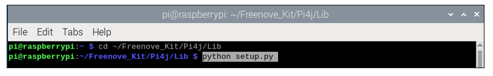
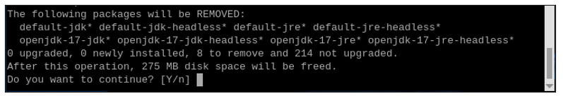
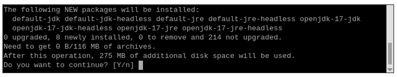
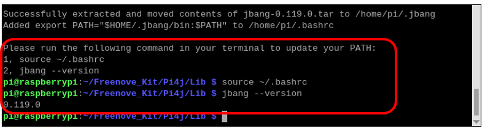
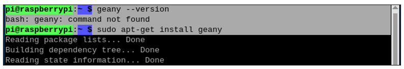
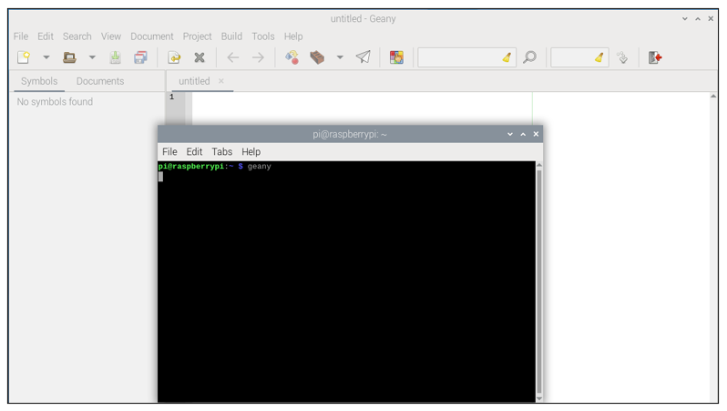
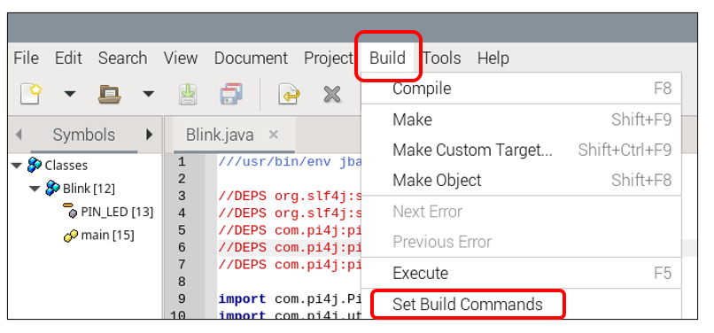
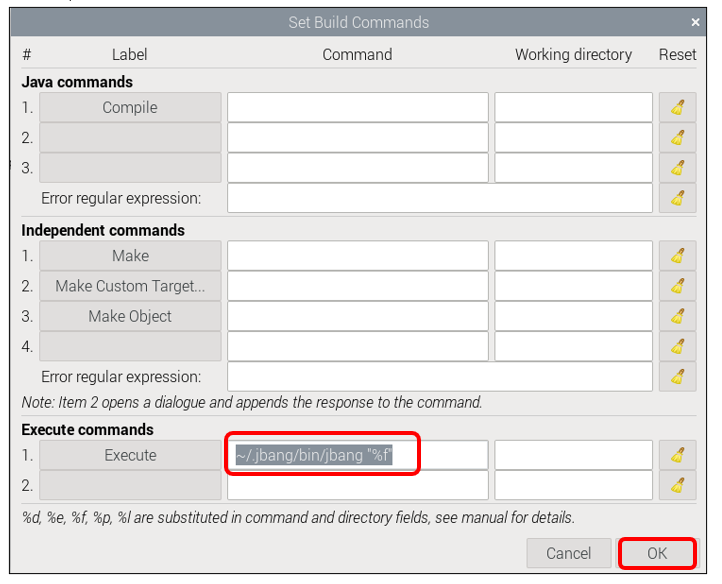
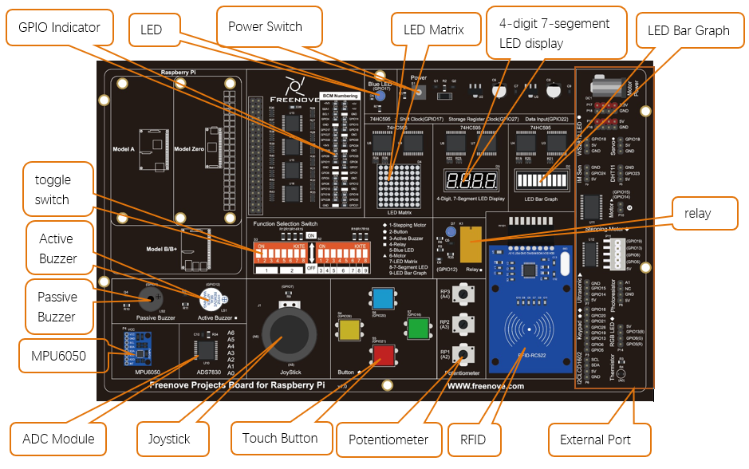

##############################################################################
0. Chapter Preparation
##############################################################################

Pi4J is a Java I/O library specially designed for Raspberry Pi platform.

The Pi4J project aims to provide Java programs with access, control and communication to the core I/O functions of the Raspberry Pi, enabling Java programmers to easily access and control the full I/O capabilities of the Raspberry Pi platform. It abstracts the low-level native integration and interrupt monitoring to enable Java programmers to focus on implementing their application business logic.

It is recommended to use JBang to run pi4j code. JBang allows you to execute Java code with dependencies as a single file without the need for a full Maven or Gradle project. You also don’t need to compile your code. So it’s a very easy way to get started with Java and Pi4J.

https://www.pi4j.com/examples/jbang/

To learn more about Pi4J, please refer to the documentation linked below:

https://www.pi4j.com/documentation/

Download Code
****************************************************************

Run the following command to download the code to Raspberry Pi.

.. code-block:: console

    $ cd ~
    $ git clone --depth 1 https://github.com/Freenove/Freenove_Projects_Kit_for_Raspberry_Pi.git

Run the command to rename the folder.

.. code-block:: console

    $ mv Freenove_Projects_Kit_for_Raspberry_Pi/ Freenove_Kit/

Installation of JBang
****************************************************************

Run the following commands one by one to install jbang.

.. code-block:: console

    $ cd ~/Freenove_Kit/Pi4j/Lib
    $ python setup.py

:red:`Please note that sudo is not applicable here.`

The built-in default-jdk library is not complete, so we need to uninstall and reinstall it.

Enter 'Y' to uninstall it.

Enter 'Y' again to install the full default-jdk library.

When you see the messages below, it indicates that the installation is almost finished.

You can run the following commands one by one to check whether jbang is installed.

.. code-block:: console

    $ source ~/.bashrc
    $ jbang --version

When you see the results as above, it means that jbang is already installed.

Installation of Geany 
****************************************************************

Geany is installed on Raspberry Pi OS by default.

You can run the following command to see if Geany is installed.

.. code-block:: console

    $ geany --version

If geany is not installed on your OS, please run the following command to install it.

.. code-block:: console

    $ sudo apt-get install geany

.. _geany:

Geany Configuration
****************************************************************

Run the command to open Geany software.

.. code-block:: console

    $ geany

As can be seen below, Geany is open after the command is run.

Click Build -> Set Build Commands on the menu bar.

In the pop-up window, enter the following command.

.. code-block:: console

    $ ~/.jbang/bin/jbang "%f"

The detailed operation is as illustrated below:

So far, you can use Geany to open, edit, and run the code of the Pi4J tutorial.

Projects Board for Raspberry Pi 
****************************************************************

.. note::

    1.	Stepper motor, keypad and RGBLED must NOT be used at the same time.
    
    2.	Touch button and keypad must NOT be used at the same time.
    
    3.	Active buzzer and relay must NOT be used at the same time. 
    
    4.	Motor and ultrasonic module must NOT be used at the same time. 
   
    5.	Servo and WS2812LED must NOT be used at the same time.
   
    6.	Batteries need to be plugged in when using the motor. 

