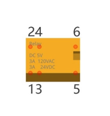
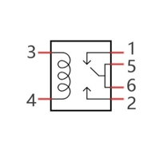
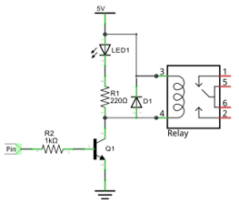
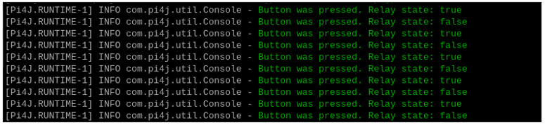

##############################################################################
Chapter Relay & LED
##############################################################################

In this chapter, we will learn a kind of special switch module, Relay Module.

Project 12.1 Relay & LED
****************************************************************

Component knowledge
================================================================

Relay
----------------------------------------------------------------

Relays are a type of Switch that open and close circuits electromechanically or electronically. Relays control one electrical circuit by opening and closing contacts in another circuit using an electromagnet to initiate the Switch action. When the electromagnet is energized (powered), it will attract internal contacts completing a circuit, which act as a Switch. Many times Relays are used to allow a low powered circuit (and a small low amperage switch) to safely turn ON a larger more powerful circuit. They are commonly found in automobiles, especially from the ignition to the starter motor.

The following is a basic diagram of a common Relay and the image and circuit symbol diagram of the 5V relay used in this project:

.. list-table:: 
    :width: 100%
    :align: center
    :class: product-table

    *   -   Diagram 
        -   Feature:
        -   Symbol
    
    *   -   |Chapter12_00|
        -   |Chapter12_01|
        -   |Chapter12_02|

.. |Chapter12_00| image:: ../_static/imgs/12_Relay_&_LED/Chapter12_00.png

Pin 5 and pin 6 are internally connected to each other. When the coil pin3 and pin 4 are connected to a 5V power supply, pin 1 will be disconnected from pins 5 & 6 and pin 2 will be connected to pins 5 & 6. Pin 1 is called Closed End and pin 2 is called the Open End.

Inductor
----------------------------------------------------------------

The symbol of Inductance is “L” and the unit of inductance is the “Henry” (H). Here is an example of how this can be encountered: 1H=1000mH, 1mH=1000μH.

An Inductor is a passive device that stores energy in its Magnetic Field and returns energy to the circuit whenever required. An Inductor is formed by a Cylindrical Core with many Turns of conducting wire (usually copper wire). Inductors will hinder the changing current passing through it. When the current passing through the Inductor increases, it will attempt to hinder the increasing movement of current; and when the current passing through the inductor decreases, it will attempt to hinder the decreasing movement of current. So the current passing through an Inductor is not transient.

.. image:: ../_static/imgs/12_Relay_&_LED/Chapter12_03.png
    :align: center

The circuit for a Relay is as follows: The coil of Relay can be equivalent to an Inductor, when a Transistor is present in this coil circuit it can disconnect the power to the relay, the current in the Relay’s coil does not stop immediately, which affects the power supply adversely. To remedy this, diodes in parallel are placed on both ends of the Relay coil pins in opposite polar direction. Having the current pass through the diodes will avoid any adverse effect on the power supply.

Component List
================================================================

+------------------------------------------+
| Freenove Projects Board for Raspberry Pi |
|                                          |
|  |Chapter01_04|                          |
+---------------------+--------------------+
| Raspberry Pi        | GPIO Ribbon Cable  |
|                     |                    |
|  |Chapter01_05|     |  |Chapter01_06|    |
+---------------------+--------------------+

.. |Chapter01_04| image:: ../_static/imgs/1_LED/Chapter01_04.png
.. |Chapter01_05| image:: ../_static/imgs/1_LED/Chapter01_05.png
.. |Chapter01_06| image:: ../_static/imgs/1_LED/Chapter01_06.png

Circuit
================================================================

.. list-table:: 
    :width: 100%
    :align: center
    :class: product-table

    *   -   Schematic diagram
    *   -   |Chapter12_05|
    *   -   Hardware connection:
    *   -   |Chapter12_06|

.. |Chapter12_05| image:: ../_static/imgs/12_Relay_&_LED/Chapter12_05.png
.. |Chapter12_06| image:: ../_static/imgs/12_Relay_&_LED/Chapter12_06.png

.. note::
    
    :red:`If you have any concerns, please send an email to:` support@freenove.com

Sketch 
================================================================

In the project, we will control the ON and OFF of the relay with the button.

Sketch_12_Relay
----------------------------------------------------------------

First, enter where the project is located:

.. code-block:: console

    $ cd ~/Freenove_Kit/Pi4j/Sketches/Sketch_12_Relay 

Enter the command to run the code.

.. code-block:: console

    $ jbang Relay.java

After running the code, press the button, the relay will be closed and the indicator light will light up. Press the button again, the relay will be disconnected and the indicator light will go out.

Each time when the button is pressed, you can see the messages printed on the terminal.

Press Ctrl+C to exit the program.

You can run the following command to open the code with Geany to view and edit it.

.. code-block:: console

    $ geany Relay.java

Click the icon to run the code.

If the code fails to run, please check :ref:`Geany Configuration<geany>`.

The following is program code:

.. literalinclude:: ../../../freenove_Kit/Pi4j/Sketches/Sketch_12_Relay/Relay.java
    :linenos: 
    :language: java

Create a boolean variable relayState and set the default state to false.

.. literalinclude:: ../../../freenove_Kit/Pi4j/Sketches/Sketch_12_Relay/Relay.java
    :linenos: 
    :language: java
    :lines: 19-19

Relay control function: According to the value of the Boolean variable state, the Raspberry Pi controls the GPIO output high and low levels, thereby controlling the relay to be attracted and disconnected.

.. literalinclude:: ../../../freenove_Kit/Pi4j/Sketches/Sketch_12_Relay/Relay.java
    :linenos: 
    :language: java
    :lines: 26-32

Each time a button is pressed, the value of relayState is changed and the value of relayState is sent as a parameter to the relay control function. At the same time, a prompt message is printed in the terminal.

.. literalinclude:: ../../../freenove_Kit/Pi4j/Sketches/Sketch_12_Relay/Relay.java
    :linenos: 
    :language: java
    :lines: 41-47