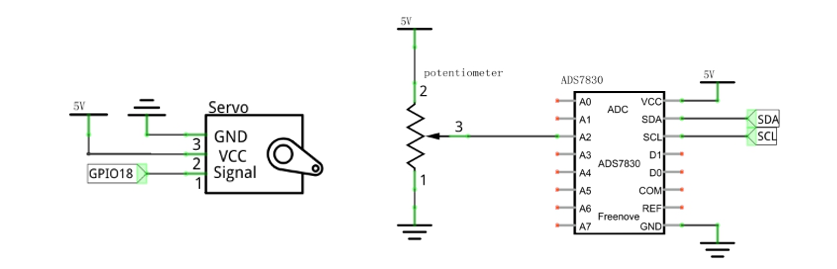
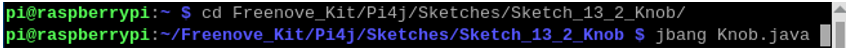
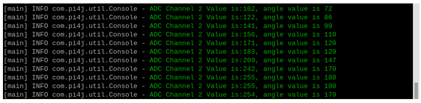
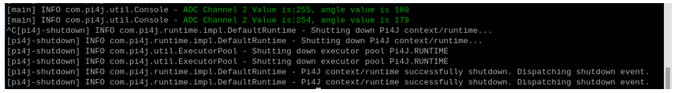
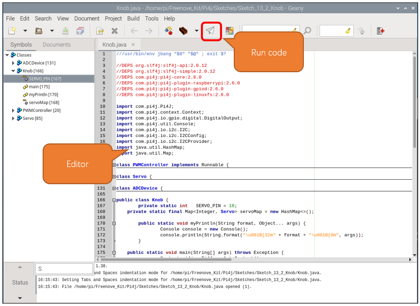

##############################################################################
Chapter 13 Servo
##############################################################################

Previously, we learned how to control the speed and rotational direction of a DC Motor. In this chapter, we will learn about Servos which are a rotary actuator type motor that can be controlled rotate to specific angles.

Project Sweep
****************************************************************

First, we need to learn how to make a Servo rotate.

Component knowledge
================================================================

Servo
----------------------------------------------------------------

Servo is a compact package which consists of a DC Motor, a set of reduction gears to provide torque, a sensor and control circuit board. Most Servos only have a 180-degree range of motion via their “horn”. Servos can output higher torque than a simple DC Motor alone and they are widely used to control motion in model cars, model airplanes, robots, etc. Servos have three wire leads which usually terminate to a male or female 3-pin plug. Two leads are for electric power: Positive (2-VCC, Red wire), Negative (3-GND, Brown wire), and the signal line (1-Signal, Orange wire) as represented in the Servo provided in your Kit.

.. image:: ../_static/imgs/13_Servo/Chapter13_00.png
    :align: center

We will use a 50Hz PWM signal with a duty cycle in a certain range to drive the Servo. The lasting time 0.5ms-2.5ms of PWM single cycle high level corresponds to the Servo angle 0 degrees - 180 degree linearly. Part of the corresponding values are as follows:

.. note:: 
    
    the lasting time of high level corresponding to the servo angle is absolute instead of accumulating. For example, the high level time lasting for 0.5ms correspond to the 0 degree of the servo. If the high level time lasts for another 1ms, the servo rotates to 45 degrees.

.. list-table::
    :align: center
    :header-rows: 1
    :class: zebra

    *  - High level time
       - Servo angle
    
    *  - 0.5ms
       - 0 degree
    
    *  - 1ms
       - 45 degree

    *  - 1.5ms
       - 90 degree

    *  - 2ms
       - 135 degree

    *  - 2.5ms
       - 180 degree

When you change the Servo signal value, the Servo will rotate to the designated angle.

Component List
================================================================

.. table::
    :width: 80%
    :align: center
    :class: table-line
    
    +---------------------------------------------+
    | Freenove Projects Board for Raspberry Pi    |
    |                                             |
    |  |Chapter01_04|                             |
    +---------------------+-----------------------+
    | Raspberry Pi        | GPIO Ribbon Cable     |
    |                     |                       |
    |  |Chapter01_05|     |  |Chapter01_06|       |
    +---------------------+-----------------------+
    | Jumper Wire         | Servo                 |
    |                     |                       |
    |  |Chapter05_02|     |  |Chapter13_01|       |
    +---------------------+-----------------------+

.. |Chapter01_04| image:: ../_static/imgs/1_LED/Chapter01_04.png
.. |Chapter01_05| image:: ../_static/imgs/1_LED/Chapter01_05.png
.. |Chapter01_06| image:: ../_static/imgs/1_LED/Chapter01_06.png
.. |Chapter05_02| image:: ../_static/imgs/5_RGB_LED/Chapter05_02.png
.. |Chapter13_01| image:: ../_static/imgs/13_Servo/Chapter13_01.png

Circuit
================================================================

.. list-table:: 
    :width: 80%
    :align: center
    :class: table-line

    * - Schematic diagram
    * - |Chapter13_02|
    * - Hardware connection:
    * - |Chapter13_03|

.. |Chapter13_02| image:: ../_static/imgs/13_Servo/Chapter13_02.png
.. |Chapter13_03| image:: ../_static/imgs/13_Servo/Chapter13_03.png

.. note::
    
    :combo:`red font-bolder:If you have any concerns, please send an email to:` support@freenove.com

Sketch
================================================================

In this chapter, we will learn how to control the servo to rotate at the range of 0 to 180 degrees.

Sketch_13_1_Sweep
----------------------------------------------------------------

First, enter where the project is located:

.. code-block:: console

    $ cd ~/Freenove_Kit/Pi4j/Sketches/Sketch_13_1_Sweep

.. image:: ../_static/imgs/13_Servo/Chapter13_06.png
    :align: center

Enter the command to run the code.

.. code-block:: console

    $ jbang Sweep.java

.. image:: ../_static/imgs/13_Servo/Chapter13_07.png
    :align: center

When the code is running, you can see the servo rotate between 0 to 180 degrees.

.. image:: ../_static/imgs/13_Servo/Chapter13_08.png
    :align: center

Meanwhile, the messages are printed on the terminal.

.. image:: ../_static/imgs/13_Servo/Chapter13_09.png
    :align: center

Press Ctrl+C to exit the code.

.. image:: ../_static/imgs/13_Servo/Chapter13_10.png
    :align: center

You can run the following command to open the code with Geany to view and edit it.

.. code-block:: console

    $ geany Sweep.java

Click the icon to run the code.

.. image:: ../_static/imgs/13_Servo/Chapter13_11.png
    :align: center

If the code fails to run, please check :ref:`Geany Configuration<geany>`.

The following is program code:

.. literalinclude:: ../../../freenove_Kit/Pi4j/Sketches/Sketch_13_1_Sweep/Sweep.java
    :linenos: 
    :language: java

Servo constructor, initializes the servo control pins, and adds a JVM shutdown hook to ensure that the PWM controller and Pi4J context are properly closed when the program exits.

.. literalinclude:: ../../../freenove_Kit/Pi4j/Sketches/Sketch_13_1_Sweep/Sweep.java
    :linenos: 
    :language: java
    :lines: 85-102
    :dedent:

Set the PWM duty cycle according to the angle to control the servo to rotate to the specified position.

.. literalinclude:: ../../../freenove_Kit/Pi4j/Sketches/Sketch_13_1_Sweep/Sweep.java
    :linenos: 
    :language: java
    :lines: 112-118
    :dedent:

Initialize the servo controller and store it in servoMap.

.. literalinclude:: ../../../freenove_Kit/Pi4j/Sketches/Sketch_13_1_Sweep/Sweep.java
    :linenos: 
    :language: java
    :lines: 136-136
    :dedent:

Get the servo controller from servoMap.

.. literalinclude:: ../../../freenove_Kit/Pi4j/Sketches/Sketch_13_1_Sweep/Sweep.java
    :linenos: 
    :language: java
    :lines: 137-137
    :dedent:

The signal period of the servo is 20ms. According to the formula f=1/T, the frequency of the servo is set to 50Hz.

To control the servo to rotate to 0 degrees, a 1.5ms high level is required. 1.5ms/20ms=0.075, so the duty cycle of the servo is 0.075. Similarly, if you want the servo to rotate to 180 degrees, a 2.5ms high level is required, 2.5ms/20ms=0.375. You only need to modify the duty cycle value to control the rotation of the servo.

.. literalinclude:: ../../../freenove_Kit/Pi4j/Sketches/Sketch_13_1_Sweep/Sweep.java
    :linenos: 
    :language: java
    :lines: 138-139
    :dedent:

The main code controls the servo to rotate between 0-180 degrees and prints prompt information on the terminal interface.

.. literalinclude:: ../../../freenove_Kit/Pi4j/Sketches/Sketch_13_1_Sweep/Sweep.java
    :linenos: 
    :language: java
    :lines: 145-156
    :dedent:

Project Knob
**********************************

In this project, we will learn how to control the servo with a potentiometer.

Component List
===================================

.. table::
    :width: 80%
    :align: center
    :class: table-line
    
    +---------------------------------------------+
    | Freenove Projects Board for Raspberry Pi    |
    |                                             |
    |  |Chapter01_04|                             |
    +---------------------+-----------------------+
    | Raspberry Pi        | GPIO Ribbon Cable     |
    |                     |                       |
    |  |Chapter01_05|     |  |Chapter01_06|       |
    +---------------------+-----------------------+
    | Jumper Wire         | Servo                 |
    |                     |                       |
    |  |Chapter05_02|     |  |Chapter13_01|       |
    +---------------------+-----------------------+

Circuit
================================================================

.. list-table:: 
    :width: 80%
    :align: center
    :class: table-line

    * - Schematic diagram
    * - |Chapter13_12|
    * - Hardware connection:
    * - |Chapter13_03|

Sketch
================================================================

In this project, we will control the servo to rotate to a designated position by rotating the potentiometer.

Sketch_13_2_Knob
----------------------------------------------------------------

First, enter where the project is located:

.. code-block:: console
    
    cd ~/Freenove_Kit/Pi4j/Sketches/Sketch_13_2_Knob

Enter the command to run the code.

.. code-block:: console
    
    jbang Knob.java

When the code is running, rotating the potentiometer and you can see the servo angle change.

.. image:: ../_static/imgs/13_Servo/Chapter13_03.png
    :align: center

On the terminal, you can see messages printed.

Press Ctrl+C to exit the program.

You can run the following command to open the code with Geany to view and edit it.

.. code-block:: console
    
    geany Knob.java

Click the icon to run the code.

If the code fails to run, please check :ref:`Geany Configuration<geany>`.

The following is program code:

.. literalinclude:: ../../../freenove_Kit/Pi4j/Sketches/Sketch_13_2_Knob/Knob.java
    :linenos: 
    :language: java
    :dedent:

The ADC value at the potentiometer is obtained every 100 milliseconds and is converted into an angle value, which is provided to the servo angle control function, and a prompt message is printed on the terminal interface.

.. code-block:: c
    :linenos:

    if (adcDevice.detectI2C()) {  
        int ADC_CHANNEL = 2;  
        while (true) {  
            int adcValue = adcDevice.analogRead(ADC_CHANNEL);  
            int angle = (int)((double)adcValue/255.0*180);
            if (adcValue != -1) {  
                myPrintln("ADC Channel %d Value is:%d, angle value is %d", ADC_CHANNEL, adcValue, angle); 
                servo.setAngle(angle);
            } else {  
                myPrintln("Failed to read data from ADC.");  
            }  
            Thread.sleep(100);  
        }  
    }