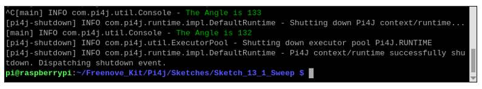

##############################################################################
Chapter Servo
##############################################################################

Previously, we learned how to control the speed and rotational direction of a DC Motor. In this chapter, we will learn about Servos which are a rotary actuator type motor that can be controlled rotate to specific angles.

Project 13.1 Sweep
****************************************************************

First, we need to learn how to make a Servo rotate.

Component knowledge
================================================================

Servo
----------------------------------------------------------------

Servo is a compact package which consists of a DC Motor, a set of reduction gears to provide torque, a sensor and control circuit board. Most Servos only have a 180-degree range of motion via their “horn”. Servos can output higher torque than a simple DC Motor alone and they are widely used to control motion in model cars, model airplanes, robots, etc. Servos have three wire leads which usually terminate to a male or female 3-pin plug. Two leads are for electric power: Positive (2-VCC, Red wire), Negative (3-GND, Brown wire), and the signal line (1-Signal, Orange wire) as represented in the Servo provided in your Kit.

.. image:: ../_static/imgs/13_Servo/Chapter13_00.png
    :align: center

We will use a 50Hz PWM signal with a duty cycle in a certain range to drive the Servo. The lasting time 0.5ms-2.5ms of PWM single cycle high level corresponds to the Servo angle 0 degrees - 180 degree linearly. Part of the corresponding values are as follows:

.. note:: 
    
    the lasting time of high level corresponding to the servo angle is absolute instead of accumulating. For example, the high level time lasting for 0.5ms correspond to the 0 degree of the servo. If the high level time lasts for another 1ms, the servo rotates to 45 degrees.

.. list-table::
    :align: center

    *  - High level time
       - Servo angle
    
    *  - 0.5ms
       - 0 degree
    
    *  - 1ms
       - 45 degree

    *  - 1.5ms
       - 90 degree

    *  - 2ms
       - 135 degree

    *  - 2.5ms
       - 180 degree

When you change the Servo signal value, the Servo will rotate to the designated angle.

Component List
================================================================

+---------------------------------------------+
| Freenove Projects Board for Raspberry Pi    |
|                                             |
|  |Chapter01_04|                             |
+---------------------+-----------------------+
| Raspberry Pi        | GPIO Ribbon Cable     |
|                     |                       |
|  |Chapter01_05|     |  |Chapter01_06|       |
+---------------------+-----------------------+
| Jumper Wire         | Servo                 |
|                     |                       |
|  |Chapter05_02|     |  |Chapter13_01|       |
+---------------------+-----------------------+

.. |Chapter01_04| image:: ../_static/imgs/1_LED/Chapter01_04.png
.. |Chapter01_05| image:: ../_static/imgs/1_LED/Chapter01_05.png
.. |Chapter01_06| image:: ../_static/imgs/1_LED/Chapter01_06.png
.. |Chapter05_02| image:: ../_static/imgs/5_RGB_LED/Chapter05_02.png
.. |Chapter13_01| image:: ../_static/imgs/13_Servo/Chapter13_01.png

Circuit
================================================================

.. list-table:: 
    :width: 100%
    :align: center
    :class: product-table

    *   -   Schematic diagram
    *   -   |Chapter13_02|
    *   -   Hardware connection:
    *   -   |Chapter13_03|

.. |Chapter13_02| image:: ../_static/imgs/13_Servo/Chapter13_02.png

.. note::
    
    :red:`If you have any concerns, please send an email to:` support@freenove.com

Sketch
================================================================

In this chapter, we will learn how to control the servo to rotate at the range of 0 to 180 degrees.

Sketch_13_1_Sweep
----------------------------------------------------------------

First, enter where the project is located:

.. code-block:: console

    $ cd ~/Freenove_Kit/Pi4j/Sketches/Sketch_13_1_Sweep

Enter the command to run the code.

.. code-block:: console

    $ jbang Sweep.java

When the code is running, you can see the servo rotate between 0 to 180 degrees.

.. image:: ../_static/imgs/13_Servo/Chapter13_08.png
    :align: center

Meanwhile, the messages are printed on the terminal.

.. image:: ../_static/imgs/13_Servo/Chapter13_09.png
    :align: center

Press Ctrl+C to exit the code.

You can run the following command to open the code with Geany to view and edit it.

.. code-block:: console

    $ geany Sweep.java

Click the icon to run the code.

.. image:: ../_static/imgs/13_Servo/Chapter13_11.png
    :align: center

If the code fails to run, please check :ref:`Geany Configuration<geany>`.

The following is program code:

.. literalinclude:: ../../../freenove_Kit/Pi4j/Sketches/Sketch_13_1_Sweep/Sweep.java
    :linenos: 
    :language: java

Servo constructor, initializes the servo control pins, and adds a JVM shutdown hook to ensure that the PWM controller and Pi4J context are properly closed when the program exits.

.. literalinclude:: ../../../freenove_Kit/Pi4j/Sketches/Sketch_13_1_Sweep/Sweep.java
    :linenos: 
    :language: java
    :lines: 191-204