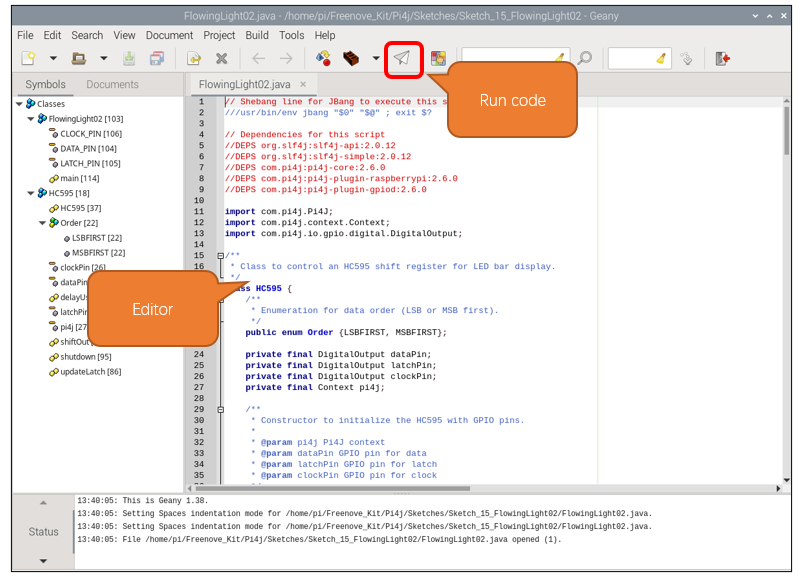

##############################################################################
Chapter 74HC595 & Bar Graph LED
##############################################################################

We have used LED Bar Graph to make a flowing water light, in which 10 GPIO ports of RPi are occupied. More GPIO ports mean that more peripherals can be connected to RPi, so GPIO resource is very precious. Can we make flowing water light with less GPIO ports? In this chapter, we will learn a component, 74HC595, which can achieve the target.

Project 15.1 Flowing Water Light
****************************************************************

Now let us learn how to use the 74HC595 IC Chip to make a flowing water light using less GPIO. 

Component knowledge
================================================================

Bar Graph LED
----------------------------------------------------------------

A Bar Graph LED has 10 LEDs integrated into one compact component. The two rows of pins at its bottom are paired to identify each LED like the single LED used earlier. 

74HC595
----------------------------------------------------------------

A 74HC595 chip is used to convert serial data into parallel data. A 74HC595 chip can convert the serial data of one byte into 8 bits, and send its corresponding level to each of the 8 ports correspondingly. With this characteristic, the 74HC595 chip can be used to expand the IO ports of a Raspberry Pi. At least 3 ports on the RPI board are required to control the 8 ports of the 74HC595 chip.

.. image:: ../_static/imgs/16_74HC595_&_Bar_Graph_LED/Chapter16_01.png
    :align: center

The ports of the 74HC595 chip are described as follows:

.. list-table:: 
    :widths: 1 1 1
    :align: center
    :class: product-table

    *   -   Pin name
        -   Pin number
        -   Description
    
    *   -   Q0-Q7
        -   15, 1-7
        -   Parallel Data Output

    *   -   VCC
        -   16
        -   The Positive Electrode of the Power Supply, the Voltage is 2~6V

    *   -   GND 
        -   8
        -   The Negative Electrode of Power Supply

    *   -   DS
        -   14
        -   Serial Data Input

    *   -   OE
        -   13
        -   Enable Output,

            When this pin is in high level, Q0-Q7 is in high resistance state

            When this pin is in low level, Q0-Q7 is in output mode

    *   -   ST_CP
        -   12
        -   Parallel Update Output: when its electrical level is rising, it will update the
        
            parallel data output.

    *   -   SH_CP
        -   11
        -   Serial Shift Clock: when its electrical level is rising, serial data input 
         
            register will do a shift.

    *   -   MR
        -   10
        -   Remove Shift Register: When this pin is in low level, the content in shift
           
            register will be cleared.

    *   -   Q7'
        -   9
        -   Serial Data Output: it can be connected to more 74HC595 chips in series.

For more details, please refer to the datasheet on the 74HC595 chip.

Component List
================================================================

+---------------------------------------------+
| Freenove Projects Board for Raspberry Pi    |
|                                             |
|  |Chapter01_04|                             |
+---------------------+-----------------------+
| Raspberry Pi        | GPIO Ribbon Cable     |
|                     |                       |
|  |Chapter01_05|     |  |Chapter01_06|       |
+---------------------+-----------------------+
| Bar Graph LED                               |
|                                             |
|  |Chapter16_02|                             |                              
|                                             |
+---------------------------------------------+

.. |Chapter01_04| image:: ../_static/imgs/1_LED/Chapter01_04.png
.. |Chapter01_05| image:: ../_static/imgs/1_LED/Chapter01_05.png
.. |Chapter01_06| image:: ../_static/imgs/1_LED/Chapter01_06.png
.. |Chapter14_04| image:: ../_static/imgs/16_74HC595_&_Bar_Graph_LED/Chapter16_02.png

Circuit
================================================================

.. list-table:: 
    :width: 100%
    :align: center
    :class: product-table

    *   -   Schematic diagram
    *   -   |Chapter16_03|
    *   -   Hardware connection:
    *   -   |Chapter16_04|

.. |Chapter16_03| image:: ../_static/imgs/16_74HC595_&_Bar_Graph_LED/Chapter16_03.png
.. |Chapter16_04| image:: ../_static/imgs/16_74HC595_&_Bar_Graph_LED/Chapter16_04.png

.. hint::

    :red:`If it dosen't work, rotate the LED bar graph for 180°.`

.. note::
    
    :red:`If you have any concerns, please send an email to:` support@freenove.com

Sketch
================================================================

In this chapter, we will learn how to drive the LED Bar by expanding the chip.

Sketch_15_FlowingLight02
----------------------------------------------------------------

First, enter where the project is located:

.. code-block:: console

    $ cd ~/Freenove_Kit/Pi4j/Sketches/Sketch_15_FlowingLight02

Enter the command to run the code.

.. code-block:: console

    $ jbang FlowingLight02.java

When the code is running, you can see the LEDs of the LED bar light up in a flowing water pattern.

.. code-block:: console

    $ jbang FlowingLight02.java

Press Ctrl+C to exit the program.

You can run the following command to open the code with Geany to view and edit it.

.. code-block:: console

    $ geany FlowingLight02.java

Click the icon to run the code.

If the code fails to run, please check :ref:`Geany Configuration<geany>`.

The following is program code:

.. literalinclude:: ../../../freenove_Kit/Pi4j/Sketches/Sketch_15_FlowingLight02/FlowingLight02.java
    :linenos: 
    :language: java

Define the data transfer order for enumeration types.

.. literalinclude:: ../../../freenove_Kit/Pi4j/Sketches/Sketch_15_FlowingLight02/FlowingLight02.java
    :linenos: 
    :language: java
    :lines: 14-14

Define the data pin, latch pin, clock pin, and Pi4j context.

.. literalinclude:: ../../../freenove_Kit/Pi4j/Sketches/Sketch_15_FlowingLight02/FlowingLight02.java
    :linenos: 
    :language: java
    :lines: 15-18

Constructor, initialize pins and context.

.. literalinclude:: ../../../freenove_Kit/Pi4j/Sketches/Sketch_15_FlowingLight02/FlowingLight02.java
    :linenos: 
    :language: java
    :lines: 20-25

Delay function in microsecond.

.. literalinclude:: ../../../freenove_Kit/Pi4j/Sketches/Sketch_15_FlowingLight02/FlowingLight02.java
    :linenos: 
    :language: java
    :lines: 27-32

Shift function for expansion chip. The Raspberry Pi sends data to the extended chip through GPIO.

.. literalinclude:: ../../../freenove_Kit/Pi4j/Sketches/Sketch_15_FlowingLight02/FlowingLight02.java
    :linenos: 
    :language: java
    :lines: 34-53

Update the expansion chip latch to let the expansion chip output the signal. Usually you need to first call the shiftOut function to input data to the expansion chip, and then call the updateLatch function to have the expansion chip output the signal level corresponding to the data.

.. literalinclude:: ../../../freenove_Kit/Pi4j/Sketches/Sketch_15_FlowingLight02/FlowingLight02.java
    :linenos: 
    :language: java
    :lines: 55-59

When Pi4j context is not used, shut it down to release resources.

.. literalinclude:: ../../../freenove_Kit/Pi4j/Sketches/Sketch_15_FlowingLight02/FlowingLight02.java
    :linenos: 
    :language: java
    :lines: 61-63

Define the pin number of the driver expansion chip.

.. literalinclude:: ../../../freenove_Kit/Pi4j/Sketches/Sketch_15_FlowingLight02/FlowingLight02.java
    :linenos: 
    :language: java
    :lines: 67-69

Create a pi4j automatic context and create an HC595 instance.

.. literalinclude:: ../../../freenove_Kit/Pi4j/Sketches/Sketch_15_FlowingLight02/FlowingLight02.java
    :linenos: 
    :language: java
    :lines: 72-73

The Raspberry Pi controls the LED bar to flow from left to right and then from right to left.

.. literalinclude:: ../../../freenove_Kit/Pi4j/Sketches/Sketch_15_FlowingLight02/FlowingLight02.java
    :linenos: 
    :language: java
    :lines: 77-95

Shutdown HC595 instance resources.

.. literalinclude:: ../../../freenove_Kit/Pi4j/Sketches/Sketch_15_FlowingLight02/FlowingLight02.java
    :linenos: 
    :language: java
    :lines: 96-98