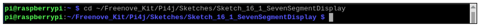
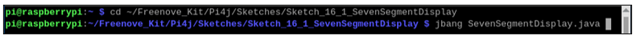
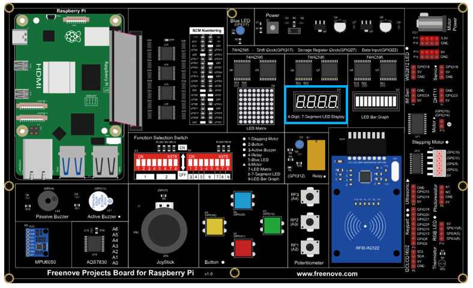
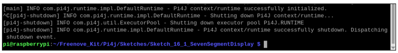
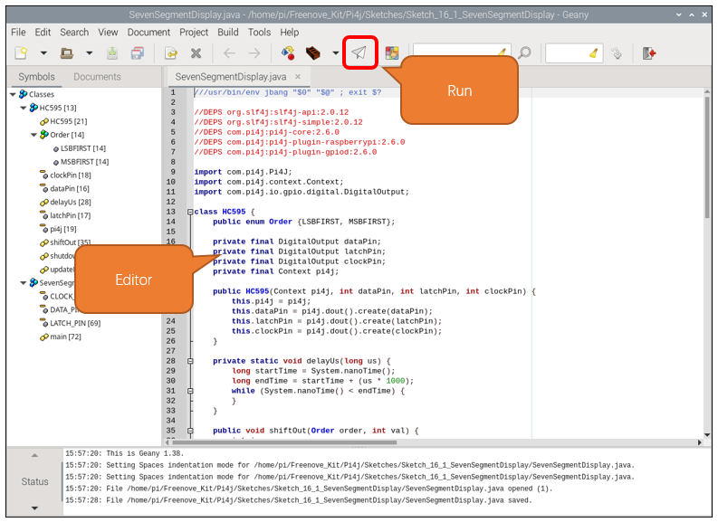
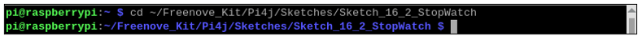
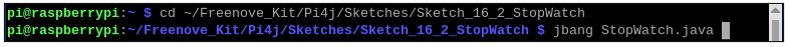
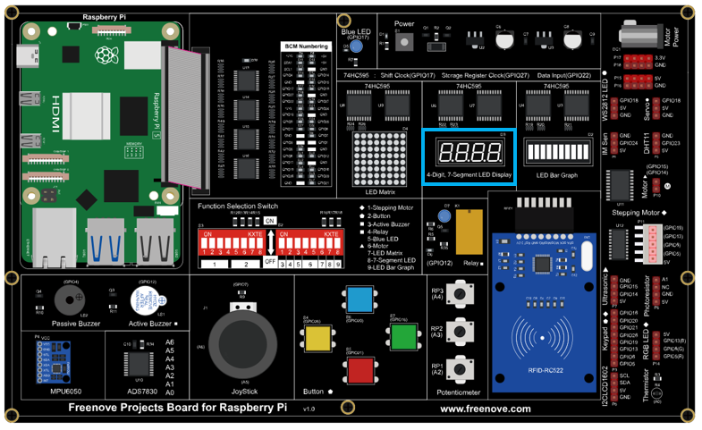
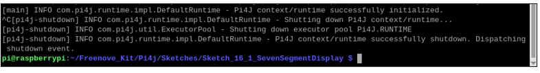
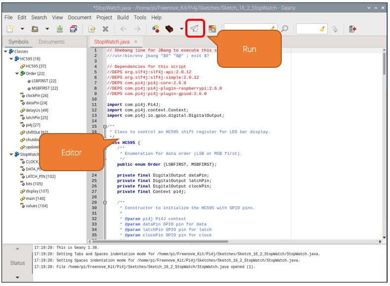

##############################################################################
Chapter 74HC595 & 4-Digit 7-Segment Display
##############################################################################

In this chapter, we will introduce the 7-Segment Display.

Project 16.1 4-Digit 7-Segment Display
****************************************************************

We will use a 74HC595 IC Chip to control a 4-Digit 7-Segment Display and make it display sixteen decimal characters "0” to “F".

Component List
================================================================

+---------------------------------------------+
| Freenove Projects Board for Raspberry Pi    |
|                                             |
|  |Chapter01_04|                             |
+---------------------+-----------------------+
| Raspberry Pi        | GPIO Ribbon Cable     |
|                     |                       |
|  |Chapter01_05|     |  |Chapter01_06|       |
+---------------------+-----------------------+
| 4-Digit 7-Segment Display                   |
|                                             |
|  |Chapter17_00|                             |                              
+---------------------------------------------+

.. |Chapter01_04| image:: ../_static/imgs/1_LED/Chapter01_04.png
.. |Chapter01_05| image:: ../_static/imgs/1_LED/Chapter01_05.png
.. |Chapter01_06| image:: ../_static/imgs/1_LED/Chapter01_06.png
.. |Chapter17_00| image:: ../_static/imgs/17_74HC595_&_4-Digit_7-Segment_Display/Chapter17_00.png

Component knowledge
================================================================

4 Digit 7-Segment Display
----------------------------------------------------------------

A 4 Digit 7-segment display integrates four 7-Segment Displays into one module, therefore it can display more characters. All of the LEDs contained have a Common Anode and individual Cathodes. Its internal structure and pin designation diagram is shown below:

.. image:: ../_static/imgs/17_74HC595_&_4-Digit_7-Segment_Display/Chapter17_00.png
    :align: center

The internal electronic circuit is shown below, and all 8 LED cathode pins of each 7-Segment Display are connected together.

.. image:: ../_static/imgs/17_74HC595_&_4-Digit_7-Segment_Display/Chapter17_01.png
    :align: center

Display method of 4 Digit 7-segment display is similar to 1 Digit 7-segment display. The difference between them is that the 4-Digit displays each Digit is visible in turn, one by one and not together. We need to first send high level to the common end of the first Digit Display, and send low level to the remaining three common ends, and then send content to 8 LED cathode pins of the first Digit Display. At this time, the first 7-Segment Display will show visible content and the remaining three will be OFF.

Similarly, the second, third and fourth 7-Segment Displays will show visible content in turn by scanning the display. Although the four number characters are displayed in turn separately, this process is so fast that it is unperceivable to the naked eye. This is due to the principle of optical afterglow effect and the vision persistence effect in human sight. This is how we can see all 4 number characters at the same time. However, if each number character is displayed for a longer period, you will be able to see that the number characters are displayed separately. 

Sketch
================================================================

In this project, we will use the expansion chip to drive a 4-digit 7-segment display.

Sketch_16_1_SevenSegmentDisplay
----------------------------------------------------------------

First, enter where the project is located:

.. code-block:: console

    $ cd ~/Freenove_Kit/Pi4j/Sketches/Sketch_16_1_SevenSegmentDisplay 

Enter the command to run the code.

.. code-block:: console

    $ jbang SevenSegmentDisplay.java 

When the code is running, you can see the contents displayed change every 500 milliseconds. The display contents are 0-F.

Press Ctrl+C to exit the program.

You can run the following command to open the code with Geany to view and edit it.

.. code-block:: console

    $ geany SevenSegmentDisplay.java

Click the icon to run the code.

If the code fails to run, please check Geany Configuration.

The following is program code:

.. literalinclude:: ../../../freenove_Kit/Pi4j/Sketches/Sketch_16_1_SevenSegmentDisplay/SevenSegmentDisplay.java
    :linenos: 
    :language: java

Define an array to control the display content of the digital tube.

.. literalinclude:: ../../../freenove_Kit/Pi4j/Sketches/Sketch_16_1_SevenSegmentDisplay/SevenSegmentDisplay.java
    :linenos: 
    :language: java
    :lines: 77-77

In the given circuit, the 74HC595 shift registers are used to control a digital tube display. The common anodes of the digital tube are controlled by the outputs Q3 to Q0 of chip U2, while the common cathodes are controlled by Q7 to Q0 of chip U1. To display '0000' on the digital tube, the following steps are necessary:

1. Set all the common anode pins (controlled by U2) to a high level to ensure they are all active.

2. Set the common cathode pins that correspond to the segments that need to be lit (segments for '0') to a low level, and those that need to be off to a high level.

3. Since the two 74HC595s are cascaded, the data for chip U2 (which controls the anodes) must be sent first, followed by the data for chip U1 (which controls the cathodes).

This sequence ensures that the digital tube will display '0000' with the correct segments illuminated.

.. literalinclude:: ../../../freenove_Kit/Pi4j/Sketches/Sketch_16_1_SevenSegmentDisplay/SevenSegmentDisplay.java
    :linenos: 
    :language: java
    :lines: 82-84

The digital tube displays from 0 to F in sequence, with a time interval of 500 milliseconds.

.. literalinclude:: ../../../freenove_Kit/Pi4j/Sketches/Sketch_16_1_SevenSegmentDisplay/SevenSegmentDisplay.java
    :linenos: 
    :language: java
    :lines: 79-88

Project 16.2 4-Digit 7-Segment Display
****************************************************************

Component List
================================================================

+---------------------------------------------+
| Freenove Projects Board for Raspberry Pi    |
|                                             |
|  |Chapter01_04|                             |
+---------------------+-----------------------+
| Raspberry Pi        | GPIO Ribbon Cable     |
|                     |                       |
|  |Chapter01_05|     |  |Chapter01_06|       |
+---------------------+-----------------------+
| 4-Digit 7-Segment Display                   |
|                                             |
|  |Chapter17_00|                             |                              
+---------------------------------------------+

Circuit
================================================================

The same as that of 17.1 

.. note::
    
    :red:`If you have any concerns, please send an email to:` support@freenove.com

Sketch
================================================================

In this project, we will use the expansion chip to drive the 4-digit digital tube to display different contents. 

Sketch_16_2_StopWatch
----------------------------------------------------------------

First, enter where the project is located:

.. code-block:: console

    $ cd ~/Freenove_Kit/Pi4j/Sketches/Sketch_16_2_StopWatch

Enter the command to run the code.

.. code-block:: console

    $ jbang StopWatch.java

When the code is running, you can see the digital tube displays numbers from 0000 to 9999, and the process repeats.

Press Ctrl+C to exit the program.

You can run the following command to open the code with Geany to view and edit it.

.. code-block:: console

    $ geany StopWatch.java

Click the icon to run the code.

If the code fails to run, please check :ref:`Geany Configuration<geany>`.

The following is program code:

.. literalinclude:: ../../../freenove_Kit/Pi4j/Sketches/Sketch_16_2_StopWatch/StopWatch.java
    :linenos: 
    :language: java

Define an array called 'values' to store the content displayed on the digital tube. Define an array called ‘bits’ to store the control bits for the common anode of the digital tube.

.. literalinclude:: ../../../freenove_Kit/Pi4j/Sketches/Sketch_16_2_StopWatch/StopWatch.java
    :linenos: 
    :language: java
    :lines: 70-71
    :dedent:

Extract the values for the thousands, hundreds, tens, and ones places from the 'dec' variable.

.. literalinclude:: ../../../freenove_Kit/Pi4j/Sketches/Sketch_16_2_StopWatch/StopWatch.java
    :linenos: 
    :language: java
    :lines: 74-77
    :dedent:

To display the number 1234 on a digital tube, we must first break down the number into its individual digits: 1, 2, 3, and 4. 

We then proceed to control the digital tube to show the digit 1 in the first position for 1 millisecond, followed by the digit 2 in the second position for another millisecond, and continue this pattern for digits 3 and 4. 

After displaying each digit sequentially, we repeat the entire sequence `times` times. Due to the rapid cycling through the digits, the human eye perceives a continuous display of the number 1234 on the digital tube.

.. literalinclude:: ../../../freenove_Kit/Pi4j/Sketches/Sketch_16_2_StopWatch/StopWatch.java
    :linenos: 
    :language: java
    :lines: 80-100
    :dedent:

Call the 'display' function to cycle through the display on the digital tube, showing numbers from 0000 to 9999. 

The time interval between two consecutive calls to 'display' is 100(times) * 4(bits) * 1ms = 400 milliseconds.

.. literalinclude:: ../../../freenove_Kit/Pi4j/Sketches/Sketch_16_2_StopWatch/StopWatch.java
    :linenos: 
    :language: java
    :lines: 111-115 
    :dedent: