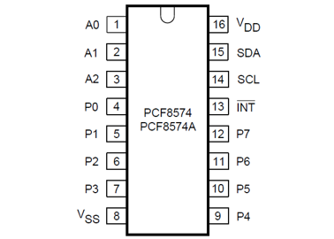
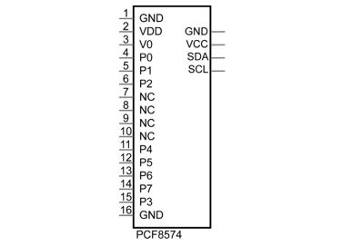
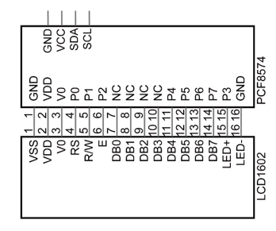
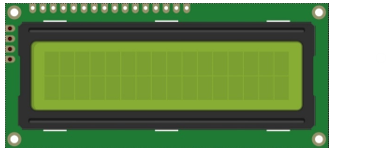

##############################################################################
Chapter LCD1602
##############################################################################

In this chapter, we will learn about the LCD1602 Display Screen,

Project 19.1 I2C LCD1602
****************************************************************

There are LCD1602 display screen and the I2C LCD. We will introduce both of them in this chapter. But what we use in this project is an I2C LCD1602 display screen. The LCD1602 Display Screen can display 2 lines of characters in 16 columns. It is capable of displaying numbers, letters, symbols, ASCII code and so on. As shown below is a monochrome LCD1602 Display Screen along with its circuit pin diagram

.. image:: ../_static/imgs/19_LCD1602/Chapter19_00.png
    :align: center

I2C LCD1602 Display Screen integrates a I2C interface, which connects the serial-input & parallel-output module to the LCD1602 Display Screen. This allows us to only use 4 lines to operate the LCD1602.

.. image:: ../_static/imgs/19_LCD1602/Chapter19_01.png
    :align: center

The serial-to-parallel IC chip used in this module is PCF8574T (PCF8574AT), and its default I2C address is 0x27(0x3F). You can also view the RPI bus on your I2C device address through command "i2cdetect -y 1" (refer to the "configuration I2C" section below). 

Below is the PCF8574 chip pin diagram and its module pin diagram:

.. list-table:: 
    :width: 100%
    :align: center
    :class: product-table
    :

    *   -  PCF8574 chip pin diagram:
        -  PCF8574 module pin diagram 

    *   -  |Chapter19_02|
        -  |Chapter19_03|

PCF8574 module pins and LCD1602 pins correspond to each other and are connected to each other:

Because of this, as stated earlier, we only need 4 pins to control the 16 pins of the LCD1602 Display Screen through the I2C interface.

In this project, we will use the I2C LCD1602 to display some static characters and dynamic variables.

Component List
================================================================

+------------------------------------------------+
| Freenove Projects Board for Raspberry Pi       |
|                                                |
|  |Chapter01_04|                                |
+---------------------+--------------------------+
| Raspberry Pi        | GPIO Ribbon Cable        |
|                     |                          |
|  |Chapter01_05|     |  |Chapter01_06|          |
+---------------------+--------------------------+
| Jumper Wire         | I2C LCD1602 Module       |
|                     |                          |
|  |Chapter05_02|     |  |Chapter19_05|          |
+---------------------+--------------------------+

.. |Chapter01_04| image:: ../_static/imgs/1_LED/Chapter01_04.png
.. |Chapter01_05| image:: ../_static/imgs/1_LED/Chapter01_05.png
.. |Chapter01_06| image:: ../_static/imgs/1_LED/Chapter01_06.png
.. |Chapter05_02| image:: ../_static/imgs/5_RGB_LED/Chapter05_02.png

Circuit
================================================================

.. note::
    
    the power supply for I2C LCD1602 in this circuit is 5V.

.. list-table:: 
    :width: 100%
    :align: center
    :class: product-table

    *   -   Schematic diagram
    *   -   |Chapter19_06|
    *   -   Hardware connection:
    *   -   |Chapter19_07|

.. |Chapter19_06| image:: ../_static/imgs/19_LCD1602/Chapter19_06.png
.. |Chapter19_07| image:: ../_static/imgs/19_LCD1602/Chapter19_07.png

.. note::
    
    :red:`If you have any concerns, please send an email to:` support@freenove.com

Sketch
================================================================

In this project, we will drive the LCD1602 display with I2C.

Sketch_18_I2CLCD1602
----------------------------------------------------------------

First, enter where the project is located:

.. code-block:: console

    $ cd ~/Freenove_Kit/Pi4j/Sketches/Sketch_18_I2CLCD1602

.. image:: ../_static/imgs/19_LCD1602/Chapter19_08.png
    :align: center

Enter the command to run the code.

.. code-block:: console

    $ jbang I2CLCD1602.java

When the code is running, you can see the first line of the display shows “Hello World”, and the second line displays the running time in second.

Press Ctrl+C to exit the program.

You can run the following command to open the code with Geany to view and edit it.

.. code-block:: console

    $ geany I2CLCD1602.java

Click the icon to run the code.

If the code fails to run, please check Geany Configuration.

The following is program code:

.. literalinclude:: ../../../freenove_Kit/Pi4j/Sketches/Sketch_18_I2CLCD1602/I2CLCD1602.java
    :linenos: 
    :language: java
    :dedent:

Constructor, assigns the I2C bus to bus, and calls the constructor function to initialize the I2C bus.

.. literalinclude:: ../../../freenove_Kit/Pi4j/Sketches/Sketch_18_I2CLCD1602/I2CLCD1602.java
    :linenos: 
    :language: java
    :lines: 40-53
    :dedent:

I2C constructor, initialize the I2C bus.

.. literalinclude:: ../../../freenove_Kit/Pi4j/Sketches/Sketch_18_I2CLCD1602/I2CLCD1602.java
    :linenos: 
    :language: java
    :lines: 55-59
    :dedent:

I2C bus acquisition function. Calling the list() function can obtain the names of all I2C buses currently existing on the Raspberry Pi.

.. literalinclude:: ../../../freenove_Kit/Pi4j/Sketches/Sketch_18_I2CLCD1602/I2CLCD1602.java
    :linenos: 
    :language: java
    :lines: 87-101
    :dedent:

Use the pi4j library to repackage the I2C functions. These functions refer to the classic usage of Arduino. This is to be compatible with the subsequent PCF8574 class and Freenove_LCD1602 class, making it easier to drive LCD1602.

.. literalinclude:: ../../../freenove_Kit/Pi4j/Sketches/Sketch_18_I2CLCD1602/I2CLCD1602.java
    :linenos: 
    :language: java
    :lines: 61-85
    :dedent:

The following are the two classes we wrote for LCD1602 in reference to Arduino. Here, we do not go into too much detail here. If you are interested in this code, you can use Geany to view the code.

.. code-block:: python

    class PCF8574 {
      ......
    }

    class Freenove_LCD1602 {
      ......
    }

Initialize PCF8574 and Freenove_LCD1602 classes, and assign the value to LCD.

.. literalinclude:: ../../../freenove_Kit/Pi4j/Sketches/Sketch_18_I2CLCD1602/I2CLCD1602.java
    :linenos: 
    :language: java
    :lines: 376-378
    :dedent:

At the first lin of LCD1602, print the character “Hello World”.

.. literalinclude:: ../../../freenove_Kit/Pi4j/Sketches/Sketch_18_I2CLCD1602/I2CLCD1602.java
    :linenos: 
    :language: java
    :lines: 382-389
    :dedent:

In Java, an `InterruptedException` is thrown when a thread's waiting, sleeping (e.g., using 'Thread.sleep()'), or other blocking operations are interrupted. When a thread is interrupted, its interrupted status is set to true, and any of these blocking operations will result in an 'InterruptedException' being thrown.

When 'InterruptedException' is capured, 'Thread.currentThread().interrupt()' is called keep the interrupt status, so that the thread can respond to the interruption request appropriately.

.. literalinclude:: ../../../freenove_Kit/Pi4j/Sketches/Sketch_18_I2CLCD1602/I2CLCD1602.java
    :linenos: 
    :language: java
    :lines: 390-392
    :dedent: