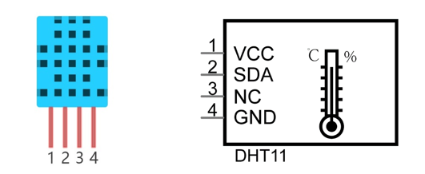
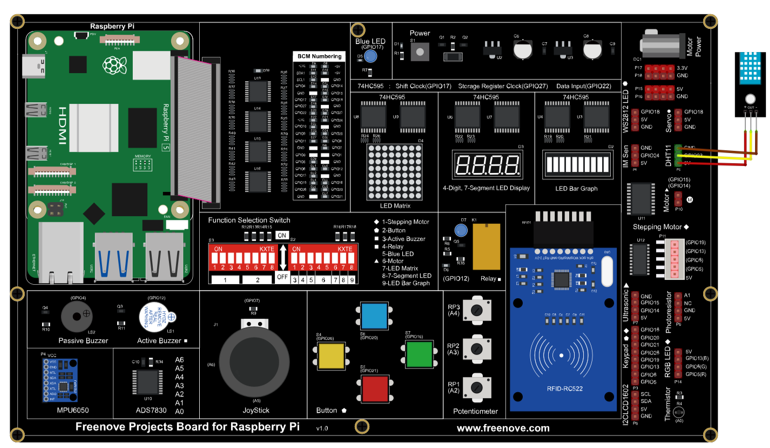

##############################################################################
Chapter Hygrothermograph DHT11
##############################################################################

In this chapter, we will learn about a commonly used sensor called a Hygrothermograph DHT11.

Project 19.1 Hygrothermograph
****************************************************************

Hygrothermograph is an important tool in our lives to give us data on the temperature and humidity in our environment. In this project, we will use the RPi to read Temperature and Humidity data of the DHT11 Module.

Component knowledge
================================================================

The Temperature & Humidity Sensor DHT11 is a compound temperature & humidity sensor, and the output digital signal has been calibrated by its manufacturer.

After being powered up, it will initialize in 1 second. Its operating voltage is within the range of 3.3V-5.5V.

The SDA pin is a data pin, which is used to communicate with other devices. 

The NC pin (Not Connected Pin) is a type of pin found on various integrated circuit packages. Such pin has no functional purpose to the outside circuit (but may have an unknown functionality during manufacture and test). It should not be connected to any of the circuit connections.

Component List
================================================================

+------------------------------------------------+
| Freenove Projects Board for Raspberry Pi       |
|                                                |
|  |Chapter01_04|                                |
+---------------------+--------------------------+
| Raspberry Pi        | GPIO Ribbon Cable        |
|                     |                          |
|  |Chapter01_05|     |  |Chapter01_06|          |
+---------------------+--------------------------+
| Jumper Wire         | DHT11 Module             |
|                     |                          |
|  |Chapter05_02|     |  |Chapter20_01|          |
+---------------------+--------------------------+

.. |Chapter01_04| image:: ../_static/imgs/1_LED/Chapter01_04.png
.. |Chapter01_05| image:: ../_static/imgs/1_LED/Chapter01_05.png
.. |Chapter01_06| image:: ../_static/imgs/1_LED/Chapter01_06.png
.. |Chapter05_02| image:: ../_static/imgs/5_RGB_LED/Chapter05_02.png
.. |Chapter20_01| image:: ../_static/imgs/20_Hygrothermograph_DHT11/Chapter20_01.png

Circuit
================================================================

.. list-table:: 
    :width: 100%
    :align: center
    :class: product-table

    *   -   Schematic diagram
    *   -   |Chapter20_02|
    *   -   Hardware connection:
    *   -   |Chapter20_03|

.. |Chapter20_02| image:: ../_static/imgs/20_Hygrothermograph_DHT11/Chapter20_02.png

.. note::
    
    :red:`If you have any concerns, please send an email to:` support@freenove.com

Sketch
================================================================

The Raspberry Pi can directly obtain data from the DHT11 sensor through system configuration. Before running the code, it is necessary to configure the Raspberry Pi first.

Configure the config.txt file

Run the command to open the config.txt file.

.. code-block:: console

    $ sudo nano /boot/firmware/config.txt

Add the following line to the end of the file.

.. code-block:: console

    dtoverlay=dht11,gpiopin=23

Press Ctrl+x, y, enter to save and exit the file. And then reboot your Raspberry Pi.

Sketch_19_DHT11
----------------------------------------------------------------

First, enter where the project is located:

.. code-block:: console

    $ cd ~/Freenove_Kit/Pi4j/Sketches/Sketch_19_DHT11

Enter the command to run the code.

.. code-block:: console

    $ jbang DHT11.java

When the code is running, the Raspberry Pi will continuously obtain the temperature and humidity data of DHT11 through GPIO23 and print it out. 

Please note that DHT11 is a less sensitive sensor, and sometimes it takes a long time to obtain data, so please be patient.

Press Ctrl+C to exit the program.

You can run the following command to open the code with Geany to view and edit it.

.. code-block:: console

    $ geany DHT11.java

Click the icon to run the code.

If the code fails to run, please check :ref:`Geany Configuration<geany>`.

The following is program code:

.. literalinclude:: ../../../freenove_Kit/Pi4j/Sketches/Sketch_19_DHT11/DHT11.java
    :linenos: 
    :language: java
    :dedent:

Defines the file storage path for temperature and humidity data.

.. literalinclude:: ../../../freenove_Kit/Pi4j/Sketches/Sketch_19_DHT11/DHT11.java
    :linenos: 
    :language: java
    :dedent:

Below are the functions for getting temperature and humidity. The raw data read by the Raspberry Pi from the file needs to be converted to 0.001 times the original value.

.. literalinclude:: ../../../freenove_Kit/Pi4j/Sketches/Sketch_19_DHT11/DHT11.java
    :linenos: 
    :language: java
    :lines: 8-19
    :dedent:

The method to read the contents of a file, loop through each line in the file, and append it to ‘content’.

.. literalinclude:: ../../../freenove_Kit/Pi4j/Sketches/Sketch_19_DHT11/DHT11.java
    :linenos: 
    :language: java
    :lines: 21-30
    :dedent:

Create an instance of the DHT11 class, read the temperature and humidity data every 2 seconds, and print it out if the data is normal; if the data is not normal, do not print it. and retrieve the next temperature and humidity data instead.

.. literalinclude:: ../../../freenove_Kit/Pi4j/Sketches/Sketch_19_DHT11/DHT11.java
    :linenos: 
    :language: java
    :lines: 33-51
    :dedent:

Please note that after you finish studying this chapter, you should comment out the line related to DHT11 in the ‘config.txt’ file to avoid errors when Raspberry Pi uses GPIO23 in subsequent chapters.

Run the command to open the config.txt file.

.. code-block:: console

    $ sudo nano /boot/firmware/config.txt

Add the “#” in front of the line.

.. code-block:: console

    #dtoverlay=dht11,gpiopin=23

Save the file and reboot your Raspberry Pi.