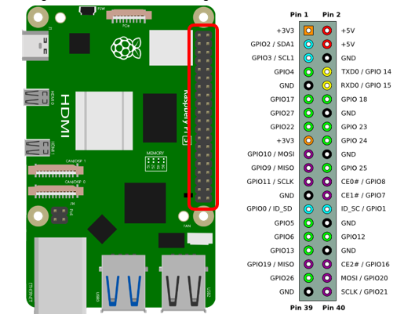
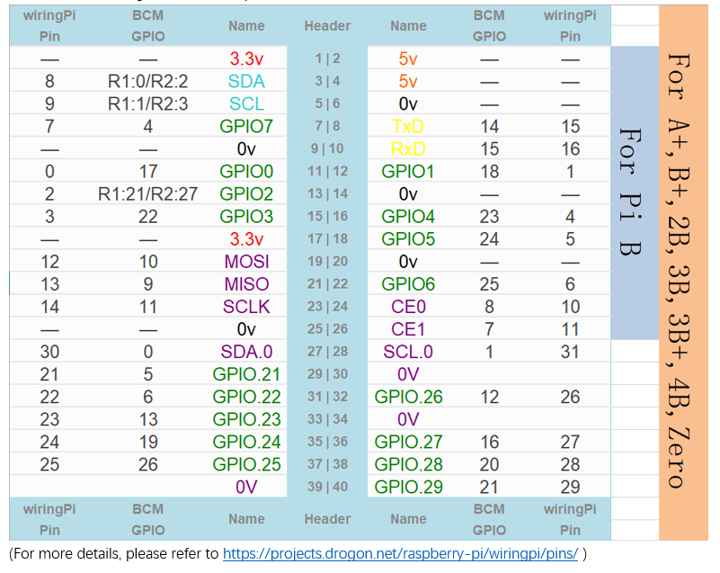
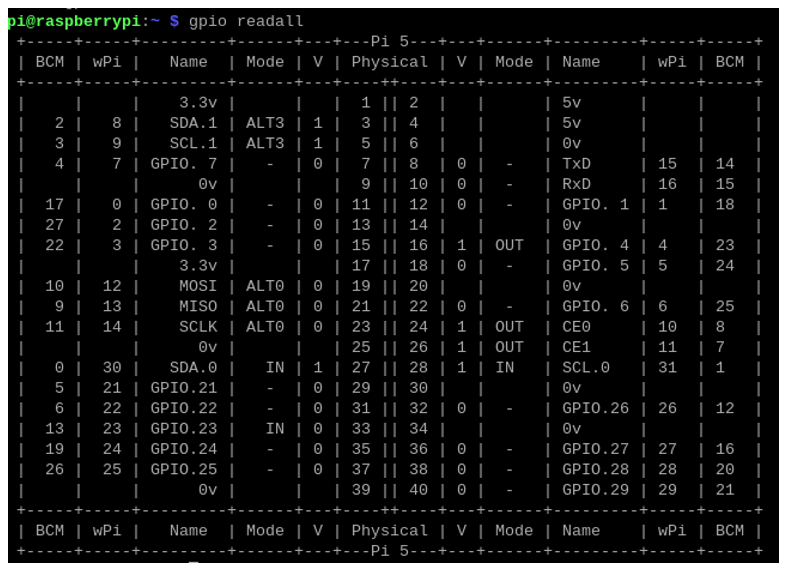
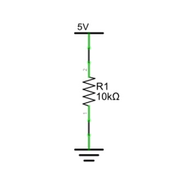

##############################################################################
Chapter LED
##############################################################################

This chapter is the Start Point in the journey to build and explore RPi electronic projects. We will start with simple “Blink” project.

Project Blink
****************************************************************

In this project, we will use RPi to control blinking a common LED.

GPIO
================================================================

GPIO: General Purpose Input/Output. Here we will introduce the specific function of the pins on the Raspberry Pi and how you can utilize them in all sorts of ways in your projects. Most RPi Module pins can be used as either an input or output, depending on your program and its functions.

When programming GPIO pins, there are 3 different ways to reference them: GPIO Numbering, Physical Numbering and WiringPi GPIO Numbering.

BCM GPIO Numbering
----------------------------------------------------------------

The Raspberry Pi CPU uses Broadcom (BCM) processing chips BCM2835, BCM2836 or BCM2837. GPIO pin numbers are assigned by the processing chip manufacturer and are how the computer recognizes each pin. The pin numbers themselves do not make sense or have meaning as they are only a form of identification. Since their numeric values and physical locations have no specific order, there is no way to remember them, so you will need to have a printed reference or a reference board that fits over the pins.

Each pin's functional assignment is defined in the image below:

For more details about pin definition of GPIO, please refer to http://pinout.xyz/

PHYSICAL Numbering
----------------------------------------------------------------

Another way to refer to the pins is by simply counting across and down from pin 1 at the top left (nearest to the SD card). This is 'Physical Numbering', as shown below:

.. image:: ../_static/imgs/1_LED/Chapter01_01.png
    :align: center

WiringPi GPIO Numbering
----------------------------------------------------------------

Different from the previous two types of GPIO serial numbers, RPi GPIO serial number of the WiringPi are numbered according to the BCM chip used in RPi.

You can also use the following command to view their correlation.

.. code-block:: console
    
    $ gpio readall

For more details about wiringPi, please refer to https://github.com/WiringPi/WiringPi .

Component List
================================================================

+------------------------------------------+
| Freenove Projects Board for Raspberry Pi |
|                                          |
|  |Chapter01_04|                          |
+---------------------+--------------------+
| Raspberry Pi        | GPIO Ribbon Cable  |
|                     |                    |
|  |Chapter01_05|     |  |Chapter01_06|    |
+---------------------+--------------------+

.. |Chapter01_04| image:: ../_static/imgs/1_LED/Chapter01_04.png
.. |Chapter01_05| image:: ../_static/imgs/1_LED/Chapter01_05.png
.. |Chapter01_06| image:: ../_static/imgs/1_LED/Chapter01_06.png

Circuit
================================================================

.. list-table:: 
    :width: 100%
    :align: center
    :class: product-table

    *   -   Schematic diagram
    *   -   |Chapter01_07|
    *   -   Hardware connection:

            Turn ON the power switch and NO.5 toggle switch. 

            Power switch should be turned ON in all the projects.
    *   -   |Chapter01_08|

.. |Chapter01_07| image:: ../_static/imgs/1_LED/Chapter01_07.png
.. |Chapter01_08| image:: ../_static/imgs/1_LED/Chapter01_08.png

.. note::
    
    :red:`If you have any concerns, please send an email to:` support@freenove.com

Component knowledge
================================================================

LED
----------------------------------------------------------------

An LED is a type of diode. All diodes have two Poles and only work if current is flowing in the correct direction. An LED will only work (light up) if the longer pin (+) of LED is connected to the positive output from a power source and the shorter pin is connected to the negative (-) output, which is also referred to as Ground (GND). This type of component is known as “Polar” (think One-Way Street).

All common 2 lead diodes are the same in this respect. Diodes work only if the voltage of its positive electrode is higher than its negative electrode and there is a narrow range of operating voltage for most all common diodes of 1.9 and 3.4V. If you use much more than 3.3V the LED will be damaged and burnt out.

.. image:: ../_static/imgs/1_LED/Chapter01_09.png
    :align: center

.. note:: 
    
    LEDs cannot be directly connected to a power supply, which usually ends in a damaged component. A resistor with a specified resistance value must be connected in series to the LED you plan to use.

Resistor
----------------------------------------------------------------

Resistors use Ohms (Ω) as the unit of measurement of their resistance (R). 1MΩ=1000kΩ, 1kΩ=1000Ω.

A resistor is a passive electrical component that limits or regulates the flow of current in an electronic circuit.

On the left, we see a physical representation of a resistor, and the right is the symbol used to represent the presence of a resistor in a circuit diagram or schematic.

.. image:: ../_static/imgs/1_LED/Chapter01_10.png
    :align: center

The bands of color on a resistor is a shorthand code used to identify its resistance value. For more details of resistor color codes, please refer to the card in the kit package.

With a fixed voltage, there will be less current output with greater resistance added to the circuit. The relationship between Current, Voltage and Resistance can be expressed by this formula: I=V/R known as Ohm’s Law where I = Current, V = Voltage and R = Resistance. Knowing the values of any two of these allows you to solve the value of the third.

In the following diagram, the current through R1 is: I=U/R=5V/10kΩ=0.0005A=0.5mA.

.. warning::
    
    Never connect the two poles of a power supply with anything of low resistance value (i.e. a metal object or bare wire). This is a Short and results in high current that may damage the power supply and electronic components.

.. note::
    
    Unlike LEDs and Diodes, Resistors have no poles and re non-polar (it does not matter which direction you insert them into a circuit, it will work the same)

Sketch
================================================================

According to the circuit, when the GPIO17 of Raspberry Pi output level is high, the LED turns ON. Conversely, when the GPIO17 Raspberry Pi output level is low, the LED turns OFF. Therefore, we can let GPIO17 cycle output high and output low level to make the LED blink.

Sketch_01_Blink
----------------------------------------------------------------

First, enter where the project is located:

.. code-block:: console
    
    $ cd ~/Freenove_Kit/Pi4j/Sketches/Sketch_01_Blink

Enter the command to run the code.

.. code-block:: console
    
    $ jbang Blink.java

Upon the code runs, you can see the onboard blue LED blinks.

And on Raspberry Pi Terminal, you can see the corresponding messages printed.

 
Press CTRL-C to exit the program.

If you want to view or modify the code, you can open the code with Geany with the following command.

.. code-block:: console
    
    $ geany Blink.java

Click the icon to run the code.

If the code fails to run, please check Geany Configuration.

The following is program code:

.. literalinclude:: ../../../freenove_Kit/Pi4j/Sketches/Sketch_01_Blink/Blink.java
    :linenos: 
    :language: java

At the beginning of the code, we use shebang command to inform Raspberry Pi that we are going to use JBangto run Java script.

.. literalinclude:: ../../../freenove_Kit/Pi4j/Sketches/Sketch_01_Blink/Blink.java
    :linenos: 
    :language: java
    :lines: 1-1

Likewise, we specify the dependencies required for the script to run. This includes the different components of the SLF4J logging library and the Pi4J library and their version numbers.

.. literalinclude:: ../../../freenove_Kit/Pi4j/Sketches/Sketch_01_Blink/Blink.java
    :linenos: 
    :language: java
    :lines: 3-7

Import Pi4J library and the Console class to facilitate creating and managing contexts and printing messages on the console.

.. literalinclude:: ../../../freenove_Kit/Pi4j/Sketches/Sketch_01_Blink/Blink.java
    :linenos: 
    :language: java
    :lines: 9-10

Assign the GPIO pin to the LED, and configure it as output mode.

.. literalinclude:: ../../../freenove_Kit/Pi4j/Sketches/Sketch_01_Blink/Blink.java
    :linenos: 
    :language: java
    :lines: 13-18

Use the try…finally structure to ensure the smooth running of the code.

.. code-block:: java
    
    try{
                
    }
    finally{
            
    }

Make the LED turn on and off once every 1 second, repeat this process, and print prompt messages.

.. literalinclude:: ../../../freenove_Kit/Pi4j/Sketches/Sketch_01_Blink/Blink.java
    :linenos: 
    :language: java
    :lines: 21-28

