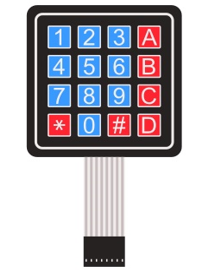

##############################################################################
Chapter Matrix Keypad
##############################################################################

Earlier we learned about a single Push Button Switch. In this chapter, we will learn about Matrix Keyboards, which integrates a number of Push Button Switches as Keys for the purposes of Input.

Project 20 Matrix Keypad
****************************************************************

In this project, we will attempt to get every key code on the Matrix Keypad to work.

Component knowledge
================================================================

4x4 Matrix Keypad
----------------------------------------------------------------

A Keypad Matrix is a device that integrates a number of keys in one package. As is shown below, a 4x4 Keypad Matrix integrates 16 keys (think of this as 16 Push Button Switches in one module):

.. image:: ../_static/imgs/21_Matrix_Keypad/Chapter21_00.png
    :align: center

Similar to the integration of an LED Matrix, the 4x4 Keypad Matrix has each row of keys connected with one pin and this is the same for the columns. Such efficient connections reduce the number of processor ports required. The internal circuit of the Keypad Matrix is shown below.

.. image:: ../_static/imgs/21_Matrix_Keypad/Chapter21_01.png
    :align: center

The method of usage is similar to the Matrix LED, by using a row or column scanning method to detect the state of each key’s position by column and row. Take column scanning method as an example, send low level to the first 1 column (Pin1), detect level state of rows 5, 6, 7, 8 to judge whether the keys A, B, C, D are pressed. Then send low level to columns 2, 3, 4 in turn to detect whether other keys are pressed. Therefore, you can get the state of all of the keys.

Component List
================================================================

+---------------------------------------------+
| Freenove Projects Board for Raspberry Pi    |
|                                             |
|  |Chapter01_04|                             |
+---------------------+-----------------------+
| Raspberry Pi        | GPIO Ribbon Cable     |
|                     |                       |
|  |Chapter01_05|     |  |Chapter01_06|       |
+---------------------+-----------------------+
| 4x4 Matrix Keypad                           |
|                                             |
|  |Chapter21_02|                             |                              
+---------------------------------------------+

.. |Chapter01_04| image:: ../_static/imgs/1_LED/Chapter01_04.png
.. |Chapter01_05| image:: ../_static/imgs/1_LED/Chapter01_05.png
.. |Chapter01_06| image:: ../_static/imgs/1_LED/Chapter01_06.png

Circuit
================================================================

.. list-table:: 
    :width: 100%
    :align: center
    :class: product-table

    *   -   Schematic diagram
    *   -   |Chapter21_03|
    *   -   Hardware connection:
    *   -   |Chapter21_04|

.. |Chapter21_03| image:: ../_static/imgs/20_Hygrothermograph_DHT11/Chapter21_03.png
.. |Chapter21_04| image:: ../_static/imgs/20_Hygrothermograph_DHT11/Chapter21_04.png

.. note::
    
    :red:`If you have any concerns, please send an email to:` support@freenove.com

Sketch
================================================================

In this chapter, we will learn to use a martrix keypad.

Sketch_20_MatrixKeypad
----------------------------------------------------------------

First, enter where the project is located:

.. code-block:: console

    $ cd ~/Freenove_Kit/Pi4j/Sketches/Sketch_20_MatrixKeypad

 
Enter the command to run the code.

.. code-block:: console

    $ jbang MatrixKeypad.java

 
When the code is running, press any key on the keypad and the corresponding value will be printed on the terminal.

Press Ctrl+C to exit the program.

You can run the following command to open the code with Geany to view and edit it.

.. code-block:: console

    $ geany MatrixKeypad.java

Click the icon to run the code.

If the code fails to run, please check :ref:`Geany Configuration<geany>`.

The following is program code:

.. literalinclude:: ../../../freenove_Kit/Pi4j/Sketches/Sketch_20_MatrixKeypad/MatrixKeypad.java
    :linenos: 
    :language: java
    :dedent:

Re-encapsulate the GPIO functions using the Pi4J library, with these functions referring to the classic usage of Arduino. This is done to ensure compatibility with the later Key class and Keypad class, making matrix buttons easier to use. If you are interested in this code, please review it, as we will include detailed comments within the code.

.. code-block:: c

    class GPIO {
        ......
    }

    //class Key:Define some of the properties of Key
    class Key {
        ......
    }

    class Keypad {
        ......
    }

Define the key values corresponding to the matrix keyboard.

.. literalinclude:: ../../../freenove_Kit/Pi4j/Sketches/Sketch_20_MatrixKeypad/MatrixKeypad.java
    :linenos: 
    :language: java
    :lines: 413-418
    :dedent:

Define pin numbers for the row and column the matrix keyboard.

.. literalinclude:: ../../../freenove_Kit/Pi4j/Sketches/Sketch_20_MatrixKeypad/MatrixKeypad.java
    :linenos: 
    :language: java
    :lines: 420-423
    :dedent:

Add a shutdown hook to ensure the Pi4J context is closed properly.

.. literalinclude:: ../../../freenove_Kit/Pi4j/Sketches/Sketch_20_MatrixKeypad/MatrixKeypad.java
    :linenos: 
    :language: java
    :lines: 439-444
    :dedent:

The key value is read from the matrix keyboard every 10 milliseconds. If the key value is not detected as empty, it is printed on the terminal interface.

.. literalinclude:: ../../../freenove_Kit/Pi4j/Sketches/Sketch_20_MatrixKeypad/MatrixKeypad.java
    :linenos: 
    :language: java
    :lines: 448-457
    :dedent: