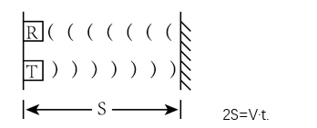
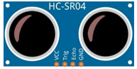
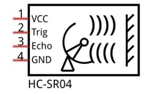
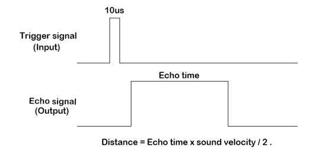
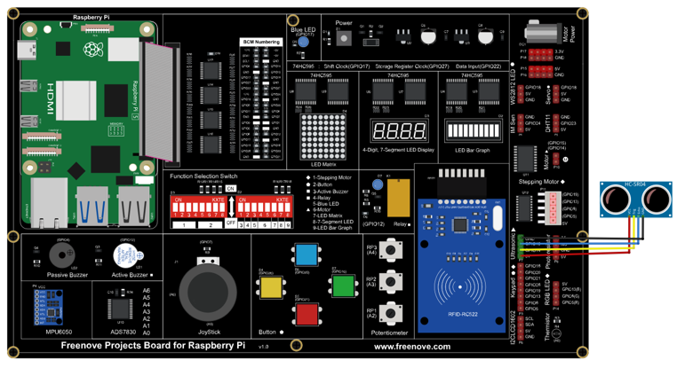
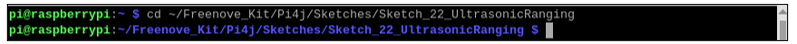
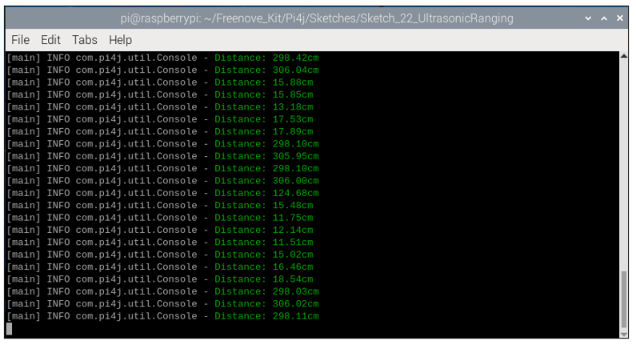
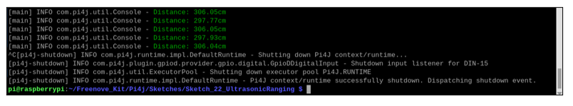
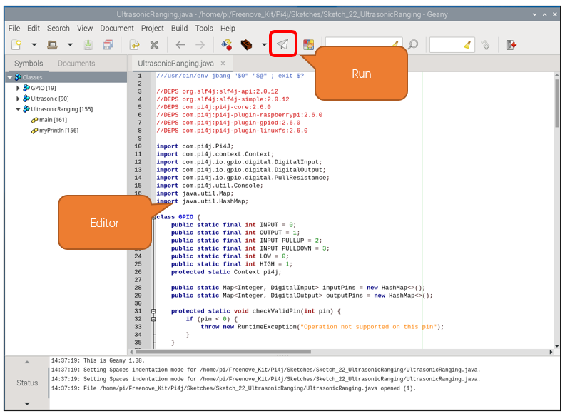

##############################################################################
Chapter Ultrasonic Ranging
##############################################################################

In this chapter, we learn a module which use ultrasonic to measure distance, HC SR04.

Project 22.1 Ultrasonic Ranging
****************************************************************

In this project, we use ultrasonic ranging module to measure distance, and print out the data in the terminal.

Component Knowledge
================================================================

The Ultrasonic Ranging Module uses the principle that ultrasonic waves will be reflected when they encounter any obstacles. This is possible by counting the time interval between when the ultrasonic wave is transmitted to when the ultrasonic wave reflects back after encountering an obstacle. Time interval counting will end after an ultrasonic wave is received, and the time difference (delta) is the total time of the ultrasonic wave’s journey from being transmitted to being received. Because the speed of sound in air is a constant, and is about v=340m/s, we can calculate the distance between the Ultrasonic Ranging Module and the obstacle: s=vt/2.

The HC-SR04 Ultrasonic Ranging Module integrates both an ultrasonic transmitter and a receiver. The transmitter is used to convert electrical signals (electrical energy) into high frequency (beyond human hearing) sound waves (mechanical energy) and the function of the receiver is opposite of this. The picture and the diagram of the HC SR04 Ultrasonic Ranging Module are shown below:

.. list-table:: 
    :width: 70%
    :align: center
    :class: product-table
    
    *   -   |Chapter23_01|
        -   |Chapter23_02|

Pin description:

.. list-table:: 
    :width: 70%
    :align: center
    :class: product-table
    
    *   -   VCC
        -   power supply pin

    *   -   Trig
        -   trigger pin

    *   -   Echo
        -   Echo pin

    *   -   GND
        -   GND

**Technical specs:**

Working voltage: 5V

Working current: 12mA

Minimum measured distance: 2cm

Maximum measured distance: 200cm

Instructions for Use: output a high-level pulse in Trig pin lasting for least 10uS, the module begins to transmit ultrasonic waves. At the same time, the Echo pin is pulled up. When the module receives the returned ultrasonic waves from encountering an obstacle, the Echo pin will be pulled down. The duration of high level in the Echo pin is the total time of the ultrasonic wave from transmitting to receiving, s=vt/2. This is done constantly.

Component List
================================================================

+------------------------------------------------+
| Freenove Projects Board for Raspberry Pi       |
|                                                |
|  |Chapter01_04|                                |
+---------------------+--------------------------+
| Raspberry Pi        | GPIO Ribbon Cable        |
|                     |                          |
|  |Chapter01_05|     |  |Chapter01_06|          |
+---------------------+--------------------------+
| Jumper Wire         | HC SR501                 |
|                     |                          |
|  |Chapter05_02|     |  |Chapter23_01|          |
+---------------------+--------------------------+

.. |Chapter01_04| image:: ../_static/imgs/1_LED/Chapter01_04.png
.. |Chapter01_05| image:: ../_static/imgs/1_LED/Chapter01_05.png
.. |Chapter01_06| image:: ../_static/imgs/1_LED/Chapter01_06.png
.. |Chapter05_02| image:: ../_static/imgs/5_RGB_LED/Chapter05_02.png

Circuit
================================================================

.. list-table:: 
    :width: 100%
    :align: center
    :class: product-table

    *   -   Schematic diagram
    *   -   |Chapter23_04|
    *   -   Hardware connection:
    *   -   After running the program, hold an object in front of the sensor and change their distance.
            
            |Chapter23_05|

.. note::
    
    :red:`If you have any concerns, please send an email to:` support@freenove.com

Sketch
================================================================

In this chapter, we will learn the usage of the ultrasonic sensor.

Sketch_22_UltrasonicRanging
----------------------------------------------------------------

First, enter where the project is located:

.. code-block:: console

    $ cd ~/Freenove_Kit/Pi4j/Sketches/Sketch_22_UltrasonicRanging

Enter the command to run the code.

.. code-block:: console

    $ jbang UltrasonicRanging.java

After running the code, the Raspberry Pi will continue to obtain the distance values of the ultrasonic module and print them on the terminal interface.

Press Ctrl+C to exit the program.

You can run the following command to open the code with Geany to view and edit it.

.. code-block:: console

    $ geany UltrasonicRanging.java

Click the icon to run the code.

If the code fails to run, please check :ref:`Geany Configuration<geany>`.

The following is program code:

.. literalinclude:: ../../../freenove_Kit/Pi4j/Sketches/Sketch_22_UltrasonicRanging/UltrasonicRanging.java
    :linenos: 
    :language: java
    :dedent:

Re-encapsulate the GPIO functions using the Pi4J library, with these functions emulating the classic usage patterns of Arduino. This is done to ensure compatibility with the upcoming Ultrasonic class, allowing the Raspberry Pi to easily obtain distance data from ultrasonic modules. If you are interested in this code, please review it, as we will include detailed comments within the code.

.. code-block:: c

    class GPIO {  
        ......
    }  
    
    class Ultrasonic {  
        ......
    }  

Initialize the Pi4J context and assign it to GPIO.pi4.

Initialize the Ultrasonic class and associate it with GPIO14 and GPIO15.

.. literalinclude:: ../../../freenove_Kit/Pi4j/Sketches/Sketch_22_UltrasonicRanging/UltrasonicRanging.java
    :linenos: 
    :language: java
    :lines: 179-181
    :dedent:

Obtain the ultrasonic distance data every 100 milliseconds and display them on the terminal interface.

.. literalinclude:: ../../../freenove_Kit/Pi4j/Sketches/Sketch_22_UltrasonicRanging/UltrasonicRanging.java
    :linenos: 
    :language: java
    :lines: 183-191
    :dedent:

At the end of the code, release the resources.

.. literalinclude:: ../../../freenove_Kit/Pi4j/Sketches/Sketch_22_UltrasonicRanging/UltrasonicRanging.java
    :linenos: 
    :language: java
    :lines: 194-199
    :dedent: