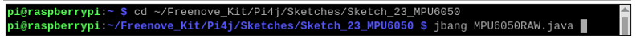
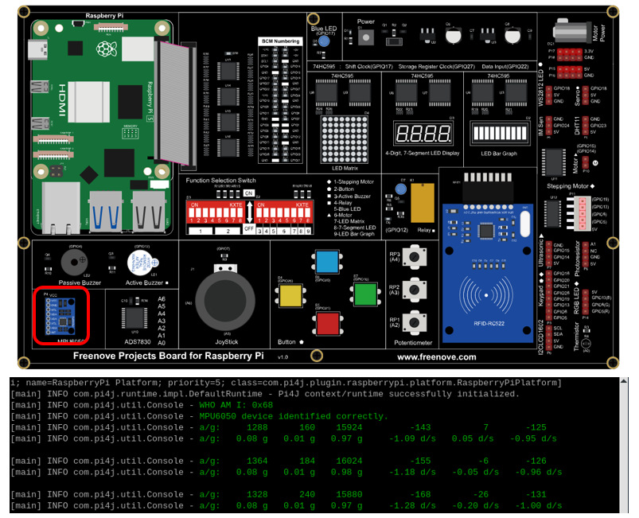
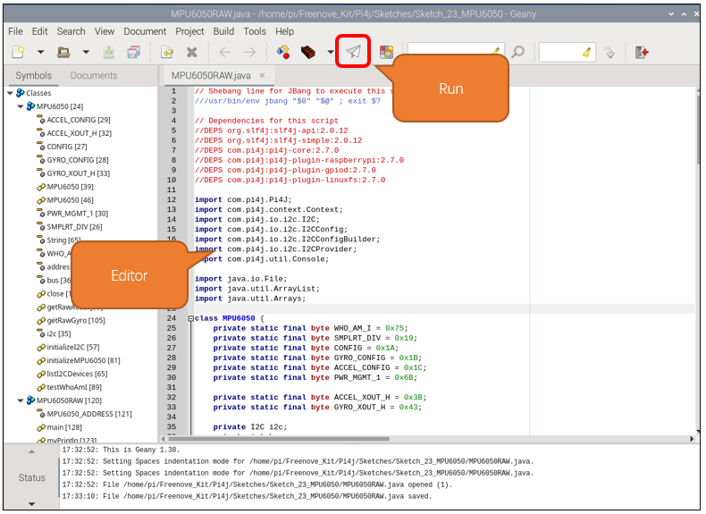

##############################################################################
Chapter Attitude Sensor MPU6050
##############################################################################

In this chapter, we will learn about a MPU6050 Attitude sensor, which integrates an Accelerometer and Gyroscope.

Project 23.1 Read an MPU6050 Sensor Module
****************************************************************

In this project, we will read Acceleration and Gyroscope Data of the MPU6050 Sensor.

Component knowledge
================================================================

MPU6050
----------------------------------------------------------------

MPU6050 Sensor Module is a complete 6-axis Motion Tracking Device. It combines a 3-axis Gyroscope, a 3-axis Accelerometer and a DMP (Digital Motion Processor) all in a small package. The settings of the Accelerometer and Gyroscope of MPU6050 can be changed. A precision wide range digital temperature sensor is also integrated to compensate data readings for changes in temperature, and temperature values can also be read. The MPU6050 Module follows the I2C communication protocol and the default address is 0x68.

.. image:: ../_static/imgs/24_Attitude_Sensor_MPU6050/Chapter24_00.png
    :align: center

The port description of the MPU6050 Module is as follows:

.. list-table:: 
    :width: 100%
    :align: center
    :class: product-table
    
    
    *   -   Pin name
        -   Pin number
        -   Description

    *   -   VCC
        -   1
        -   Positive pole of power supply with voltage 5V

    *   -   GND
        -   2
        -   Negative pole of power supply 

    *   -   SCL
        -   3
        -   I2C communication clock pin

    *   -   SDA
        -   4
        -   I2C communication data pin

    *   -   XDA
        -   5
        -   I2C host data pin which can be connected to other devices.

    *   -   XCL
        -   6
        -   I2C host clock pin which can be connected to other devices.

    *   -   AD0
        -   7
        -   I2C address bit control pin.

            Low level: the device address is 0x68
            
            High level: the device address is 0x69

    *   -   INT
        -   8
        -   Output interrupt pin

For more detail, please refer to the MPU6050 datasheet.

Component List
================================================================

+------------------------------------------+
| Freenove Projects Board for Raspberry Pi |
|                                          |
|  |Chapter01_04|                          |
+---------------------+--------------------+
| Raspberry Pi        | GPIO Ribbon Cable  |
|                     |                    |
|  |Chapter01_05|     |  |Chapter01_06|    |
+---------------------+--------------------+

.. |Chapter01_04| image:: ../_static/imgs/1_LED/Chapter01_04.png
.. |Chapter01_05| image:: ../_static/imgs/1_LED/Chapter01_05.png
.. |Chapter01_06| image:: ../_static/imgs/1_LED/Chapter01_06.png

Circuit
================================================================

.. list-table:: 
    :width: 100%
    :align: center
    :class: product-table

    *   -   Schematic diagram
    *   -   |Chapter24_01|
    *   -   Hardware connection:
    *   -   After running the program, hold an object in front of the sensor and change their distance.
            
            |Chapter24_02|

.. |Chapter24_01| image:: ../_static/imgs/24_Attitude_Sensor_MPU6050/Chapter24_01.png
.. |Chapter24_02| image:: ../_static/imgs/24_Attitude_Sensor_MPU6050/Chapter24_02.png

.. note::
    
    :red:`If you have any concerns, please send an email to:` support@freenove.com

Code
================================================================

In this chapter, we will learn to obtain MPU6050 data and print them.

Sketch_23_MPU6050
----------------------------------------------------------------

First, enter where the project is located:

.. code-block:: console

    $ cd ~/Freenove_Kit/Pi4j/Sketches/Sketch_23_MPU6050

Enter the command to run the code.

.. code-block:: console

    $ jbang MPU6050RAW.java

When the code is running, pick up the entire board with and make any movements such as shaking it left and right, turning it upside down, etc. You can observe the changes in data on the terminal interface.

Press Ctrl+C to exit the program.

You can run the following command to open the code with Geany to view and edit it.

.. code-block:: console

    $ geany MPU6050RAW.java

Click the icon to run the code.

If the code fails to run, please check Geany Configuration.

The following is program code:

.. literalinclude:: ../../../freenove_Kit/Pi4j/Sketches/Sketch_23_MPU6050/MPU6050RAW.java
    :linenos: 
    :language: java
    :dedent:

Define the commonly used registers of MPU6050.

.. literalinclude:: ../../../freenove_Kit/Pi4j/Sketches/Sketch_23_MPU6050/MPU6050RAW.java
    :linenos: 
    :language: java
    :lines: 28-36
    :dedent:

Initialize the I2C interface of the Raspberry Pi.

.. literalinclude:: ../../../freenove_Kit/Pi4j/Sketches/Sketch_23_MPU6050/MPU6050RAW.java
    :linenos: 
    :language: java
    :lines: 63-69
    :dedent:

Configure MPU6050 so that it can work properly.

.. literalinclude:: ../../../freenove_Kit/Pi4j/Sketches/Sketch_23_MPU6050/MPU6050RAW.java
    :linenos: 
    :language: java
    :lines: 89-95
    :dedent: 

Get the I2C address of MPU6050. This is only used for testing.

.. literalinclude:: ../../../freenove_Kit/Pi4j/Sketches/Sketch_23_MPU6050/MPU6050RAW.java
    :linenos: 
    :language: java
    :lines: 98-102
    :dedent: 

Get raw acceleration data.

.. literalinclude:: ../../../freenove_Kit/Pi4j/Sketches/Sketch_23_MPU6050/MPU6050RAW.java
    :linenos: 
    :language: java
    :lines: 98-102
    :dedent: 

Get raw gyroscope data.

.. literalinclude:: ../../../freenove_Kit/Pi4j/Sketches/Sketch_23_MPU6050/MPU6050RAW.java
    :linenos: 
    :language: java
    :lines: 105-113
    :dedent: 

Define the I2C address of MPU6050.

.. literalinclude:: ../../../freenove_Kit/Pi4j/Sketches/Sketch_23_MPU6050/MPU6050RAW.java
    :linenos: 
    :language: java
    :lines: 133-133
    :dedent: 

Get the I2C address from the MPU6050 register and determine whether it is consistent with the predefined address.

.. literalinclude:: ../../../freenove_Kit/Pi4j/Sketches/Sketch_23_MPU6050/MPU6050RAW.java
    :linenos: 
    :language: java
    :lines: 145-152
    :dedent: 

Get the raw data of the accelerometer and gyroscope of MPU6050, convert them and print them out.

.. literalinclude:: ../../../freenove_Kit/Pi4j/Sketches/Sketch_23_MPU6050/MPU6050RAW.java
    :linenos: 
    :language: java
    :lines: 154-163
    :dedent: 

Thread exception capture ensures that the code runs normally.

.. literalinclude:: ../../../freenove_Kit/Pi4j/Sketches/Sketch_23_MPU6050/MPU6050RAW.java
    :linenos: 
    :language: java
    :lines: 164-167
    :dedent: 

When terminating the execution of the code, shut down the MPU6050 device and disable the I2C functionality on the Raspberry Pi.

.. literalinclude:: ../../../freenove_Kit/Pi4j/Sketches/Sketch_23_MPU6050/MPU6050RAW.java
    :linenos: 
    :language: java
    :lines: 167-171
    :dedent: 
