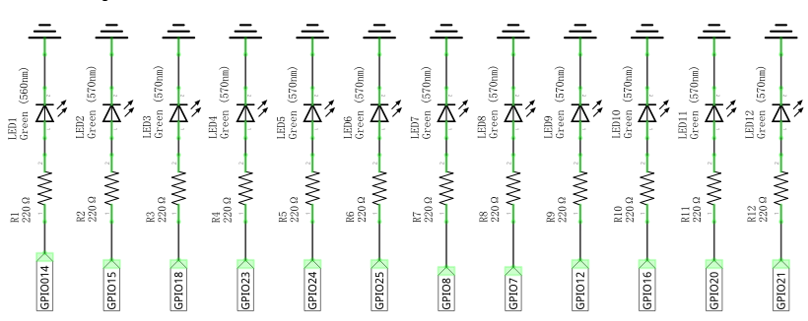
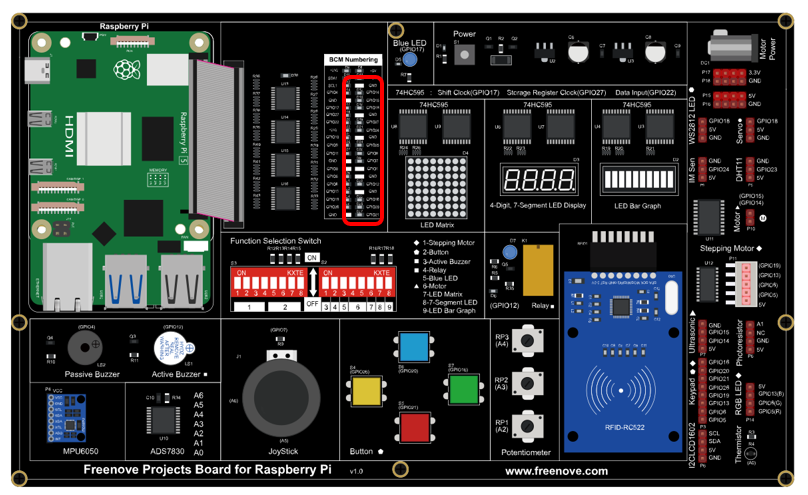

##############################################################################
Chapter Flowing Light
##############################################################################

We have learned how to control one LED to blink. Next, we will learn how to control a number of LEDs.

Project Flowing Water Light
****************************************************************

In this project, we use a number of LEDs to make a flowing water light.

Component List
================================================================

+------------------------------------------+
| Freenove Projects Board for Raspberry Pi |
|                                          |
|  |Chapter01_04|                          |
+---------------------+--------------------+
| Raspberry Pi        | GPIO Ribbon Cable  |
|                     |                    |
|  |Chapter01_05|     |  |Chapter01_06|    |
+---------------------+--------------------+

.. |Chapter01_04| image:: ../_static/imgs/1_LED/Chapter01_04.png
.. |Chapter01_05| image:: ../_static/imgs/1_LED/Chapter01_05.png
.. |Chapter01_06| image:: ../_static/imgs/1_LED/Chapter01_06.png

Circuit
================================================================

.. list-table:: 
    :width: 100%
    :align: center
    :class: product-table

    *   -   Schematic diagram
    *   -   |Chapter02_00|
    *   -   Hardware connection:
    *   -   |Chapter02_01|

.. note::
    
    :red:`If you have any concerns, please send an email to:` support@freenove.com

Sketch
================================================================

In this chapter, we will introduce how to control multiple LEDs with various GPIOs, and make the LEDs present a flowing effect.

Sketch_02_FlowingLight
----------------------------------------------------------------

First, enter where the project is located:

.. code-block:: console
    
    $ cd ~/Freenove_Kit/Pi4j/Sketches/Sketch_02_FlowingLight
 

Enter the command to run the code.

.. code-block:: console
    
    $ jbang FlowingLight.java

When the code is running, you can see the onboard indicators lights up in a flowing effect.

On the Raspberry Pi Terminal, you can see messages printed.

Press CTRL+C to exit the code.

You can view and edit the code with Geany by running the following command.

.. code-block:: console
    
    $ geany FlowingLight.java

Click the icon to run the code.

If the code fails to run, please check Geany Configuration.

The following is program code:

.. literalinclude:: ../../../freenove_Kit/Pi4j/Sketches/Sketch_02_FlowingLight/FlowingLight.java
    :linenos: 
    :language: java

Import the classes of Pi4J library for GPIO control and simple console output.

.. literalinclude:: ../../../freenove_Kit/Pi4j/Sketches/Sketch_02_FlowingLight/FlowingLight.java
    :linenos: 
    :language: java
    :lines: 9-11

Define an array that includes the GPIO numbers connecting to LEDs.

.. literalinclude:: ../../../freenove_Kit/Pi4j/Sketches/Sketch_02_FlowingLight/FlowingLight.java
    :linenos: 
    :language: java
    :lines: 14-15

Create a DigitalOutput array based on the GPIO array that controls the LEDs, and create a DigitalOutput instance for each pin.

.. literalinclude:: ../../../freenove_Kit/Pi4j/Sketches/Sketch_02_FlowingLight/FlowingLight.java
    :linenos: 
    :language: java
    :lines: 21-24

Iterate through all LEDs and turn them off (set to low level).

.. literalinclude:: ../../../freenove_Kit/Pi4j/Sketches/Sketch_02_FlowingLight/FlowingLight.java
    :linenos: 
    :language: java
    :lines: 30-32

Use 'currentLed' to record the position of the LED that is lit, recalculate the position of the lit LED every 100 milliseconds, and print a prompt message to the console. At the same time, turn off all LEDs except the LED at the position recorded by 'currentLed'.

.. literalinclude:: ../../../freenove_Kit/Pi4j/Sketches/Sketch_02_FlowingLight/FlowingLight.java
    :linenos: 
    :language: java
    :lines: 27-36