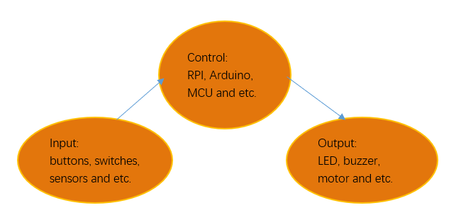
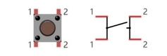
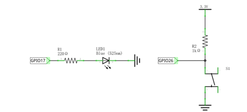
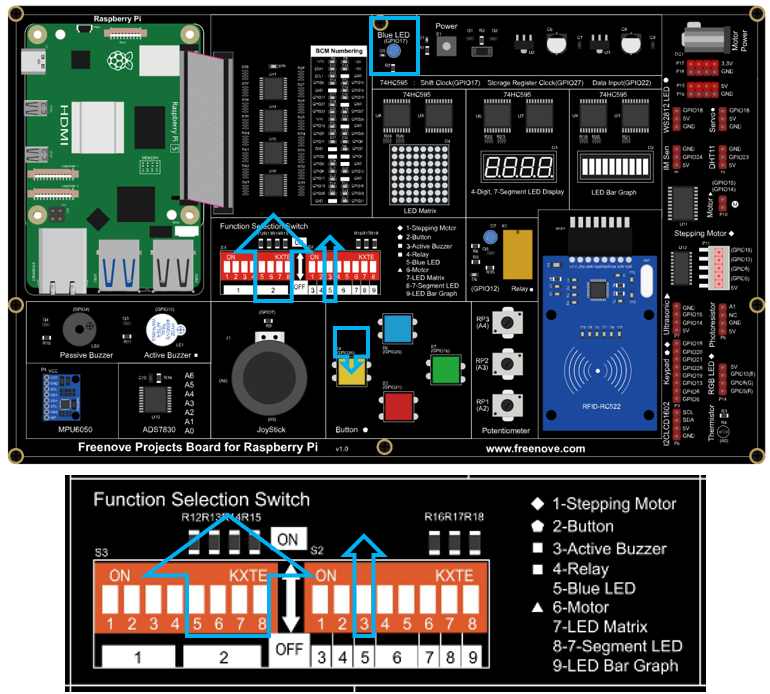
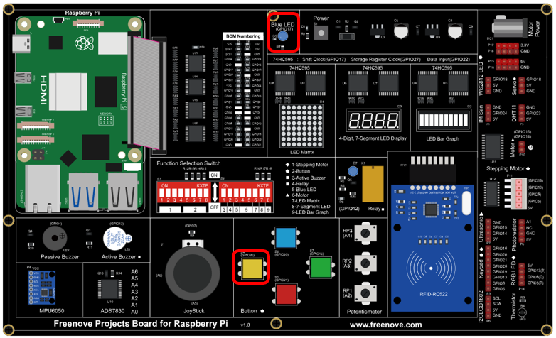
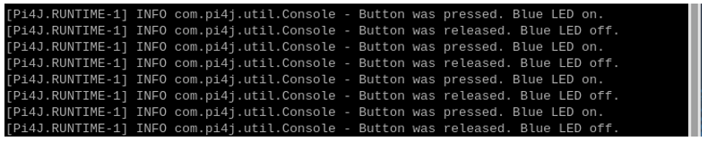
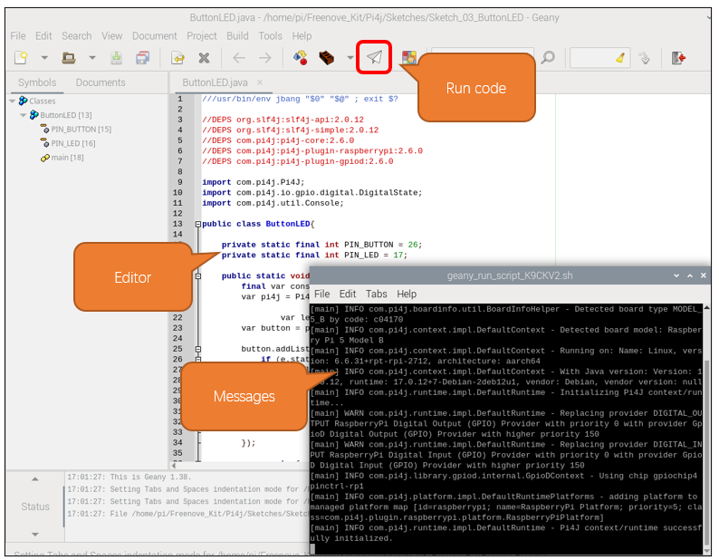

##############################################################################
Chapter Buttons & LEDs
##############################################################################

Usually, there are three essential parts in a complete automatic control device: INPUT, OUTPUT, and CONTROL. In last section, the LED module was the output part and RPI was the control part. In practical applications, we not only make LEDs flash, but also make a device sense the surrounding environment, receive instructions and then take the appropriate action such as turn on LEDs, make a buzzer beep and so on.

Next, we will build a simple control system to control an LED through a push button switch.

Project Push Button Switch & LED
****************************************************************

In the project, we will control the LED state through a Push Button Switch. When the button is pressed, our LED will turn ON, and when it is released, the LED will turn OFF. This describes a Momentary Switch.

Component knowledge
================================================================

Push Button Switch 
----------------------------------------------------------------

This type of Push Button Switch has 4 pins (2 Pole Switch). Two pins on the left are connected, and both left and right sides are the same as per the illustration:

When the button on the switch is pressed, the circuit is completed (your project is Powered ON).

Component List
================================================================

+------------------------------------------+
| Freenove Projects Board for Raspberry Pi |
|                                          |
|  |Chapter01_04|                          |
+---------------------+--------------------+
| Raspberry Pi        | GPIO Ribbon Cable  |
|                     |                    |
|  |Chapter01_05|     |  |Chapter01_06|    |
+---------------------+--------------------+

.. |Chapter01_04| image:: ../_static/imgs/1_LED/Chapter01_04.png
.. |Chapter01_05| image:: ../_static/imgs/1_LED/Chapter01_05.png
.. |Chapter01_06| image:: ../_static/imgs/1_LED/Chapter01_06.png

Circuit
================================================================

.. list-table:: 
    :width: 100%
    :align: center
    :class: product-table

    *   -   Schematic diagram
    *   -   |Chapter03_02|
    *   -   Hardware connection:
           
            Switch ON NO.5 switch and the four switches of NO.2.

    *   -   |Chapter03_03|

.. note::
    
    :red:`If you have any concerns, please send an email to:` support@freenove.com

Sketch
================================================================

In this chapter, we will introduce how to use the button to control the LED.

Sketch_03_ButtonLED
----------------------------------------------------------------

First, enter where the project is located:

.. code-block:: console
    
    $ cd ~/Freenove_Kit/Pi4j/Sketches/Sketch_03_ButtonLED

Enter the command to run the code.

.. code-block:: console
    
    $ jbang ButtonLED.java

When the code is running, press the button and you can see the LED is lit; release it and the LED goes off.

On the Raspberry Pi terminal, you will see the corresponding messages printed.

Press Ctrl+C to exit the code.

You can open the code with geany to view and edit it.

.. code-block:: console
    
    $ geany ButtonLED.java

Click the icon to run the code.

If the code fails to run, please check :ref:`Geany Configuration<geany>`.

The following is program code:

.. literalinclude:: ../../../freenove_Kit/Pi4j/Sketches/Sketch_03_ButtonLED/ButtonLED.java
    :linenos: 
    :language: java

Import the classes of Pi4J library for GPIO control and simple console output.

.. literalinclude:: ../../../freenove_Kit/Pi4j/Sketches/Sketch_03_ButtonLED/ButtonLED.java
    :linenos: 
    :language: java
    :lines: 9-11

Define the GPIO numbers for the button and LED.

.. literalinclude:: ../../../freenove_Kit/Pi4j/Sketches/Sketch_03_ButtonLED/ButtonLED.java
    :linenos: 
    :language: java
    :lines: 15-16

Create a Console instance for printing logs or messages.

Create a Pi4J context to manage the GPIO interface.

Create an LED output pin object, connected to the pin specified by PIN_LED.

Create a button input pin object, connected to the pin specified by PIN_BUTTON.

.. literalinclude:: ../../../freenove_Kit/Pi4j/Sketches/Sketch_03_ButtonLED/ButtonLED.java
    :linenos: 
    :language: java
    :lines: 19-23

Add a listener event to the button, which is triggered when the button's state changes.

When the button is pressed, its state is low, and we control the LED to light up.

When the button is released, its state is high, and we control the LED to turn off.

.. literalinclude:: ../../../freenove_Kit/Pi4j/Sketches/Sketch_03_ButtonLED/ButtonLED.java
    :linenos: 
    :language: java
    :lines: 25-34

Nothing needs to be done in the main loop. Just set it in an infinite loop and ensure that the Pi4J context is closed when the program ends. 

.. literalinclude:: ../../../freenove_Kit/Pi4j/Sketches/Sketch_03_ButtonLED/ButtonLED.java
    :linenos: 
    :language: java
    :lines: 36-43