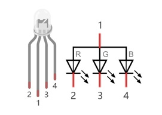
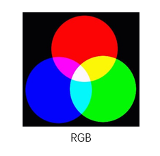

##############################################################################
Chapter RGB LED
##############################################################################

In this chapter, we will learn how to control an RGB LED.

An RGB LED has 3 LEDs integrated into one LED component. It can respectively emit Red, Green and Blue light. In order to do this, it requires 4 pins (this is also how you identify it). The long pin (1) is the common which is the Anode (+) or positive lead, the other 3 are the Cathodes (-) or negative leads. A rendering of an RGB LED and its electronic symbol are shown below. We can make RGB LED emit various colors of light and brightness by controlling the 3 Cathodes (2, 3 & 4) of the RGB LED

    
Red, Green, and Blue light are called 3 Primary Colors when discussing light (Note: for pigments such as paints, the 3 Primary Colors are Red, Blue and Yellow). When you combine these three Primary Colors of light with varied brightness, they can produce almost any color of visible light. Computer screens, single pixels of cell phone screens, neon lamps, etc. can all produce millions of colors due to phenomenon.

    
If we use a three 8 bit PWM to control the RGB LED, in theory, we can create 28*28*28=16777216 (16 million) colors through different combinations of RGB light brightness.

Next, we will use RGB LED to make a multicolored LED. 

Project 5.1 RainbowLED
****************************************************************

In this project, we will make a multicolored LED, which we can program the RGB LED to automatically change colors.

Component List
================================================================

+------------------------------------------+
| Freenove Projects Board for Raspberry Pi |
|                                          |
|  |Chapter01_04|                          |
+---------------------+--------------------+
| Raspberry Pi        | GPIO Ribbon Cable  |
|                     |                    |
|  |Chapter01_05|     |  |Chapter01_06|    |
+---------------------+--------------------+
| Jumper Wire         | RGBLED Module      |
|                     |                    |
|  |Chapter05_02|     |  |Chapter05_03|    |
+---------------------+--------------------+

.. |Chapter01_04| image:: ../_static/imgs/1_LED/Chapter01_04.png
.. |Chapter01_05| image:: ../_static/imgs/1_LED/Chapter01_05.png
.. |Chapter01_06| image:: ../_static/imgs/1_LED/Chapter01_06.png
.. |Chapter05_02| image:: ../_static/imgs/5_RGB_LED/Chapter05_02.png
.. |Chapter05_03| image:: ../_static/imgs/5_RGB_LED/Chapter05_03.png

Circuit
================================================================

.. list-table:: 
    :width: 100%
    :align: center
    :class: product-table

    *   -   Schematic diagram
    *   -   |Chapter05_04|
    *   -   Hardware connection:
    *   -   |Chapter05_05|

.. |Chapter05_04| image:: ../_static/imgs/5_RGB_LED/Chapter05_04.png
.. |Chapter05_05| image:: ../_static/imgs/5_RGB_LED/Chapter05_05.png

.. note::
    
    :red:`If you have any concerns, please send an email to:` support@freenove.com

Sketch
================================================================

In this chapter, we will control the RGB LED with 3 PWMs.

Sketch_05_RainbowLED
----------------------------------------------------------------

First, enter where the project is located:

.. code-block:: console
    
    $ cd ~/Freenove_Kit/Pi4j/Sketches/Sketch_05_RainbowLED

Enter the command to run the code.

.. code-block:: console
    
    $ jbang RainbowLED.java
 

When the code is running, the RGB LED randomly emits various colors.

Press Ctr+C to exit the program.

You can open the code with Geany to view and edit it, with the following command.

.. code-block:: console
    
    $ geany RainbowLED.java

Click the icon to run the code.

If the code fails to run, please check :ref:`Geany Configuration<geany>`.

The following is program code:

.. literalinclude:: ../../../freenove_Kit/Pi4j/Sketches/Sketch_05_RainbowLED/RainbowLED.java
    :linenos: 
    :language: java

Import Pi4j library, context management, digital output interface, HashMap class and Map interface, and random function library.

.. literalinclude:: ../../../freenove_Kit/Pi4j/Sketches/Sketch_05_RainbowLED/RainbowLED.java
    :linenos: 
    :language: java
    :lines: 9-15

Initialize the pins corresponding to the RGB lights and print a stack trace if an exception occurs.

.. literalinclude:: ../../../freenove_Kit/Pi4j/Sketches/Sketch_05_RainbowLED/RainbowLED.java
    :linenos: 
    :language: java
    :lines: 102-110

Configure the RGB colored lights and adjust the brightness of the LED by adjusting the duty cycle of PWM.

.. literalinclude:: ../../../freenove_Kit/Pi4j/Sketches/Sketch_05_RainbowLED/RainbowLED.java
    :linenos: 
    :language: java
    :lines: 112-121

Create a console instance, define an array of GPIO pins for LED connections, and create a random number generator instance.

.. literalinclude:: ../../../freenove_Kit/Pi4j/Sketches/Sketch_05_RainbowLED/RainbowLED.java
    :linenos: 
    :language: java
    :lines: 124-126

Initialize the array of GPIO pins connected to the LEDs, generate 3 new random numbers every 500 milliseconds as brightness values for the RGB lights, and print prompt messages on the console.

.. literalinclude:: ../../../freenove_Kit/Pi4j/Sketches/Sketch_05_RainbowLED/RainbowLED.java
    :linenos: 
    :language: java
    :lines: 128-138

At the end of the program, stop all PWM controllers and close the Pi4J context.

.. literalinclude:: ../../../freenove_Kit/Pi4j/Sketches/Sketch_05_RainbowLED/RainbowLED.java
    :linenos: 
    :language: java
    :lines: 139-144