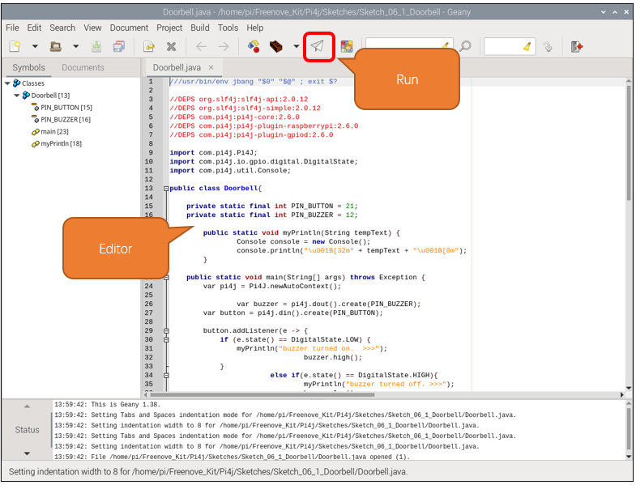

##############################################################################
Chapter Buzzer
##############################################################################

In this chapter, we will learn about buzzers and the sounds they make. And in our next project, we will use an active buzzer to make a doorbell and a passive buzzer to make an alarm.

Project 6.1 Doorbell
****************************************************************

We will make a doorbell with this functionality: when the Push Button Switch is pressed the buzzer sounds and when the button is released, the buzzer stops. This is a momentary switch function.

Component knowledge
================================================================

Buzzer
----------------------------------------------------------------

A buzzer is an audio component. They are widely used in electronic devices such as calculators, electronic alarm clocks, automobile fault indicators, etc. There are both active and passive types of buzzers. Active buzzers have oscillator inside, these will sound as long as power is supplied. Passive buzzers require an external oscillator signal (generally using PWM with different frequencies) to make a sound.

Active buzzers are easier to use. Generally, they only make a specific sound frequency. Passive buzzers require an external circuit to make sounds, but passive buzzers can be controlled to make sounds of various frequencies. The resonant frequency of the passive buzzer in this Kit is 2kHz, which means the passive buzzer is the loudest when its resonant frequency is 2kHz.

:red:`How to identify active and passive buzzer?`

1.	As a rule, there is a label on an active buzzer covering the hole where sound is emitted, but there are exceptions to this rule.

2.	Active buzzers are more complex than passive buzzers in their manufacture. There are many circuits and crystal oscillator elements inside active buzzers; all of this is usually protected with a waterproof coating (and a housing) exposing only its pins from the underside. On the other hand, passive buzzers do not have protective coatings on their underside. From the pin holes, view of a passive buzzer, you can see the circuit board, coils, and a permanent magnet (all or any combination of these components depending on the model.

Transistors

A transistor is required in this project due to the buzzer's current being so great that GPIO of RPi's output capability cannot meet the power requirement necessary for operation. A NPN transistor is needed here to amplify the current. 

Transistors, full name: semiconductor transistor, is a semiconductor device that controls current (think of a transistor as an electronic “amplifying or switching device”. Transistors can be used to amplify weak signals, or to work as a switch. Transistors have three electrodes (PINs): base (b), collector (c) and emitter (e). When there is current passing between "be" then "ce" will have a several-fold current increase (transistor magnification), in this configuration the transistor acts as an amplifier. When current produced by "be" exceeds a certain value, "ce" will limit the current output. at this point the transistor is working in its saturation region and acts like a switch. Transistors are available as two types as shown below: PNP and NPN,

:red:`In our kit, the PNP transistor is marked with 8550, and the NPN transistor is marked with 8050.`

Thanks to the transistor's characteristics, they are often used as switches in digital circuits. As micro-controllers output current capacity is very weak, we will use a transistor to amplify its current in order to drive components requiring higher current.

When we use a NPN transistor to drive a buzzer, we often use the following method. If GPIO outputs high level, current will flow through R1 (Resistor 1), the transistor conducts current and the buzzer will make sounds. If GPIO outputs low level, no current will flow through R1, the transistor will not conduct currentand buzzer will remain silent (no sounds).

When we use a PNP transistor to drive a buzzer, we often use the following method. If GPIO outputs low level, current will flow through R1. The transistor conducts current and the buzzer will make sounds. If GPIO outputs high level, no current flows through R1, the transistor will not conduct current and buzzer will remain silent (no sounds). Below are the circuit schematics for both a NPN and PNP transistor to power a buzzer.

.. list-table:: 
    :width: 100%
    :align: center
    :class: product-table

    *   -   NPN transistor to drive buzzer
        -   PNP transistor to drive buzzer
    *   -   |Chapter06_03|
        -   |Chapter06_04|

.. |Chapter06_03| image:: ../_static/imgs/6_Buzzer/Chapter06_03.png

Component List
================================================================

+------------------------------------------+
| Freenove Projects Board for Raspberry Pi |
|                                          |
|  |Chapter01_04|                          |
+---------------------+--------------------+
| Raspberry Pi        | GPIO Ribbon Cable  |
|                     |                    |
|  |Chapter01_05|     |  |Chapter01_06|    |
+---------------------+--------------------+

.. |Chapter01_04| image:: ../_static/imgs/1_LED/Chapter01_04.png
.. |Chapter01_05| image:: ../_static/imgs/1_LED/Chapter01_05.png
.. |Chapter01_06| image:: ../_static/imgs/1_LED/Chapter01_06.png

Circuit
================================================================

.. list-table:: 
    :width: 100%
    :align: center
    :class: product-table

    *   -   Schematic diagram
    *   -   |Chapter06_05|
    *   -   Hardware connection:
    *   -   |Chapter06_06|

.. |Chapter06_05| image:: ../_static/imgs/6_Buzzer/Chapter06_05.png
.. |Chapter06_06| image:: ../_static/imgs/6_Buzzer/Chapter06_06.png

.. note::
    
    :red:`If you have any concerns, please send an email to:` support@freenove.com

Code
================================================================

In this project, a buzzer will be controlled by a push button switch. When the button switch is pressed, the buzzer sounds and when the button is released, the buzzer stops. It is analogous to our earlier project that controlled an LED ON and OFF.

C Code 6.1 Doorbell
----------------------------------------------------------------

First, observe the project result, and then learn about the code in detail.

.. note::
    
    :red:`If you have any concerns, please send an email to:` support@freenove.com

1.	Use cd command to enter 6_1_Doorbell directory of C code.

.. code-block:: console

    $  ~/Freenove_Kit/Code/C_Code/6_1_Doorbell

2.	Use following command to compile “Doorbell.c” and generate executable file “Doorbell.c”.

.. code-block:: console

    $ gcc Doorbell.c -o Doorbell -lwiringPi

3.	Then run the generated file “Doorbell”.

.. code-block:: console

    $ ./Doorbell

After the program is executed, press the push button switch and the will buzzer sound. Release the push button switch and the buzzer will stop.

The following is the program code:

.. literalinclude:: ../../../freenove_Kit/Code/C_Code/6_1_Doorbell/Doorbell.c
    :linenos: 
    :language: c

Python Code 6.1 Doorbell
----------------------------------------------------------------

First, observe the project result, then learn about the code in detail.

.. note::
    
    :red:`If you have any concerns, please send an email to:` support@freenove.com

1.	Use cd command to enter 6_1_Doorbell directory of Python code.

.. code-block:: console

    $ cd ~/Freenove_Kit/Code/Python_GPIOZero_Code/6_1_Doorbell

2.	Use python command to execute python code “Doorbell.py”.

.. code-block:: console

    $ python Doorbell.py

After the program is executed, press the push button switch and the buzzer will sound. Release the push button switch and the buzzer will stop.

The following is the program code:

.. literalinclude:: ../../../freenove_Kit/Code/Python_GPIOZero_Code/6_1_Doorbell/Doorbell.py
    :linenos: 
    :language: py

Project 6.2 Alertor
****************************************************************

Next, we will use a passive buzzer to make an alarm. 

Component List
================================================================

+------------------------------------------+
| Freenove Projects Board for Raspberry Pi |
|                                          |
|  |Chapter01_04|                          |
+---------------------+--------------------+
| Raspberry Pi        | GPIO Ribbon Cable  |
|                     |                    |
|  |Chapter01_05|     |  |Chapter01_06|    |
+---------------------+--------------------+

.. |Chapter01_04| image:: ../_static/imgs/1_LED/Chapter01_04.png
.. |Chapter01_05| image:: ../_static/imgs/1_LED/Chapter01_05.png
.. |Chapter01_06| image:: ../_static/imgs/1_LED/Chapter01_06.png

Circuit
================================================================

.. list-table:: 
    :width: 100%
    :align: center
    :class: product-table

    *   -   Schematic diagram
    *   -   |Chapter06_07|
    *   -   Hardware connection:
    *   -   |Chapter06_08|

.. note::
    
    :red:`If you have any concerns, please send an email to:` support@freenove.com

Sketch
================================================================

In this chapter, we use a button to control the active buzzer. The code is similar to that in Chapter 3.

Sketch_06_1_Doorbell
----------------------------------------------------------------

First, enter where the project is located:

.. code-block:: console

    $ cd ~/Freenove_Kit/Pi4j/Sketches/Sketch_06_1_Doorbell

Enter the command to run the code.

.. code-block:: console

    $ jbang Doorbell.java

During the code running, press the button to sound the buzzer and release the button to stop it.

You can see messages printed on the terminal.

Press Ctrl+C to exit the code.

You can open the code with Geany to view and edit it, with the following command.

.. code-block:: console

    $ geany Doorbell.java

Click the icon to run the code.

If the code fails to run, please check :ref:`Geany Configuration<geany>`.

The following is program code:

.. literalinclude:: ../../../freenove_Kit/Pi4j/Sketches/Sketch_06_1_Doorbell/Doorbell.java
    :linenos: 
    :language: java

Please note that as the code is similar to that in chapter 3, here we do not explain it again.

In order to make the prompt messages printed by the terminal more conspicuous, we wrote the myprintln function to wrap the console.println function.

.. literalinclude:: ../../../freenove_Kit/Pi4j/Sketches/Sketch_06_1_Doorbell/Doorbell.java
    :linenos: 
    :language: java
    :lines: 18-21

Project 6.2 Alertor
****************************************************************

Next, we will use a passive buzzer to make an alarm. 

Component List
================================================================

+------------------------------------------+
| Freenove Projects Board for Raspberry Pi |
|                                          |
|  |Chapter01_04|                          |
+---------------------+--------------------+
| Raspberry Pi        | GPIO Ribbon Cable  |
|                     |                    |
|  |Chapter01_05|     |  |Chapter01_06|    |
+---------------------+--------------------+

.. |Chapter01_04| image:: ../_static/imgs/1_LED/Chapter01_04.png
.. |Chapter01_05| image:: ../_static/imgs/1_LED/Chapter01_05.png
.. |Chapter01_06| image:: ../_static/imgs/1_LED/Chapter01_06.png

Circuit
================================================================

.. list-table:: 
    :width: 100%
    :align: center
    :class: product-table

    *   -   Schematic diagram
    *   -   |Chapter06_07|
    *   -   Hardware connection:
    *   -   |Chapter06_08|

.. note::
    
    :red:`If you have any concerns, please send an email to:` support@freenove.com

Sketch
================================================================

In this chapter, we use button to control the passive buzzer to make sound.

Sketch_06_2_Alertor
----------------------------------------------------------------

First, enter where the project is located:

.. code-block:: console

    $ cd ~/Freenove_Kit/Pi4j/Sketches/Sketch_06_2_Alertor

Enter the command to run the code.

.. code-block:: console

    $ jbang Alertor.java

When the code is running, press the button to sound the buzzer and release to stop it.

You can see messages printed on the terminal.

Press ctrl+C to exit the code.

You can open the code with Geany to view and edit it, with the following command.

.. code-block:: console

    $ geany Alertor.java

Click the icon to run the code.

If the code fails to run, please check Geany Configuration.

The following is program code:

.. literalinclude:: ../../../freenove_Kit/Pi4j/Sketches/Sketch_06_2_Alertor/Alertor.java
    :linenos: 
    :language: java

Create a pi4j context for manipulating the GPIOs, and define the GPIO numbers that control the keys and buzzer.

.. literalinclude:: ../../../freenove_Kit/Pi4j/Sketches/Sketch_06_2_Alertor/Alertor.java
    :linenos: 
    :language: java
    :lines: 84-88

Initialize the button input pin, create a monitoring event, and assign the key value to buttonState when the button state changes.

.. literalinclude:: ../../../freenove_Kit/Pi4j/Sketches/Sketch_06_2_Alertor/Alertor.java
    :linenos: 
    :language: java
    :lines: 113-116

Initialize the PWM pin that controls the passive buzzer.

.. literalinclude:: ../../../freenove_Kit/Pi4j/Sketches/Sketch_06_2_Alertor/Alertor.java
    :linenos: 
    :language: java
    :lines: 118-121

When buttonState is 1, the passive buzzer sounds, and when buttonState is 0, the buzzer sound is turned off. Print the information in the console.

.. literalinclude:: ../../../freenove_Kit/Pi4j/Sketches/Sketch_06_2_Alertor/Alertor.java
    :linenos: 
    :language: java
    :lines: 125-131