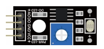
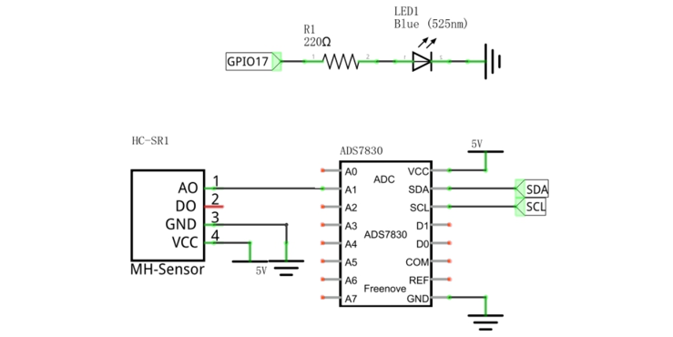
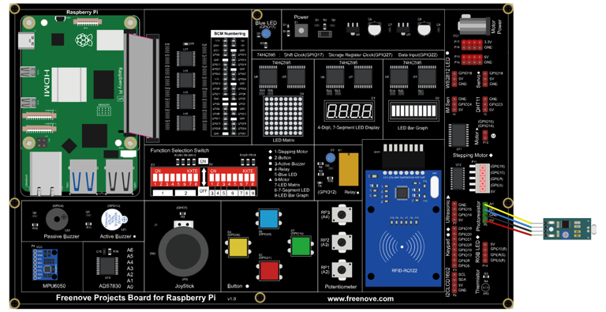
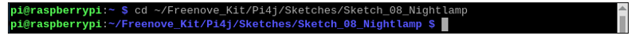
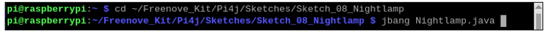
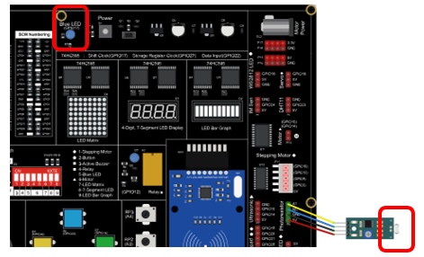
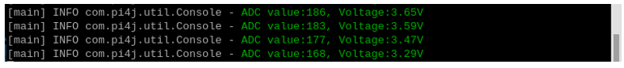
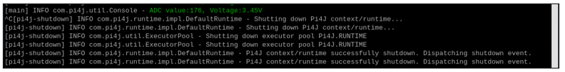
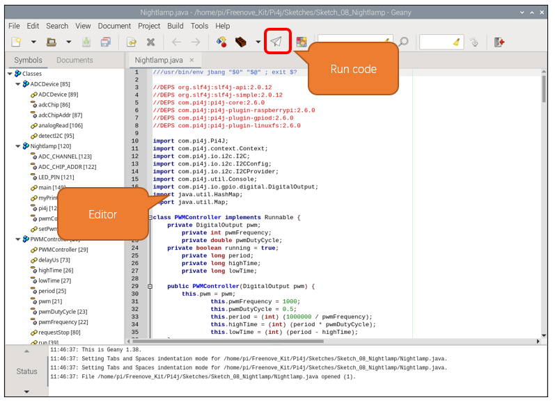

##############################################################################
Chapter Photoresistor & LED
##############################################################################

In this chapter, we will learn how to use a photoresistor to make an automatic dimming nightlight.

Project 8.1 NightLamp
****************************************************************

A Photoresistor is very sensitive to the amount of light present. We can take advantage of the characteristic to make a nightlight with the following function. When the ambient light is less (darker environment), the LED will automatically become brighter to compensate and when the ambient light is greater (brighter environment) the LED will automatically dim to compensate.

Component List
================================================================

+------------------------------------------+
| Freenove Projects Board for Raspberry Pi |
|                                          |
|  |Chapter01_04|                          |
+---------------------+--------------------+
| Raspberry Pi        | GPIO Ribbon Cable  |
|                     |                    |
|  |Chapter01_05|     |  |Chapter01_06|    |
+---------------------+--------------------+
| Jumper Wire         | Photoresistor      |
|                     |                    |
|  |Chapter05_02|     |  |Chapter08_00|    |
+---------------------+--------------------+

.. |Chapter01_04| image:: ../_static/imgs/1_LED/Chapter01_04.png
.. |Chapter01_05| image:: ../_static/imgs/1_LED/Chapter01_05.png
.. |Chapter01_06| image:: ../_static/imgs/1_LED/Chapter01_06.png
.. |Chapter05_02| image:: ../_static/imgs/5_RGB_LED/Chapter05_02.png

Circuit
================================================================

.. list-table:: 
    :width: 100%
    :align: center
    :class: product-table

    *   -   Schematic diagram
    *   -   |Chapter08_01|
    *   -   Hardware connection:
    *   -   |Chapter08_02|

.. note::
    
    :red:`If you have any concerns, please send an email to:` support@freenove.com

Sketch
================================================================

In this project, we will change the brightness of the LED based on the light intensity received by the photoresistor.

Sketch_08_Nightlamp
----------------------------------------------------------------

First, enter where the project is located:

.. code-block:: console

    $ cd ~/Freenove_Kit/Pi4j/Sketches/Sketch_08_Nightlamp

Enter the command to run the code.

.. code-block:: console

    $ jbang Nightlamp.java
 

When the code is running, use light to illuminate the photosensitive module, or cover the photosensitive module with your hand, and you can observe that the brightness of the LED on the board changes accordingly.

On the terminal, you can see the ADC and voltage values of the photoresistor are printed.

Press Ctrl+C to exit the program.

You can open the code with Geany with the following command to view and edit it.

.. code-block:: console

    $ geany Nightlamp.java

Click the icon to run the code.

If the code fails to run, please check :ref:`Geany Configuration<geany>`.

The following is program code:

.. literalinclude:: ../../../freenove_Kit/Pi4j/Sketches/Sketch_08_Nightlamp/Nightlamp.java
    :linenos: 
    :language: java
    :dedent:

The ADC value at the photosensor is obtained every 100 milliseconds, converted into a PWM duty cycle value for controlling the LED, and then a prompt message is printed on the terminal.

.. literalinclude:: ../../../freenove_Kit/Pi4j/Sketches/Sketch_08_Nightlamp/Nightlamp.java
    :linenos: 
    :language: java
    :lines: 158-168
    :dedent: