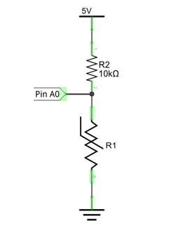

##############################################################################
Chapter 9 Thermistor
##############################################################################

In this chapter, we will learn about Thermistors which are another kind of Resistor.

Project 9.1 Thermometer
****************************************************************

A Thermistor is a type of Resistor whose resistance value is dependent on temperature and changes in temperature. Therefore, we can take advantage of this characteristic to make a Thermometer.

Component knowledge
================================================================

Thermistor
----------------------------------------------------------------

Thermistor is a temperature sensitive resistor. When it senses a change in temperature, the resistance of the Thermistor will change. We can take advantage of this characteristic by using a Thermistor to detect temperature intensity. A Thermistor and its electronic symbol are shown below.

.. image:: ../_static/imgs/9_Thermistor/Chapter09_00.png
    :align: center

The relationship between resistance value and temperature of a thermistor is:

.. math::
    
    \boldsymbol{R_t} \boldsymbol{=} \boldsymbol{R} \boldsymbol{\cdot} \boldsymbol{\mathrm{EXP}} \boldsymbol{\left[ B \boldsymbol{\cdot} \left( \frac{1}{T_2} - \frac{1}{T_1} \right) \right]}

**Where:**

    **Rt** is the thermistor resistance under T2 temperature;

    **R** is in the nominal resistance of thermistor under T1 temperature;

    **EXP[n]** is nth power of e;

    **B** is for thermal index;

    **T1, T2** is Kelvin temperature (absolute temperature). Kelvin temperature=273.15 + Celsius temperature.

For the parameters of the Thermistor, we use: B=3950, R=10k, T1=25.

The circuit connection method of the Thermistor is similar to photoresistor, as the following:

We can use the value measured by the ADC converter to obtain the resistance value of Thermistor, and then we can use the formula to obtain the temperature value.

Therefore, the temperature formula can be derived as:

.. math::
    
    \boldsymbol{T_2} \boldsymbol{=} \boldsymbol{\frac{1}{\frac{1}{T_1} + \frac{\ln\left(\frac{R_t}{R}\right)}{B}}}

Component List
================================================================

.. table::
    :class: table-line
    :align: center
    :width: 80%

    +------------------------------------------+
    | Freenove Projects Board for Raspberry Pi |
    |                                          |
    |  |Chapter01_04|                          |
    +---------------------+--------------------+
    | Raspberry Pi        | GPIO Ribbon Cable  |
    |                     |                    |
    |  |Chapter01_05|     |  |Chapter01_06|    |
    +---------------------+--------------------+

.. |Chapter01_04| image:: ../_static/imgs/1_LED/Chapter01_04.png
.. |Chapter01_05| image:: ../_static/imgs/1_LED/Chapter01_05.png
.. |Chapter01_06| image:: ../_static/imgs/1_LED/Chapter01_06.png

Circuit
================================================================

.. list-table:: 
    :width: 80%
    :align: center
    :class: table-line

    * - Schematic diagram
    * - |Chapter09_04|
    * - Hardware connection:
    * - |Chapter09_05|

.. |Chapter09_04| image:: ../_static/imgs/9_Thermistor/Chapter09_04.png
.. |Chapter09_05| image:: ../_static/imgs/9_Thermistor/Chapter09_05.png

.. note::
    
    :combo:`red font-bolder:If you have any concerns, please send an email to:` support@freenove.com

Sketch
================================================================

In this project, we will collect the ADC value of the thermistor and calculate its temperature.

Sketch_09_Thermometer
----------------------------------------------------------------

First, enter where the project is located:

.. code-block:: console

    $ cd ~/Freenove_Kit/Pi4j/Sketches/Sketch_09_Thermometer

Enter the command to run the code.

.. code-block:: console

    $ jbang Thermometer.java

After running the code, the Raspberry Pi will obtain the ADC value of the thermistor and convert it into voltage and temperature values, as shown in the figure below.

Press Ctrl+C to exit the program.

You can open the code with Geany to view and edit it.

.. code-block:: console

    $ geany Thermometer.java

Click the icon to run the code.

If the code fails to run, please check Geany Configuration.

The following is program code:

.. literalinclude:: ../../../freenove_Kit/Pi4j/Sketches/Sketch_09_Thermometer/Thermometer.java
    :linenos: 
    :language: java

Get the ADC value of the thermistor every 100 milliseconds, convert the ADC value into a temperature value according to the formula introduced at :ref:`component knowledge<9_1>` section, and print the relevant information on the terminal.

.. code-block:: c
    
    while (true) {  
        int adcValue = adcDevice.analogRead(ADC_CHANNEL);  
        if (adcValue != -1) {  
            double voltage = (double)adcValue / 255.0 * 5.0;    // calculate voltage    
            double Rt = 10 * voltage / (5.0 - voltage);        //calculate resistance value of thermistor
            double tempK = 1/(1/(273.15 + 25) + Math.log(Rt/10)/3950.0); //calculate temperature (Kelvin)
            double tempC = tempK -273.15;        //calculate temperature (Celsius)
            myPrintln("ADC value:%d, Voltage:%.2fV, Temperature:%.2fC", adcValue, voltage, tempC);
        } else {  
            myPrintln("Failed to read data from ADC.");  
        }
        Thread.sleep(100);
    }