##############################################################################
Raspberry Pi
##############################################################################

Raspberry Pi Introduction
****************************************************************

Raspberry Pi (called RPi, RPI, RasPi, the text these words will be used alternately later), a micro-computer with size of a card, quickly swept the world since its debut. It is widely used in desktop workstation, media center, smart home, robots, and even the servers, etc. It can do almost anything, which continues to attract fans to explore it. Raspberry Pi used to be running with Linux system and along with the release of windows 10 IoT. We can also run it with Windows. Raspberry Pi (with interfaces USB, network, HDMI, camera, audio, display and GPIO), as a microcomputer, can be running in command line mode and desktop system mode. Additionally, it is easy to operate just like Arduino, and you can even directly operate the GPIO of CPU. 

So far, at this writing, Raspberry Pi has advanced to its fifth generation product offering. Version changes are accompanied by increases in upgrades in hardware and capabilities. 

The A type and B type versions of the first generation products have been discontinued due to various reasons. What is most important is that other popular and currently available versions are consistent in the order and number of pins and their assigned designation of function, making compatibility of peripheral devices greatly enhanced between versions.

Below are the raspberry pi pictures and model pictures supported by this product. They have 40 pins.

.. list-table:: 
    :width: 100%
    :align: center

    *   -   Practicality picture of Raspberry Pi 5:
        -   Model diagram of Raspberry Pi 5:
    *   -   |Preface00|
        -   |Preface01|
    *   -   Actual image of Raspberry Pi 4 Model B:
        -   CAD image of Raspberry Pi 4 Model B:
    *   -   |Preface02|
        -   |Preface03|
    *   -   Actual image of Raspberry Pi 3 Model B: 
        -   CAD image of Raspberry Pi 3 Model B+:
    *   -   |Preface04|
        -   |Preface05|
    *   -   Actual image of Raspberry Pi 3 Model B: 
        -   CAD image of Raspberry Pi 3 Model B:
    *   -   |Preface06|
        -   |Preface07|
    *   -   Actual image of Raspberry Pi 2 Model B:
        -   CAD image of Raspberry Pi 2 Model B:
    *   -   |Preface08|
        -   |Preface09|
    *   -   Actual image of Raspberry Pi 1 Model B+:
        -   Actual image of Raspberry Pi 1 Model B+:
    *   -   |Preface10|
        -   |Preface11|
    *   -   Actual image of Raspberry Pi 3 Model A+:
        -   CAD image of Raspberry Pi 3 Model A+:
    *   -   |Preface12|
        -   |Preface13|
    *   -   Actual image of Raspberry Pi 1 Model A+:
        -   Actual image of Raspberry Pi 1 Model A+:
    *   -   |Preface14|
        -   |Preface15|
    *   -   Actual image of Raspberry Pi Zero W:
        -   CAD image of Raspberry Pi Zero W:
    *   -   |Preface16|
        -   |Preface17|
    *   -   Actual image of Raspberry Pi Zero:
        -   CAD image of Raspberry Pi Zero:
    *   -   |Preface18|
        -   |Preface19|

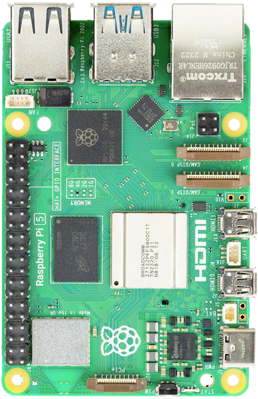
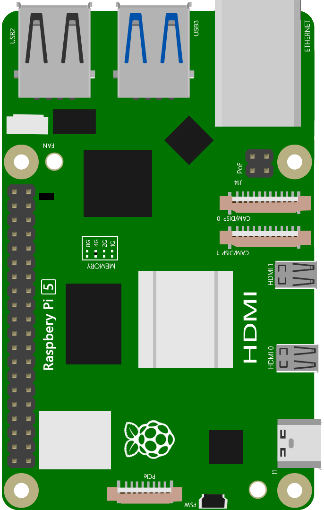
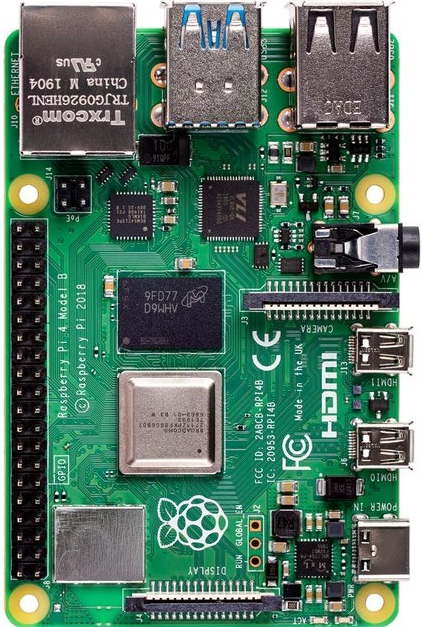
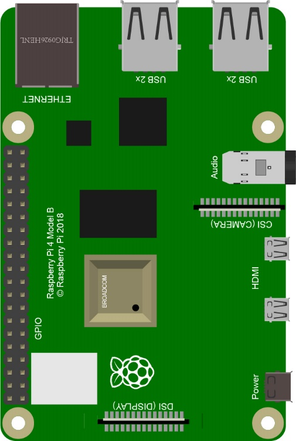
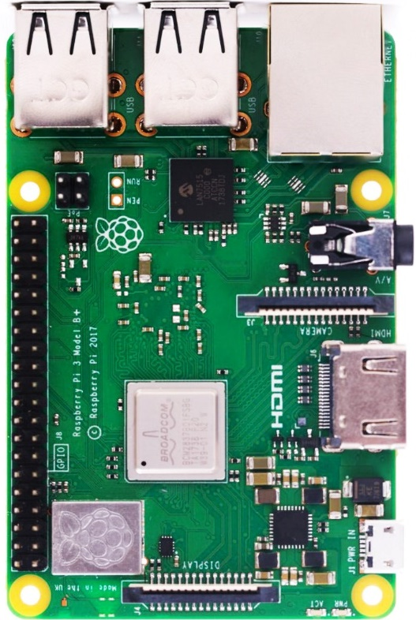
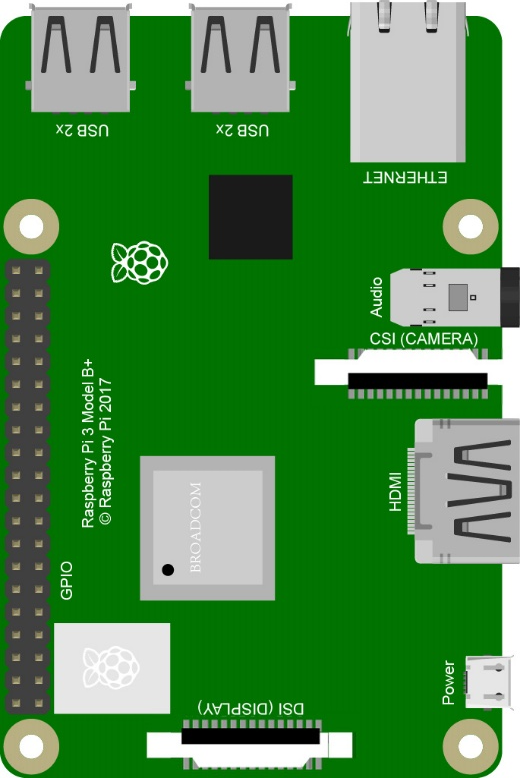
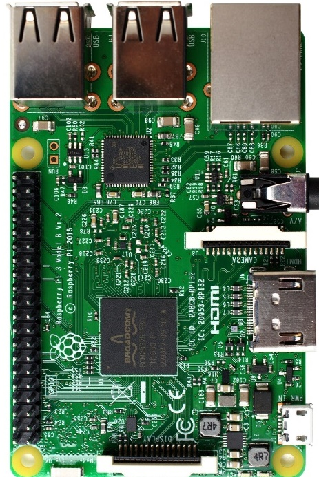
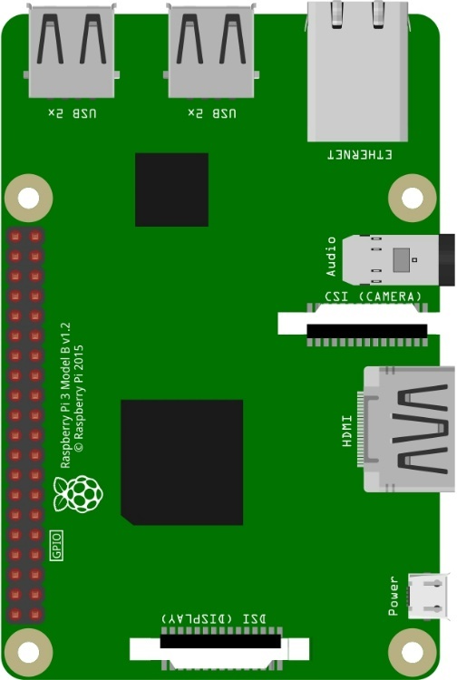
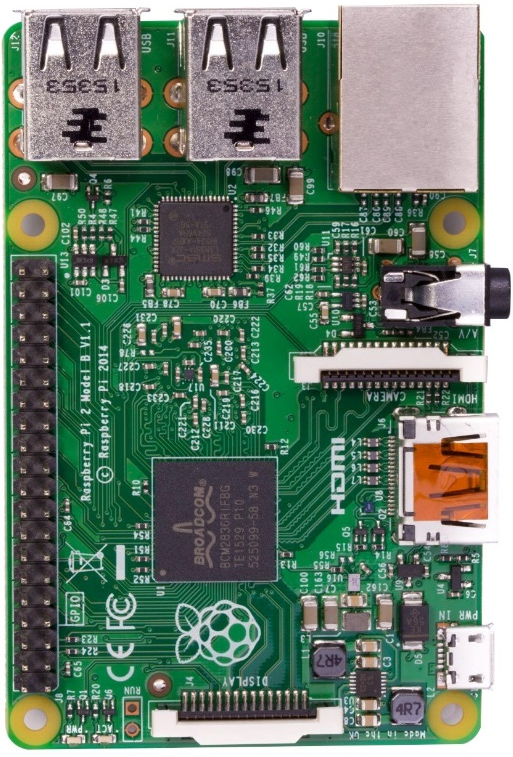
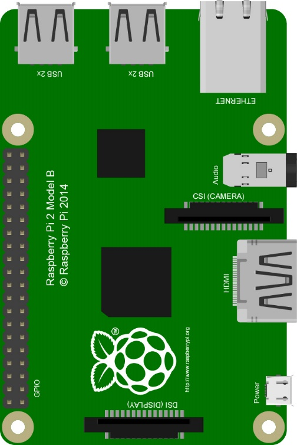
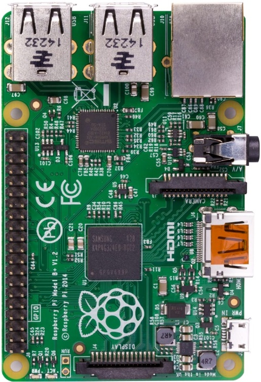
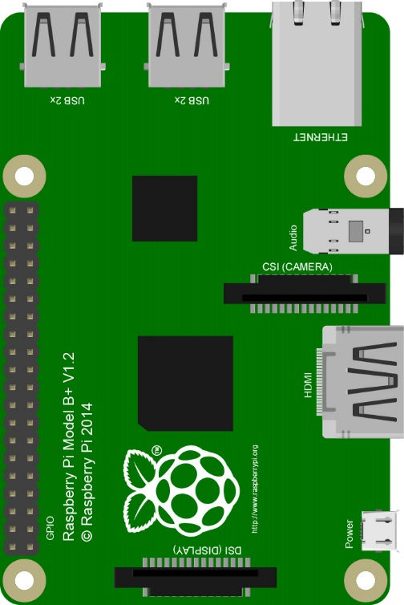
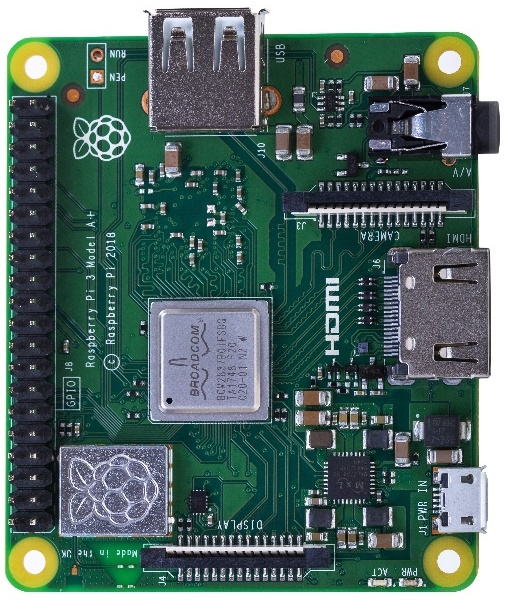
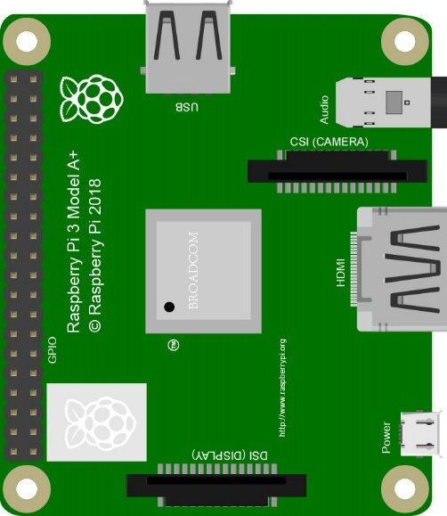
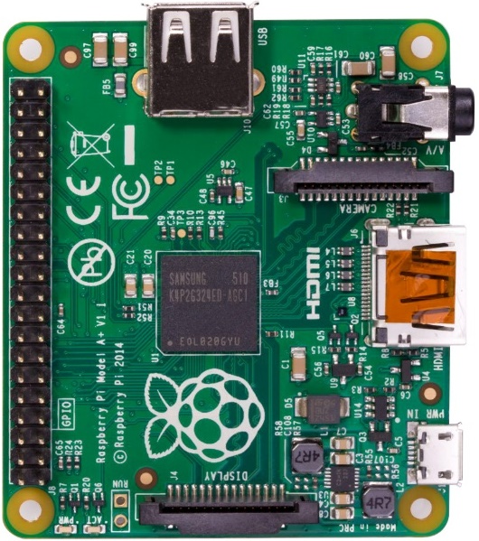
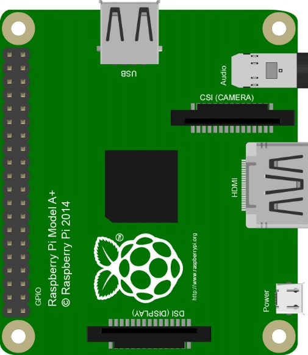
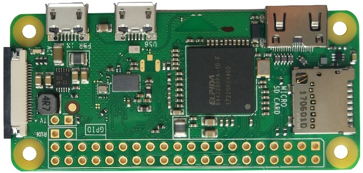
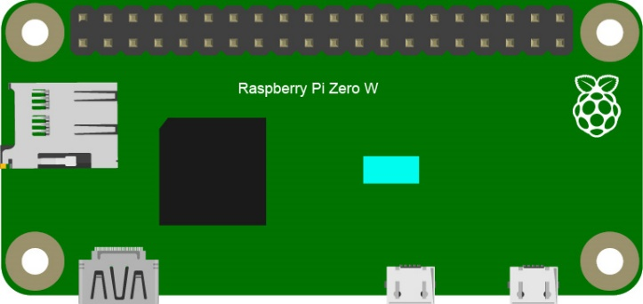
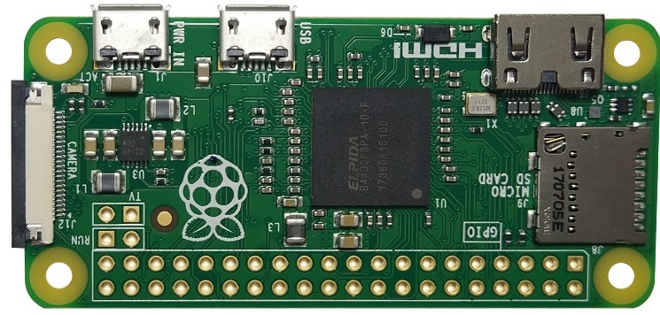
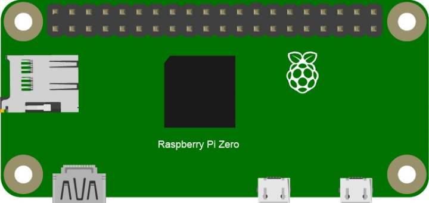

Below are the raspberry pi pictures and model pictures supported by this product. They have 40 pins.

Hardware interface diagram of RPi 5 is shown below: 

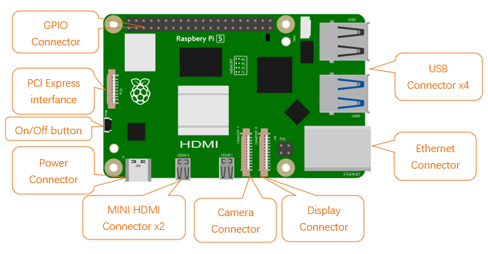

Hardware interface diagram of RPi 4B is shown below:

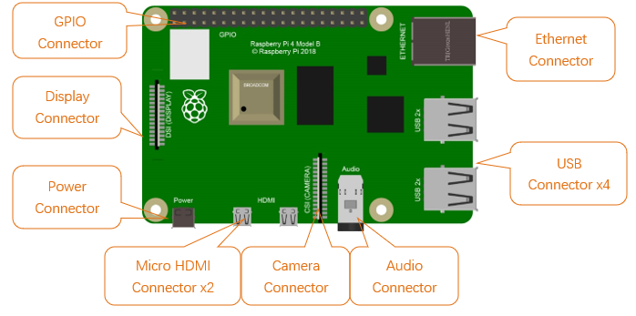

Hardware interface diagram of RPi 3B+/3B/2B/1B+:

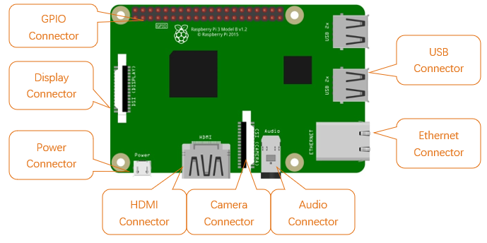

Hardware interface diagram of RPi 3A+/A+:

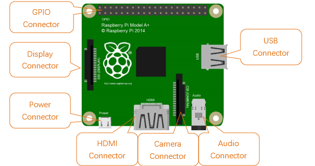

Hardware interface diagram of RPi Zero/Zero W:

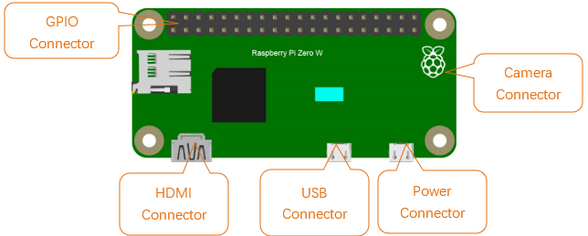

