##############################################################################
0. Chapter Processing
##############################################################################

Processing is a software used to write programs that can run on computers. Processing software is free and open source running on the Mac, Windows, and GNU/Linux platforms, which is the same as Arduino software. In fact, the development of Arduino software is based on Processing software, and they still have similar interface.

Programs written with Processing are also called sketches, and Java is the default language. Java language and C++ language have many similarities, so readers who have learned our basic tutorial are able to understand and write simple Processing sketches quickly.

This tutorial will introduce how to install and use processing software on Raspberry Pi through some electronic circuit projects. Chapters and sequence in this tutorial are basically the same as those in the C and python language tutorial. Our elaborate electronic circuits and interactive project with Processing are attached at the end, including virtual instruments, games (2D and 3D versions), etc.

Download Code
****************************************************************

Run the following command to download the code to Raspberry Pi.

.. code-block:: console
    
    $ cd ~
    $ git clone --depth 1 https://github.com/Freenove/Freenove_Projects_Kit_for_Raspberry_Pi.git

Run the command to rename the folder.

.. code-block:: console
    
    $ mv Freenove_Projects_Kit_for_Raspberry_Pi/ Freenove_Kit/

Installing Processing Software
****************************************************************

Installing the installation package for Processing Software. 

Make sure your RPi always has internet access during the download process. Please download the corresponding Processing software installation package according to your Raspberry Pi system bitness.

You can check the the current system bitness with the following command:

.. code-block:: console
    
    $ getconf LONG_BIT

**Method 1:** 

If you have a 32-bit system, enter the following command to install the package.

.. code-block:: console
    
    $ wget https://github.com/processing/processing4/releases/download/processing-1292-4.2/processing-4.2-linux-arm32.tgz

If you have a 64-bit one, enter the following command to install the package.

.. code-block:: console
    
    $ wget https://github.com/processing/processing4/releases/download/processing-1292-4.2/processing-4.2-linux-arm64.tgz

**Method 2:**

You can also download the installation package directly form the Processing official website:

https://processing.org/ 

Click“Download”. Choose to download the software installation package corresponding to the current Raspberry Pi system bitness.

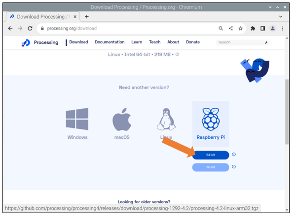

**It is recommended to use the first method to download the software package.**

Find the directory where the installation package is located and extract it to the current directory.

The default directory of the installation package using the first method is: /home/pi, and with the the second method, it is: /home/pi/Downloads

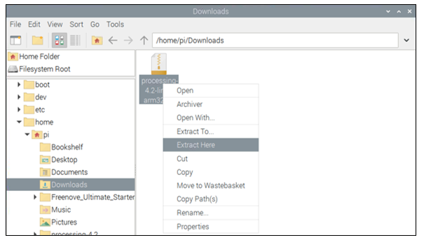

Take the first method as an example: enter the following command to install processing 

1. Run the command to enter the folder.

.. code-block:: console
    
    $ cd ~/processing-4.2

2. Run the command to install software.

.. code-block:: console
    
    $ sh ./install.sh

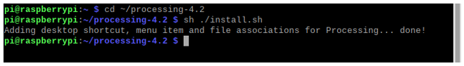

After finishing installation, there will be shortcut in Menu and desktop. 

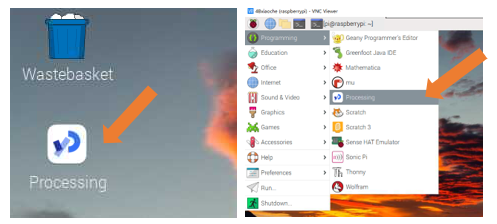

It is worth noting that the Raspberry Pi 5 series is used in this tutorial, which makes the running of Processing smoother. When using other models, there may be a phenomenon of freezing. When the freezing occurs, you cannot complete the experiment. At this time, try to lower the version of Processing, such as the specific version of processing 3.5.3, you can visit the following link:

https://github.com/processing/processing/releases

The installation command for Processing 3.5.3 is as below: 

.. code-block:: console
    
    $ wget https://github.com/processing/processing/releases/download/processing-0269-3.5.3/processing-3.5.3-linux-armv6hf.tgz

Before installing the old version of Processing, you should uninstall Processing 4.2. 

The uninstallation steps are as follows:

1. Run the command to enter the folder.

.. code-block:: console
    
    $ cd ~/processing-4.2

2. Run the command to uninstall software.

.. code-block:: console
    
    $ sh ./uninstall.sh

After the installation is complete, you can double-click the software icon on the desktop to enter the "Processing" software, or you can open the software processing in the system's start menu, as shown in the following figure:

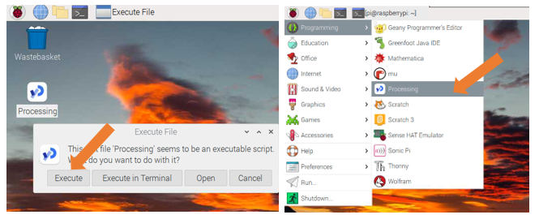

Interface of processing software is shown below: 

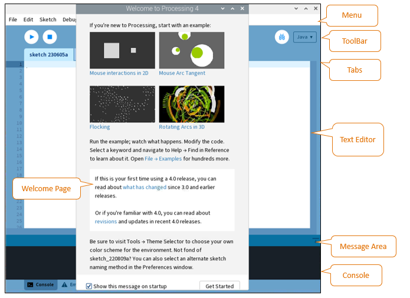

You're now running the Processing Development Environment (or PDE). There's not much to it; the large area is the Text Editor, and there's a row of buttons across the top; this is the toolbar. Below the editor is the Message Area, and below that is the Console. The Message Area is used for one line messages, and the Console is used for more technical details.

First Use
****************************************************************

In the editor, type the following:

.. code-block:: c

    ellipse(50, 50, 80, 80);

This line of code means "draw an ellipse, with the center 50 pixels over from the left and 50 pixels down from the top, with a width and height of 80 pixels." Click the Run button (the triangle button in the Toolbar).

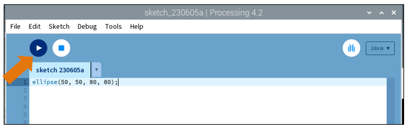

If you've typed everything correctly, you'll see a circle on your screen.

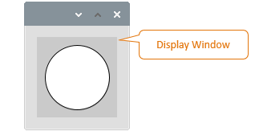

Click on "Stop" (the rectangle button in the Toolbar) or "Close" on Display Window to stop running the program.

If you didn't type it correctly, the Message Area will turn red and report an error. If this happens, make sure that you've copied the example code exactly: the numbers should be contained within parentheses and have commas between each of them, and each line should end with a semicolon.

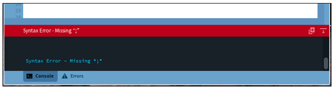

You can export this sketch to an application to run it directly without opening the Processing.

To export the sketch to the application, you must first save it.

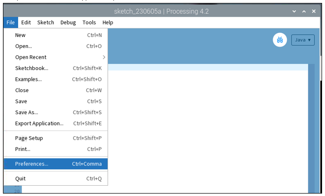

So far, we have completed the first use. I believe you have felt the joy of it.

Installing Freenove_Processing_IO Library
****************************************************************

In this tutorial, the Freenove_Processing_IO library needs to be installed in order to perform corresponding experiments. The Freenove_Processing_IO library allows access to the Raspberry Pi's hardware peripherals, such as digital inputs and outputs, serial buses, etc., in a manner similar to the Arduino platform. In Processing 4.0 and above, manual installation is required. 

Open Proessing, click File > Preferencesto check the library installation path, which, by default, is /home/pi/sketchbook 

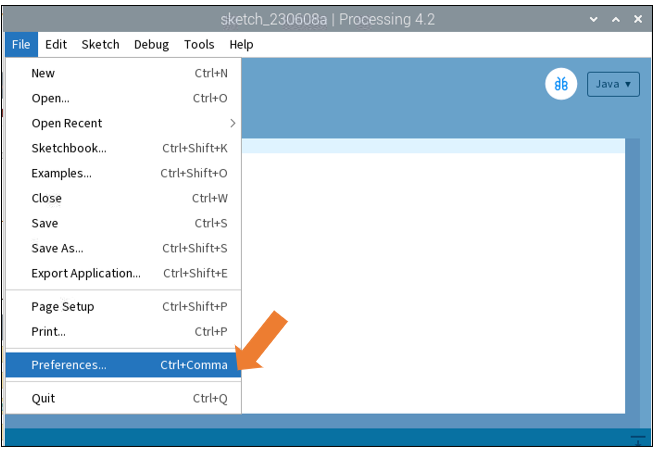

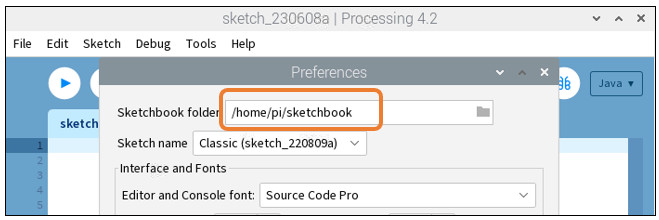

Copy the io folder under /home/pi/Freenove_Kit/Processing/Lib to the Processing library loading directory:

It is worth noting that when opening the file path /home/pi/sketchbook,if there is no folder "libraries", create a folder and name it "libraries".

.. image:: ../_static/imgs/0_Preparation/Chapter00_37.png
    :align: center

Re-open Processing, clickt Sketch> Import Library, and you can see that the Freenove_Processing_IO library has been successfully installed. 

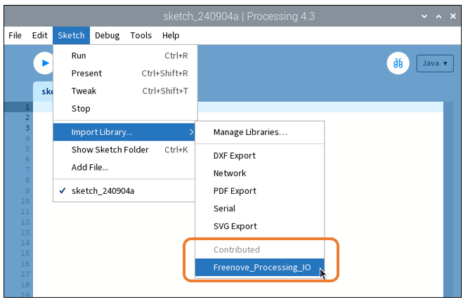

Set Commands to run on the Terminal 

Check the current Processing startup command. Find the Processing execution file on the desktop, right-click and select Properties. Or open the software Processing Properties option in the system's start menu, as shown in the figure below: 

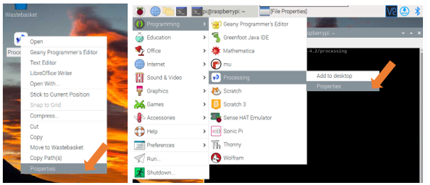

Select Desktop Entry, the content in Command is the current Processing terminal startup command, enter the following content in the terminal to open Processing. The command is different according to the installation path.

.. code-block:: console
    
    /home/pi/processing-4.2/processing

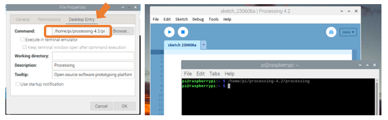

Define an alias for the command

For the convenience of use, we set an alias for the Processing terminal startup command. 

The specific steps are as follows:

1. Enter the following command to edit the $HOME/.bashrc file.

.. code-block:: console
    
    $ nano $HOME/.bashrc

2. Add processing command alias.

.. code-block:: console
    
    $ alias  processing='/home/pi/processing-4.2/processing'

.. image:: ../_static/imgs/0_Preparation/Chapter00_41.png
    :align: center

:red:`Press "CTRL"+"O" and then "Enter" to save the modified content. Then press "CTRL"+"X" to exit editing.`

Close all current terminal pages, open a new terminal page again, enter the following command, open the command list of defined alias to check whether the addition is successful:

.. code-block:: console
    
    $ alias  -p

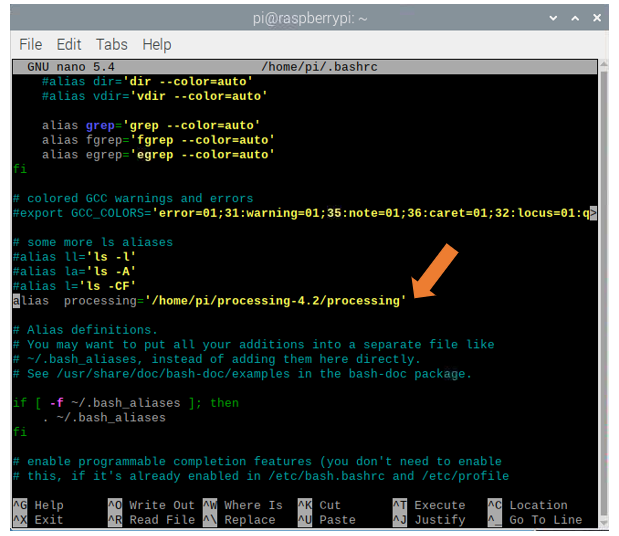

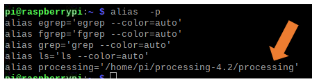

Open the terminal and enter the following to test the terminal command

.. code-block:: console
    
    $ processing

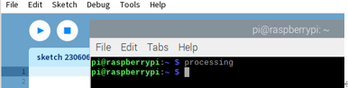

Projects Board for Raspberry Pi 
****************************************************************

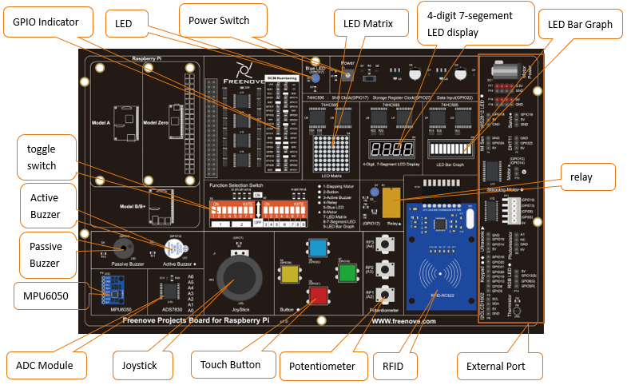

.. note::

    1.	Stepper motor, keypad and RGBLED must NOT be used at the same time.
    
    2.	Touch button and keypad must NOT be used at the same time.
    
    3.	Active buzzer and relay must NOT be used at the same time. 
    
    4.	Motor and ultrasonic module must NOT be used at the same time. 
    
    5.	Servo and WS2812LED must NOT be used at the same time.
    
    6.	Batteries need to be plugged in when using the motor. 