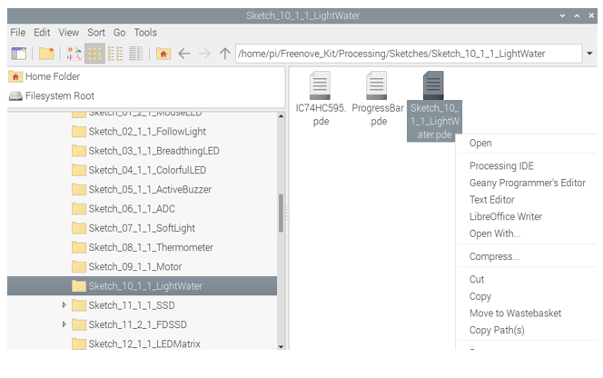
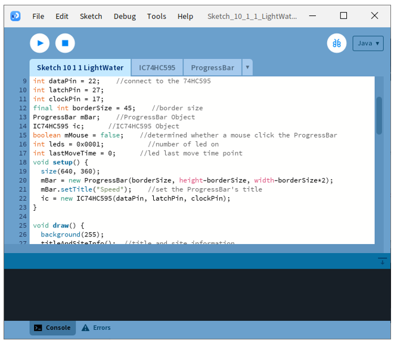
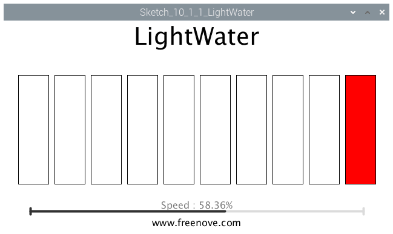
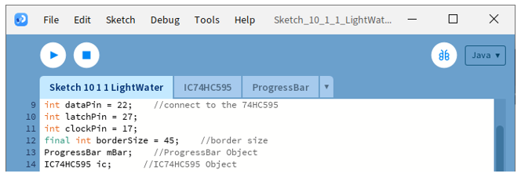

##############################################################################
Chapter 74HC595 & LED Bar Graph
##############################################################################

We have used LED Bar Graph to make a flowing water light, in which 10 GPIO ports of RPi are occupied. More GPIO ports mean that more peripherals can be connected to RPi, so GPIO resource is very precious. Can we make flowing water light with less GPIO ports? In this chapter, we will learn a component, 74HC595, which can achieve the target.

Project 7.1 Flowing Water Light
****************************************************************

Now let us learn how to use the 74HC595 IC Chip to make a flowing water light using less GPIO. 

Component knowledge
================================================================

Bar Graph LED
----------------------------------------------------------------

A Bar Graph LED has 10 LEDs integrated into one compact component. The two rows of pins at its bottom are paired to identify each LED like the single LED used earlier. 

.. image:: ../_static/imgs/16_74HC595_&_Bar_Graph_LED/Chapter16_00.png
    :align: center

74HC595
----------------------------------------------------------------

A 74HC595 chip is used to convert serial data into parallel data. A 74HC595 chip can convert the serial data of one byte into 8 bits, and send its corresponding level to each of the 8 ports correspondingly. With this characteristic, the 74HC595 chip can be used to expand the IO ports of a Raspberry Pi. At least 3 ports on the RPI board are required to control the 8 ports of the 74HC595 chip.

.. image:: ../_static/imgs/16_74HC595_&_Bar_Graph_LED/Chapter16_01.png
    :align: center

The ports of the 74HC595 chip are described as follows:

.. list-table:: 
    :widths: 1 1 1
    :align: center
    :class: product-table

    *   -   Pin name
        -   Pin number
        -   Description
    
    *   -   Q0-Q7
        -   15, 1-7
        -   Parallel Data Output

    *   -   VCC
        -   16
        -   The Positive Electrode of the Power Supply, the Voltage is 2~6V

    *   -   GND 
        -   8
        -   The Negative Electrode of Power Supply

    *   -   DS
        -   14
        -   Serial Data Input

    *   -   OE
        -   13
        -   Enable Output,

            When this pin is in high level, Q0-Q7 is in high resistance state

            When this pin is in low level, Q0-Q7 is in output mode

    *   -   ST_CP
        -   12
        -   Parallel Update Output: when its electrical level is rising, it will update the
        
            parallel data output.

    *   -   SH_CP
        -   11
        -   Serial Shift Clock: when its electrical level is rising, serial data input 
         
            register will do a shift.

    *   -   MR
        -   10
        -   Remove Shift Register: When this pin is in low level, the content in shift
           
            register will be cleared.

    *   -   Q7'
        -   9
        -   Serial Data Output: it can be connected to more 74HC595 chips in series.

For more details, please refer to the datasheet on the 74HC595 chip.

Component List
================================================================

+---------------------------------------------+
| Freenove Projects Board for Raspberry Pi    |
|                                             |
|  |Chapter01_04|                             |
+---------------------+-----------------------+
| Raspberry Pi        | GPIO Ribbon Cable     |
|                     |                       |
|  |Chapter01_05|     |  |Chapter01_06|       |
+---------------------+-----------------------+
| Bar Graph LED                               |
|                                             |
|  |Chapter16_02|                             |                              
|                                             |
+---------------------------------------------+

.. |Chapter01_04| image:: ../_static/imgs/1_LED/Chapter01_04.png
.. |Chapter01_05| image:: ../_static/imgs/1_LED/Chapter01_05.png
.. |Chapter01_06| image:: ../_static/imgs/1_LED/Chapter01_06.png
.. |Chapter16_02| image:: ../_static/imgs/16_74HC595_&_Bar_Graph_LED/Chapter16_02.png

Circuit
================================================================

.. list-table:: 
    :width: 100%
    :align: center
    :class: product-table

    *   -   Schematic diagram
    *   -   |Chapter16_03|
    *   -   Hardware connection:
    *   -   |Chapter16_04|

.. |Chapter16_03| image:: ../_static/imgs/16_74HC595_&_Bar_Graph_LED/Chapter16_03.png
.. |Chapter16_04| image:: ../_static/imgs/16_74HC595_&_Bar_Graph_LED/Chapter16_04.png

.. hint::

    :red:`If it dosen't work, rotate the LED bar graph for 180°.`

.. note::
    
    :red:`If you have any concerns, please send an email to:` support@freenove.com

Sketch
================================================================

Sketch 10.1.1 LightWater
----------------------------------------------------------------

.. note::
    
    :red:`If you have any concerns, please send an email to:` support@freenove.com

First, enter where the project is located:

.. code-block:: console

    /home/pi/Freenove_Kit/Processing/Sketches/Sketch_10_1_1_LightWater

And then right-click to select Processing IDE

Or you can enter a command in the terminal to open the file Sketch_10_1_1_LightWater. (The following is only one line of command. There is a Space after Processing.)

.. code-block:: console

    processing ~/Freenove_Kit/Processing/Sketches/Sketch_10_1_1_LightWater/Sketch_10_1_1_LightWater.pde

Open Processing and click Run。

The result is as shown below. LED bars will light up in turn. The speed can be controlled through the slider.

This project contains a lot of code files, and the core code is contained in the file Sketch_10_1_1_LightWater. The other files only contain some custom classes.

The following is program code:

.. literalinclude:: ../../../freenove_Kit/Processing/Sketches/Sketch_10_1_1_LightWater/Sketch_10_1_1_LightWater.pde
    :linenos: 
    :language: c
    :dedent:

First define the GPIO pin connected to 74HC595, the ProgressBar class object, IC74HC595 class object, and some other variables.

.. literalinclude:: ../../../freenove_Kit/Processing/Sketches/Sketch_10_1_1_LightWater/Sketch_10_1_1_LightWater.pde
    :linenos: 
    :language: c
    :lines: 9-17
    :dedent:

In the function setup(), instantiate ProgressBar class object and IC74HC595 class object.

.. literalinclude:: ../../../freenove_Kit/Processing/Sketches/Sketch_10_1_1_LightWater/Sketch_10_1_1_LightWater.pde
    :linenos: 
    :language: c
    :lines: 20-22
    :dedent:

In the function draw(), set the background, text, and other information and draw the progress bar.

.. literalinclude:: ../../../freenove_Kit/Processing/Sketches/Sketch_10_1_1_LightWater/Sketch_10_1_1_LightWater.pde
    :linenos: 
    :language: c
    :lines: 26-29
    :dedent:

Then according to the speed of followlight, calculate the data “leds” for 74HC595, and write it to 74HC595, then LEDBar Graph is turned on.

.. literalinclude:: ../../../freenove_Kit/Processing/Sketches/Sketch_10_1_1_LightWater/Sketch_10_1_1_LightWater.pde
    :linenos: 
    :language: c
    :lines: 31-37
    :dedent:

Finally, according to the variable leds, draw the virtual LEDBar Graph on Display Window.

.. literalinclude:: ../../../freenove_Kit/Processing/Sketches/Sketch_10_1_1_LightWater/Sketch_10_1_1_LightWater.pde
    :linenos: 
    :language: c
    :lines: 39-48
    :dedent:

About class IC74HC595:

.. c:function:: class IC74HC595

    This is a custom class that is used to operate integrated circuit 74HC595.
    
    public **IC74HC595** (int dPin, int lPin, int cPin) 
    
    Constructor. The parameters are for the GPIO pins connected to 74HC595.
    
    public void **write** (int order,int value)
    
    Used to write data to 74HC595, and the 74HC595 output port will output these data immediately.