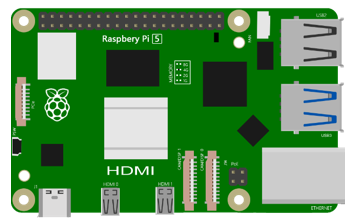
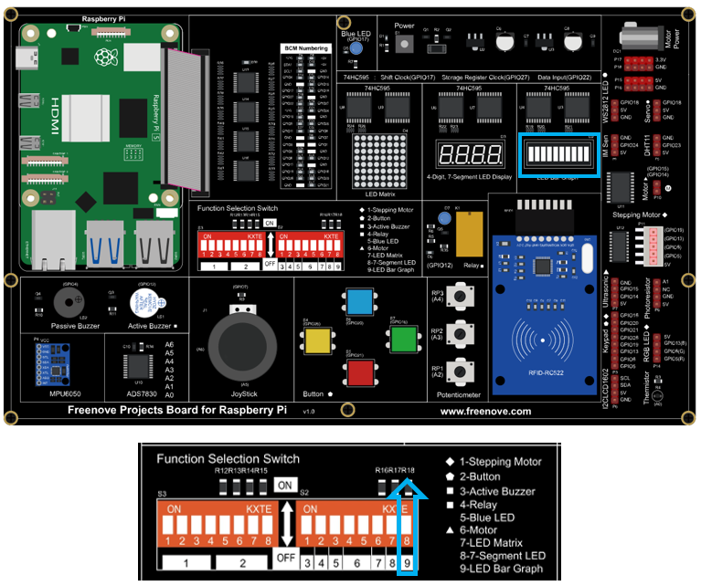

##############################################################################
Chapter 10 74HC595 & LED Bar Graph
##############################################################################

In this chapter, we will learn how to use 74HC595 chip to control Graph LED Bar.

Project 10 Flowing Water Light
****************************************************************

Component List
================================================================

.. table:: 
    :align: center
    :width: 80%
    :class: table-line
    
    +---------------------------------------------+
    | Freenove Projects Board for Raspberry Pi    |
    |                                             |
    |  |Chapter01_04|                             |
    +---------------------+-----------------------+
    | Raspberry Pi        | GPIO Ribbon Cable     |
    |                     |                       |
    |  |Chapter01_05|     |  |Chapter01_06|       |
    +---------------------+-----------------------+
    | Bar Graph LED                               |
    |                                             |
    |  |Chapter16_02|                             |
    +---------------------------------------------+

.. |Chapter01_04| image:: ../_static/imgs/1_LED/Chapter01_04.png

.. |Chapter01_06| image:: ../_static/imgs/1_LED/Chapter01_06.png
.. |Chapter16_02| image:: ../_static/imgs/16_74HC595_&_Bar_Graph_LED/Chapter16_02.png

Circuit
================================================================

.. list-table:: 
    :width: 80%
    :align: center
    :class: table-line

    * - Schematic diagram
    * - |Chapter16_03|
    * - Hardware connection
    * - |Chapter16_04|

.. |Chapter16_03| image:: ../_static/imgs/16_74HC595_&_Bar_Graph_LED/Chapter16_03.png

.. hint::

    :combo:`red font-bolder:If it dosen't work, rotate the LED bar graph for 180°.`

.. note::
    
    :combo:`red font-bolder:If you have any concerns, please send an email to:` support@freenove.com

Sketch
================================================================

Sketch 10.1.1 LightWater
----------------------------------------------------------------

.. note::
    
    :combo:`red font-bolder:If you have any concerns, please send an email to:` support@freenove.com

First, enter where the project is located:

.. code-block:: console

    /home/pi/Freenove_Kit/Processing/Sketches/Sketch_10_1_1_LightWater

And then right-click to select Processing IDE

Or you can enter a command in the terminal to open the file Sketch_10_1_1_LightWater. :combo:`red font-bolder:(The following is only one line of command. There is a Space after Processing.)`

.. code-block:: console

    processing ~/Freenove_Kit/Processing/Sketches/Sketch_10_1_1_LightWater/Sketch_10_1_1_LightWater.pde

Open Processing and click Run

The result is as shown below. LED bars will light up in turn. The speed can be controlled through the slider.

This project contains a lot of code files, and the core code is contained in the file Sketch_10_1_1_LightWater. The other files only contain some custom classes.

.. image:: ../_static/imgs/16_74HC595_&_Bar_Graph_LED/Chapter16_17.png
    :align: center

The following is program code:

.. literalinclude:: ../../../freenove_Kit/Processing/Sketches/Sketch_10_1_1_LightWater/Sketch_10_1_1_LightWater.pde
    :linenos: 
    :language: c
    :dedent:

First define the GPIO pin connected to 74HC595, the ProgressBar class object, IC74HC595 class object, and some other variables.

.. literalinclude:: ../../../freenove_Kit/Processing/Sketches/Sketch_10_1_1_LightWater/Sketch_10_1_1_LightWater.pde
    :linenos: 
    :language: c
    :lines: 9-17
    :dedent:

In the function setup(), instantiate ProgressBar class object and IC74HC595 class object.

.. literalinclude:: ../../../freenove_Kit/Processing/Sketches/Sketch_10_1_1_LightWater/Sketch_10_1_1_LightWater.pde
    :linenos: 
    :language: c
    :lines: 20-22
    :dedent:

In the function draw(), set the background, text, and other information and draw the progress bar.

.. literalinclude:: ../../../freenove_Kit/Processing/Sketches/Sketch_10_1_1_LightWater/Sketch_10_1_1_LightWater.pde
    :linenos: 
    :language: c
    :lines: 26-29
    :dedent:

Then according to the speed of followlight, calculate the data “leds” for 74HC595, and write it to 74HC595, then LEDBar Graph is turned on.

.. literalinclude:: ../../../freenove_Kit/Processing/Sketches/Sketch_10_1_1_LightWater/Sketch_10_1_1_LightWater.pde
    :linenos: 
    :language: c
    :lines: 31-37
    :dedent:

Finally, according to the variable leds, draw the virtual LEDBar Graph on Display Window.

.. literalinclude:: ../../../freenove_Kit/Processing/Sketches/Sketch_10_1_1_LightWater/Sketch_10_1_1_LightWater.pde
    :linenos: 
    :language: c
    :lines: 39-48
    :dedent:

About class IC74HC595:

.. py:function:: class IC74HC595

    This is a custom class that is used to operate integrated circuit 74HC595.
    
    public **IC74HC595** (int dPin, int lPin, int cPin) 
    
    Constructor. The parameters are for the GPIO pins connected to 74HC595.
    
    public void **write** (int order,int value)
    
    Used to write data to 74HC595, and the 74HC595 output port will output these data immediately.

:combo:`red font-bolder:If it dosen't work, rotate the LED bar graph for 180°.`