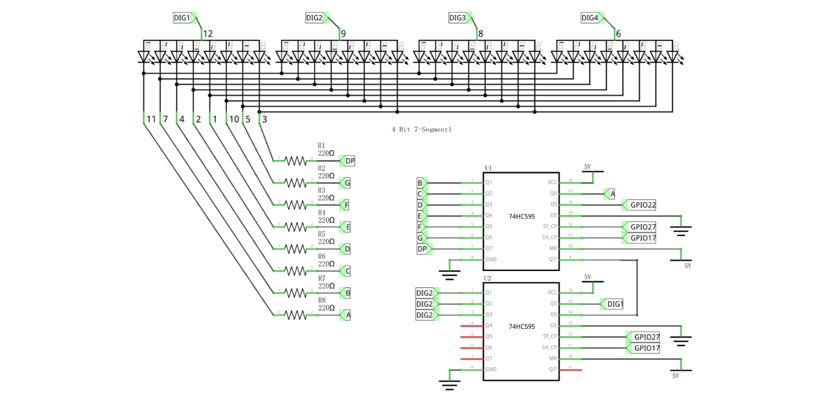
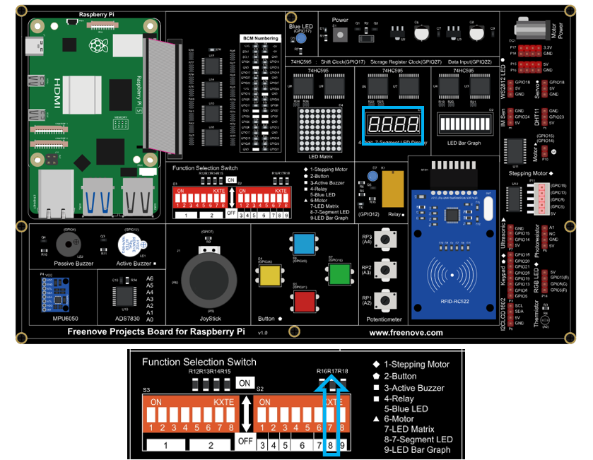
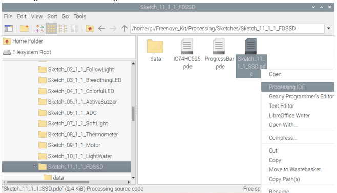
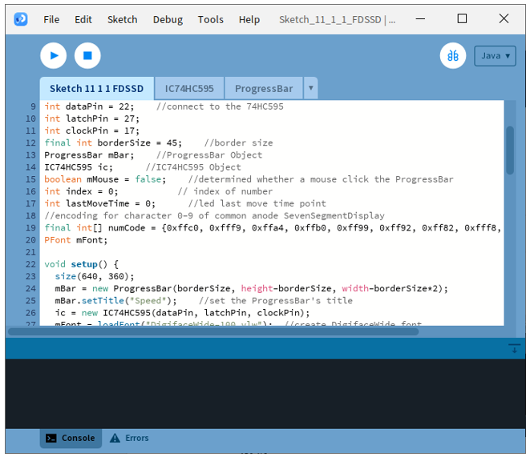
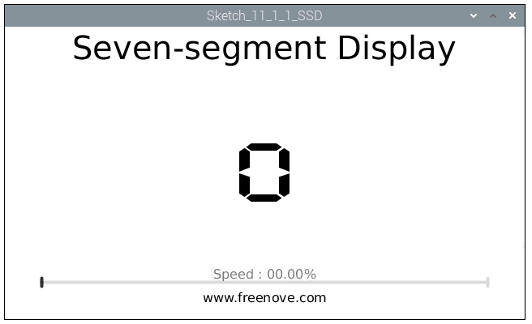
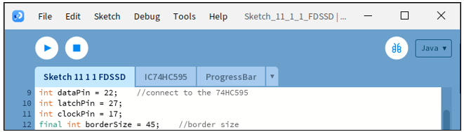
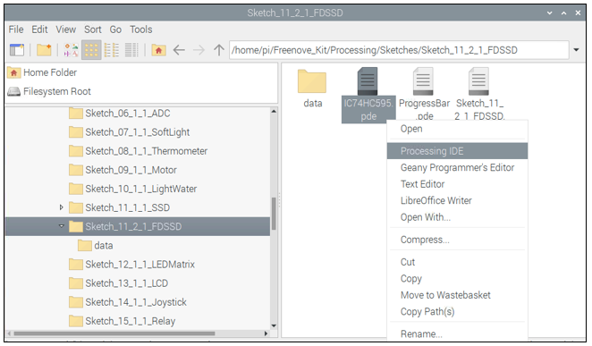
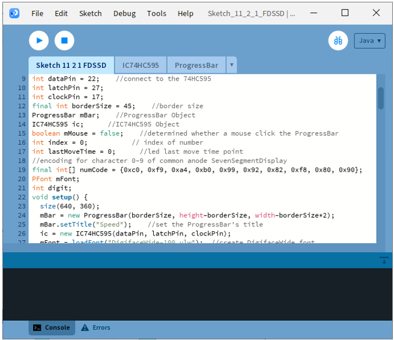
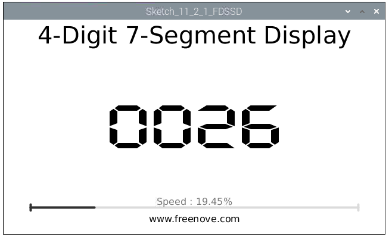
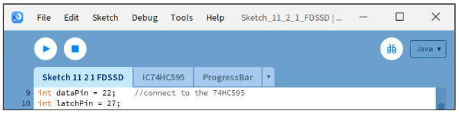

##############################################################################
Chapter 11 74HC595 & Seven-segment display
##############################################################################

In this chapter, we will learn a new component, Seven-segment display (SSD).

Project 11.1 Seven -segment display.
****************************************************************

We will use a 74HC595 IC Chip to control a 4-Digit 7-Segment Display and make it display sixteen decimal characters "0” to “F".

Component List
================================================================

.. table:: 
    :align: center
    :width: 80%
    :class: table-line
    
    +---------------------------------------------+
    | Freenove Projects Board for Raspberry Pi    |
    |                                             |
    |  |Chapter01_04|                             |
    +---------------------+-----------------------+
    | Raspberry Pi        | GPIO Ribbon Cable     |
    |                     |                       |
    |  |Chapter01_05|     |  |Chapter01_06|       |
    +---------------------+-----------------------+
    | 4-Digit 7-Segment Display                   |
    |                                             |
    |  |Chapter17_00|                             |                              
    +---------------------------------------------+

.. |Chapter01_04| image:: ../_static/imgs/1_LED/Chapter01_04.png
.. |Chapter01_05| image:: ../_static/imgs/1_LED/Chapter01_05.png
.. |Chapter01_06| image:: ../_static/imgs/1_LED/Chapter01_06.png
.. |Chapter17_00| image:: ../_static/imgs/17_74HC595_&_4-Digit_7-Segment_Display/Chapter17_00.png

Circuit
=======================================

.. list-table:: 
    :width: 80%
    :align: center
    :class: table-line

    * - Schematic diagram
    * - |Chapter17_21|
    * - Hardware connection
    * - |Chapter17_22|

Sketch
================================================================

In this project, open an independent thread to control the FDSSD. The uncertainty of the system time slice allocation may lead FDSS to flash on the display, which is a normal phenomenon. For details about display principle of FDSSD, please refer to our C and Python manual.

Sketch 11.1.1 SSD
----------------------------------------------------------------

.. note::
    
    :combo:`red font-bolder:If you have any concerns, please send an email to:` support@freenove.com

First, enter where the project is located:

.. code-block:: console

    /home/pi/Freenove_Kit/Processing/Sketches/Sketch_11_1_1_FDSSD

And then right-click to select Processing IDE

Or you can enter a command in the terminal to open the file Sketch_11_1_1_FDSSD. :combo:`red font-bolder:(The following is only one line of command. There is a Space after Processing.)`

.. code-block:: console

    processing ~/Freenove_Kit/Processing/Sketches/Sketch_11_1_1_FDSSD/Sketch_11_1_1_FDSSD.pde

Open Processing and click Run

The result is as shown below. It will display 0-9 in circle. The speed can be changed by dragging the slider.

This project contains a lot of code files, and the core code is contained in the file Sketch_11_1_1_SSD. The other files only contain some custom classes.

The following is program code:

.. literalinclude:: ../../../freenove_Kit/Processing/Sketches/Sketch_11_1_1_FDSSD/Sketch_11_1_1_FDSSD.pde
    :linenos: 
    :language: c
    :dedent:

The project code is similar to that of the previous chapter. The difference is that in this project the data output by 74HC595 is the fixed coding information of FSSD. First, the character "0-9" is defined as code of common anode FSSD.

.. literalinclude:: ../../../freenove_Kit/Processing/Sketches/Sketch_11_1_1_FDSSD/Sketch_11_1_1_FDSSD.pde
    :linenos: 
    :language: c
    :lines: 19-19
    :dedent:

In the function draw(), the data is output at a certain speed. At the same time the Display Window outputs the same character.

.. literalinclude:: ../../../freenove_Kit/Processing/Sketches/Sketch_11_1_1_FDSSD/Sketch_11_1_1_FDSSD.pde
    :linenos: 
    :language: c
    :lines: 36-44
    :dedent:

By creating the font "mFont", we change the font of the characters on Display Window. The font ".vlw" file is created by clicking the "Create Font" on the menu bar, which is saved in the data folder of current Sketch.

.. literalinclude:: ../../../freenove_Kit/Processing/Sketches/Sketch_11_1_1_FDSSD/Sketch_11_1_1_FDSSD.pde
    :linenos: 
    :language: c
    :lines: 20-28
    :dedent:

For more details about loadFont(), please refer to "Help -> Reference -> loadFont()" or the official website:

https://processing.org/reference/loadFont\_.html 

By creating an empty font, you can reset the font to default font.

.. literalinclude:: ../../../freenove_Kit/Processing/Sketches/Sketch_11_1_1_FDSSD/Sketch_11_1_1_FDSSD.pde
    :linenos: 
    :language: c
    :lines: 71-71
    :dedent:

.. note::
    
    :combo:`red font-bolder:If you have any concerns, please send an email to:` support@freenove.com

Project 11.2 4-digit Seven-segment display.
****************************************************************

Now, let's learn to use 4-digit 7-segment display(FDSSD).

Component List
================================================================

.. table:: 
    :align: center
    :width: 80%
    :class: table-line
    
    +---------------------------------------------+
    | Freenove Projects Board for Raspberry Pi    |
    |                                             |
    |  |Chapter01_04|                             |
    +---------------------+-----------------------+
    | Raspberry Pi        | GPIO Ribbon Cable     |
    |                     |                       |
    |  |Chapter01_05|     |  |Chapter01_06|       |
    +---------------------+-----------------------+
    | 4-Digit 7-Segment Display                   |
    |                                             |
    |  |Chapter17_00|                             |                              
    +---------------------------------------------+

Circuit
================================================================

The same as that of 17.1 

.. note::
    
    :combo:`red font-bolder:If you have any concerns, please send an email to:` support@freenove.com

Sketch
================================================================

In this project, open an independent thread to control the FDSSD. The uncertainty of the system time slice allocation may lead FDSS to flash on the display, which is a normal phenomenon. For details about display principle of FDSSD, please refer to our C and Python manual.

Sketch 11.2.1 FDSSD
----------------------------------------------------------------

.. note::
    
    :combo:`red font-bolder:If you have any concerns, please send an email to:` support@freenove.com

First, enter where the project is located:

.. code-block:: console

    /home/pi/Freenove_Kit/Processing/Sketches/Sketch_11_2_1_FDSSD

And then right-click to select Processing IDE

Or you can enter a command in the terminal to open the file Sketch_11_2_1_FDSSD. :combo:`red font-bolder:(The following is only one line of command. There is a Space after Processing.)`

.. code-block:: console

    processing ~/Freenove_Kit/Processing/Sketches/Sketch_11_2_1_FDSSD/Sketch_11_2_1_FDSSD.pde

Open Processing and click Run

The result is as shown below. It will count from 0 to 9999. The speed can be changed by dragging the slider.

This project contains several code files, as shown below:

The following is program code:

.. literalinclude:: ../../../freenove_Kit/Processing/Sketches/Sketch_11_2_1_FDSSD/Sketch_11_2_1_FDSSD.pde
    :linenos: 
    :language: c
    :dedent:

In a separate thread, make the FDSSD display numbers in scan mode. Subfunction display() is used to make FDSSD display a four-digit number.

.. code-block:: c

      thread("displaySSD");
    ...
    void displaySSD() {
        while (true) {
            display(index);
        }
    }

Other contents of the program are the same as the previous section "SSD".

.. note::
    
    :combo:`red font-bolder:If you have any concerns, please send an email to:` support@freenove.com
