##############################################################################
Chapter I2C-LCD1602
##############################################################################

In this chapter, we will learn about the LCD1602 Display Screen,

Project 13.1 I2C LCD1602
****************************************************************

There are LCD1602 display screen and the I2C LCD. We will introduce both of them in this chapter. But what we use in this project is an I2C LCD1602 display screen. The LCD1602 Display Screen can display 2 lines of characters in 16 columns. It is capable of displaying numbers, letters, symbols, ASCII code and so on. As shown below is a monochrome LCD1602 Display Screen along with its circuit pin diagram

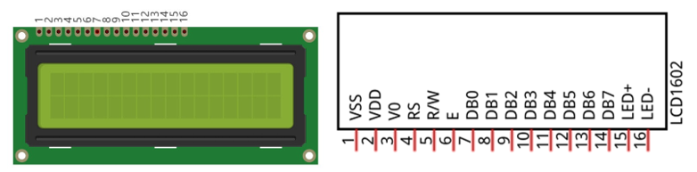

I2C LCD1602 Display Screen integrates a I2C interface, which connects the serial-input & parallel-output module to the LCD1602 Display Screen. This allows us to only use 4 lines to operate the LCD1602.

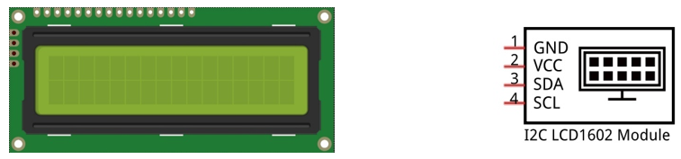

The serial-to-parallel IC chip used in this module is PCF8574T (PCF8574AT), and its default I2C address is 0x27(0x3F). You can also view the RPI bus on your I2C device address through command "i2cdetect -y 1" (refer to the "configuration I2C" section below). 

Below is the PCF8574 chip pin diagram and its module pin diagram:

.. list-table:: 
    :width: 100%
    :align: center
    :class: product-table
    :

    *   -  PCF8574 chip pin diagram:
        -  PCF8574 module pin diagram 

    *   -  |Chapter19_02|
        -  |Chapter19_03|

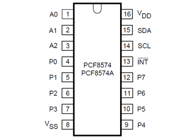
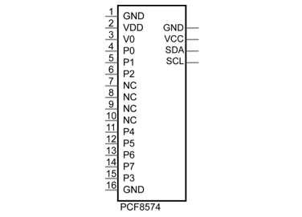

PCF8574 module pins and LCD1602 pins correspond to each other and are connected to each other:

.. image:: ../_static/imgs/19_LCD1602/Chapter19_04.png
    :align: center

Because of this, as stated earlier, we only need 4 pins to control the 16 pins of the LCD1602 Display Screen through the I2C interface.

In this project, we will use the I2C LCD1602 to display some static characters and dynamic variables.

Component List
================================================================

+------------------------------------------------+
| Freenove Projects Board for Raspberry Pi       |
|                                                |
|  |Chapter01_04|                                |
+---------------------+--------------------------+
| Raspberry Pi        | GPIO Ribbon Cable        |
|                     |                          |
|  |Chapter01_05|     |  |Chapter01_06|          |
+---------------------+--------------------------+
| Jumper Wire         | I2C LCD1602 Module       |
|                     |                          |
|  |Chapter05_02|     |  |Chapter19_05|          |
+---------------------+--------------------------+

.. |Chapter01_04| image:: ../_static/imgs/1_LED/Chapter01_04.png
.. |Chapter01_05| image:: ../_static/imgs/1_LED/Chapter01_05.png
.. |Chapter01_06| image:: ../_static/imgs/1_LED/Chapter01_06.png
.. |Chapter05_02| image:: ../_static/imgs/5_RGB_LED/Chapter05_02.png
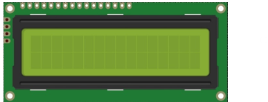

Circuit
================================================================

.. note::
    
    the power supply for I2C LCD1602 in this circuit is 5V.

.. list-table:: 
    :width: 100%
    :align: center
    :class: product-table

    *   -   Schematic diagram
    *   -   |Chapter19_06|
    *   -   Hardware connection:
    *   -   |Chapter19_07|

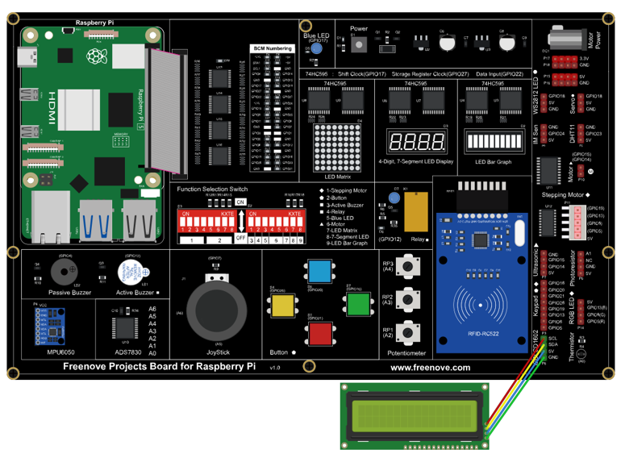

.. note::
    
    :red:`If you have any concerns, please send an email to:` support@freenove.com

Sketch
================================================================

Sketch 13.1.1 LCD
----------------------------------------------------------------

.. note::
    
    :red:`If you have any concerns, please send an email to:` support@freenove.com

First, enter where the project is located:

.. code-block:: console

    /home/pi/Freenove_Kit/Processing/Sketches/Sketch_13_1_1_LCD

And then right-click to select Processing IDE

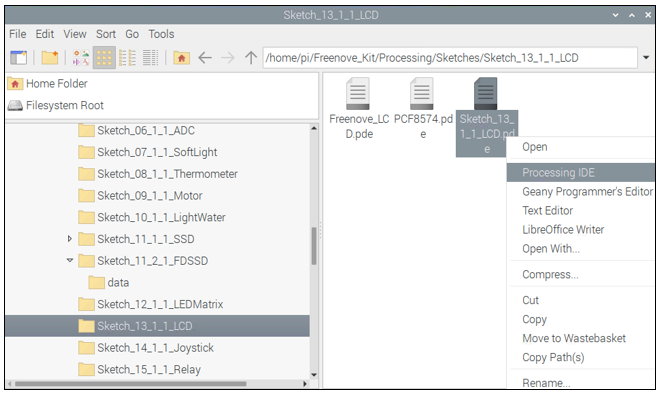

Or you can enter a command in the terminal to open the file Sketch_13_1_1_LCD. (The following is only one line of command. There is a Space after Processing.)

.. code-block:: console

    processing ~/Freenove_Kit/Processing/Sketches/Sketch_13_1_1_LCD/Sketch_13_1_1_LCD.pde

Open Processing and click Run

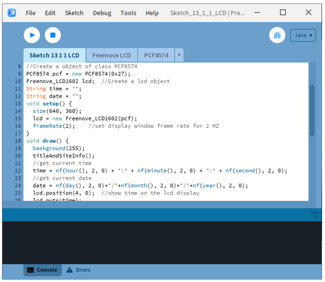

The result is as shown below. You can see the time and date on the pop-up window and LCD1602 screen。

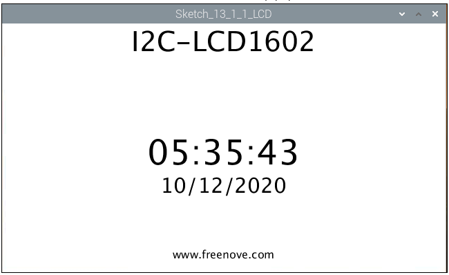

.. note::
    
    If you cannot see anything on the display or the display is not clear, try rotating the white knob on back of LCD1602 slowly, which adjusts the contrast, until the screen can display the Time and Data clearly.

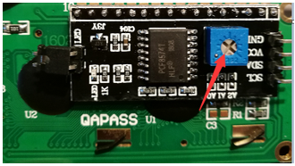

This project contains a lot of code files, and the core code is contained in the file Sketch_13_1_1_LCD. The other files only contain some custom classes.

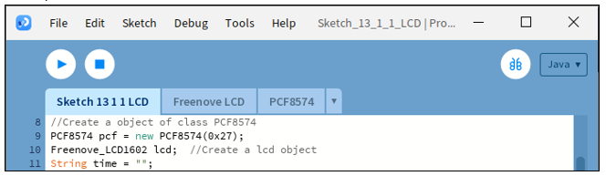

The following is program code:

.. literalinclude:: ../../../freenove_Kit/Processing/Sketches/Sketch_13_1_1_LCD/Sketch_13_1_1_LCD.pde
    :linenos: 
    :language: c
    :dedent:

First create a PCF8574 class object “pcf”, and take “pcf” as a parameter to create an LCD1602 class object. And then define the variable “time” to store date and time. Display window needs not refresh frequently. Therefore, the frame rate can be set to 1Hz or 2Hz.

.. literalinclude:: ../../../freenove_Kit/Processing/Sketches/Sketch_13_1_1_LCD/Sketch_13_1_1_LCD.pde
    :linenos: 
    :language: c
    :lines: 9-17
    :dedent:

In the function draw(), get the current time and date, and display them on the LCD1602 and Display Window.

.. literalinclude:: ../../../freenove_Kit/Processing/Sketches/Sketch_13_1_1_LCD/Sketch_13_1_1_LCD.pde
    :linenos: 
    :language: c
    :lines: 18-30
    :dedent:

Reference
----------------------------------------------------------------

.. c:function:: class PCF8574

    This is a custom class that is used to control the integrated circuit PCF8574.
    
    public **PCF8574** (int addr)
    
    Constructor, used to create a PCF8574 class object. The parameter represents the I2C device address of PCF8574.
    
    public int **digitalRead** (int pin)
    
    Used to read the value(HIGH/LOW) of one of the ports.
    
    public int **readByte** ()
    
    Used to read values of all ports.
    
    public void **digitalWrite** (int pin, int val)
    
    Write data(HIGH/LOW) to a port.
    
    public void **writeByte** (int data)
    
    Write data to all ports.

.. c:function:: class Freenove_LCD

    This is a custom class that is currently only used to control the I2C-LCD1602 connected to PCF8574.
    
    public **Freenove_LCD1602** (PCF8574 ipcf)
    
        Constructor, used to create Freenove_LCD1602 class object. The parameter is for PCF8574 class object.
    
    public void **putChar** (char data)
    
        Write a character to the LCD screen.
    
    public void **puts** (String str)
    
        Write a string to the LCD screen.
    
    public void **display** (boolean state)
    
        Turn on/off LCD.
    
    public void **lcdCursor** (boolean state)
    
        Turn on/off Cursor.
    
    public void **cursorBlink** (boolean state)
        
        Turn on/off Cursor Blink. 
    
    public void **position** (int x, int y)
    
        Set the location of Cursor.
    
    public void **home** ()  
    
        Set the Cursor to home.
    
    public void **lcdClear** ()
    
        Clear the screen.
    
    public void **backLightON** ()  &  public void **backLightOFF** ()
    
        Turn on/off the backlight.
    
    public void **scrollDisplayLeft** ()  &  public void **scrollDisplayRight** ()
    
        Shift screen of a unit to left/right.
    
    public void **leftToRight** ()  &  public void **rightToLeft** ()
    
        Set text direction to be from left to right / from right to left.
    
    public void **autoScroll** ()  &  public void **noAutoScroll** ()
    
        Automatic shifting screen/turn off automatic shifting screen.

.. note::
    
    :red:`If you have any concerns, please send an email to:` support@freenove.com