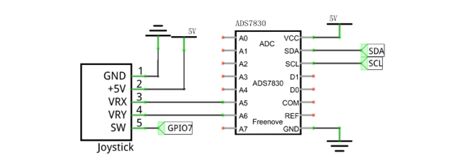
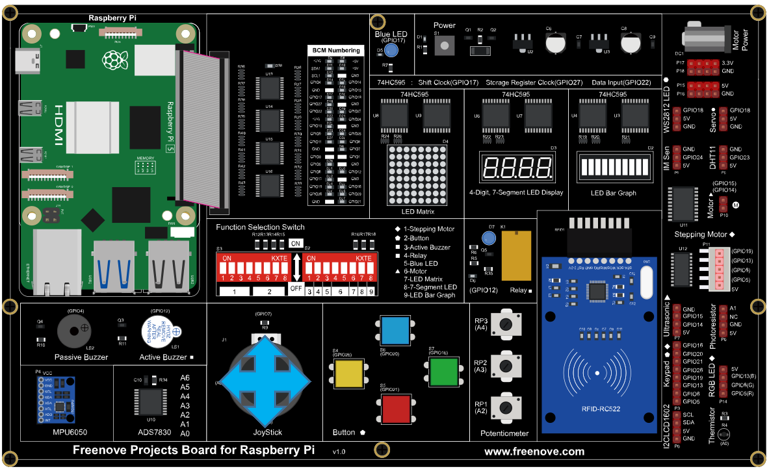

##############################################################################
Chapter 14 Joystick
##############################################################################

In the previous chapter, we have learned how to use a rotary potentiometer. Now, let's learn a new electronic module Joystick which works on the same principle as the rotary potentiometer.

Project 14.1 Joystick
****************************************************************

In this project, we will read the data of the joystick, and draw its coordinates position and Z axis state on the Display window.

Component knowledge
================================================================

Component List
================================================================

.. table:: 
    :align: center
    :width: 80%
    :class: table-line
    
    +------------------------------------------+
    | Freenove Projects Board for Raspberry Pi |
    |                                          |
    |  |Chapter01_04|                          |
    +---------------------+--------------------+
    | Raspberry Pi        | GPIO Ribbon Cable  |
    |                     |                    |
    |  |Chapter01_05|     |  |Chapter01_06|    |
    +---------------------+--------------------+

.. |Chapter01_04| image:: ../_static/imgs/1_LED/Chapter01_04.png
.. |Chapter01_05| image:: ../_static/imgs/1_LED/Chapter01_05.png
.. |Chapter01_06| image:: ../_static/imgs/1_LED/Chapter01_06.png

Circuit
================================================================

.. list-table::
    :width: 80%
    :align: center
    :class: table-line

    * - Schematic diagram
    * - |Chapter10_02|
    * - Hardware connection
    * - |Chapter10_03|

.. note::
    
    :combo:`red font-bolder:If you have any concerns, please send an email to:` support@freenove.com

Sketch
================================================================

Sketch 14.1.1 Joystick
----------------------------------------------------------------

First, enter where the project is located:

.. code-block:: console

    /home/pi/Freenove_Kit/Processing/Sketches/Sketch_14_1_1_Joystick

And then right-click to select Processing IDE

.. image:: ../_static/imgs/10_Joystick/Chapter10_10.png
    :align: center

Or you can enter a command in the terminal to open the file Sketch_14_1_1_Joystick. :combo:`red font-bolder:(The following is only one line of command. There is a Space after Processing.)`

.. code-block:: console

    processing ~/Freenove_Kit/Processing/Sketches/Sketch_14_1_1_Joystick/Sketch_14_1_1_Joystick.pde

Open Processing and click Run.

.. image:: ../_static/imgs/10_Joystick/Chapter10_11.png
    :align: center

The result is as shown below. The movement of the circle can be controlled through the joystick.

.. image:: ../_static/imgs/10_Joystick/Chapter10_12.png
    :align: center

This project contains several code files, as shown below:

.. image:: ../_static/imgs/10_Joystick/Chapter10_13.png
    :align: center

The following is program code:

.. literalinclude:: ../../../freenove_Kit/Processing/Sketches/Sketch_14_1_1_Joystick/Sketch_14_1_1_Joystick.pde
    :linenos: 
    :language: c
    :dedent:

In function draw(), the ADC value of three axes Joystick is read. And the ADC value of X and Y directions are mapped into the position of the circle, and the ADC value of Z axis is mapped into the filled color of the circle.

.. literalinclude:: ../../../freenove_Kit/Processing/Sketches/Sketch_14_1_1_Joystick/Sketch_14_1_1_Joystick.pde
    :linenos: 
    :language: c
    :lines: 24-39
    :dedent:

.. note::
    
    :combo:`red font-bolder:If you have any concerns, please send an email to:` support@freenove.com