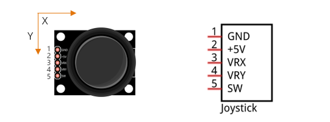
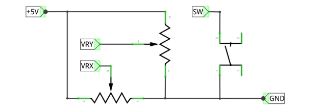

##############################################################################
Chapter Joystick
##############################################################################

In the previous chapter, we have learned how to use a rotary potentiometer. Now, let's learn a new electronic module Joystick which works on the same principle as the rotary potentiometer.

Project 14.1 Joystick
****************************************************************

In this project, we will read the data of the joystick, and draw its coordinates position and Z axis state on the Display window.

Component knowledge
================================================================

Joystick
----------------------------------------------------------------

A Joystick is a kind of input sensor used with your fingers. You should be familiar with this concept already as they are widely used in gamepads and remote controls. It can receive input on two axes (Y and or X) at the same time (usually used to control direction on a two dimensional plane). And it also has a third direction capability by pressing down (Z axis/direction).

This is accomplished by incorporating two rotary potentiometers inside the Joystick Module at 90 degrees of each other, placed in such a manner as to detect shifts in two directions simultaneously and with a Push Button Switch in the “vertical” axis, which can detect when a User presses on the Joystick.

When the Joystick data is read, there are some differences between the axes: data of X and Y axes is analog, which needs to use the ADC. The data of the Z axis is digital, so you can directly use the GPIO to read this data or you have the option to use the ADC to read this.

Component List
================================================================

+------------------------------------------+
| Freenove Projects Board for Raspberry Pi |
|                                          |
|  |Chapter01_04|                          |
+---------------------+--------------------+
| Raspberry Pi        | GPIO Ribbon Cable  |
|                     |                    |
|  |Chapter01_05|     |  |Chapter01_06|    |
+---------------------+--------------------+

.. |Chapter01_04| image:: ../_static/imgs/1_LED/Chapter01_04.png
.. |Chapter01_05| image:: ../_static/imgs/1_LED/Chapter01_05.png
.. |Chapter01_06| image:: ../_static/imgs/1_LED/Chapter01_06.png

Circuit
================================================================

.. list-table:: 
    :width: 100%
    :align: center
    :class: product-table

    *   -   Schematic diagram
    *   -   |Chapter10_00|
    *   -   Hardware connection:
    *   -   |Chapter10_01|

.. |Chapter10_00| image:: ../_static/imgs/9_Thermistor/Chapter10_00.png
.. |Chapter10_01| image:: ../_static/imgs/9_Thermistor/Chapter10_01.png

.. note::
    
    :red:`If you have any concerns, please send an email to:` support@freenove.com

Sketch
================================================================

Sketch 14.1.1 Joystick
----------------------------------------------------------------

First, enter where the project is located:

.. code-block:: console

    /home/pi/Freenove_Kit/Processing/Sketches/Sketch_14_1_1_Joystick

And then right-click to select Processing IDE

Or you can enter a command in the terminal to open the file Sketch_14_1_1_Joystick. (The following is only one line of command. There is a Space after Processing.)

.. code-block:: console

    processing ~/Freenove_Kit/Processing/Sketches/Sketch_14_1_1_Joystick/Sketch_14_1_1_Joystick.pde

Open Processing and click Run.

.. image:: ../_static/imgs/10_Joystick/Chapter10_11.png
    :align: center

The result is as shown below. The movement of the circle can be controlled through the joystick.

.. image:: ../_static/imgs/10_Joystick/Chapter10_12.png
    :align: center

This project contains several code files, as shown below:

.. image:: ../_static/imgs/10_Joystick/Chapter10_13.png
    :align: center

The following is program code:

.. literalinclude:: ../../../freenove_Kit/Processing/Sketches/Sketch_14_1_1_Joystick/Sketch_14_1_1_Joystick.pde
    :linenos: 
    :language: c
    :dedent:

In function draw(), the ADC value of three axes Joystick is read. And the ADC value of X and Y directions are mapped into the position of the circle, and the ADC value of Z axis is mapped into the filled color of the circle.

.. literalinclude:: ../../../freenove_Kit/Processing/Sketches/Sketch_14_1_1_Joystick/Sketch_14_1_1_Joystick.pde
    :linenos: 
    :language: c
    :lines: 24-39
    :dedent:

.. note::
    
    :red:`If you have any concerns, please send an email to:` support@freenove.com