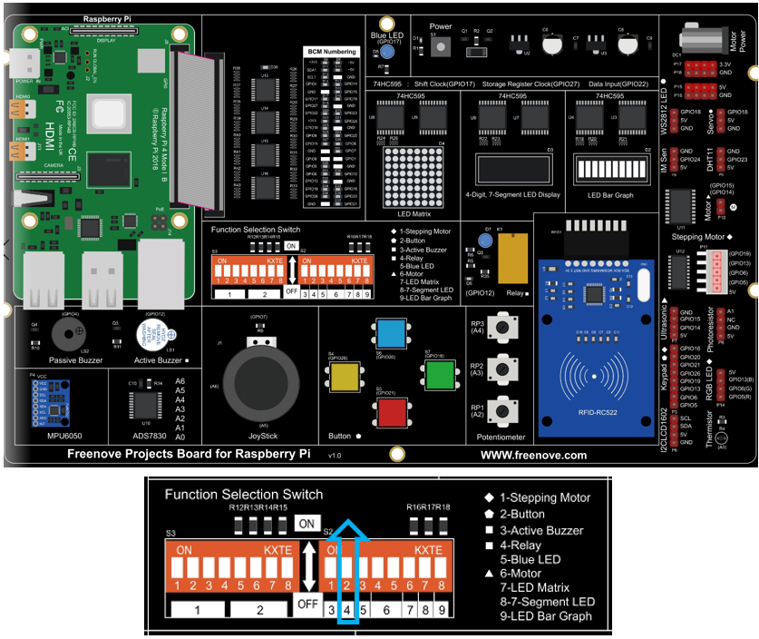

##############################################################################
Chapter 15 Relay & LED
##############################################################################

In this chapter, we will learn how to use a relay.

Project 15.1 Relay & LED
****************************************************************

In the project, the relay is used to control the LED.	

Component List
================================================================

.. table::
    :class: table-line
    :align: center
    :width: 80%

    +------------------------------------------+
    | Freenove Projects Board for Raspberry Pi |
    |                                          |
    |  |Chapter01_04|                          |
    +---------------------+--------------------+
    | Raspberry Pi        | GPIO Ribbon Cable  |
    |                     |                    |
    |  |Chapter01_05|     |  |Chapter01_06|    |
    +---------------------+--------------------+

.. |Chapter01_04| image:: ../_static/imgs/1_LED/Chapter01_04.png
.. |Chapter01_05| image:: ../_static/imgs/1_LED/Chapter01_05.png
.. |Chapter01_06| image:: ../_static/imgs/1_LED/Chapter01_06.png

Circuit
================================================================

.. list-table:: 
    :width: 80%
    :align: center
    :class: table-line

    * - Schematic diagram
    * - |Chapter12_05|
    * - Hardware connection:
    * - |Chapter12_17|

.. |Chapter12_05| image:: ../_static/imgs/12_Relay_&_LED/Chapter12_05.png

.. note::
    
    :combo:`red font-bolder:If you have any concerns, please send an email to:` support@freenove.com

Sketch
================================================================

Sketch 15.1.1 Relay
----------------------------------------------------------------

First, enter where the project is located:

.. code-block:: console

    /home/pi/Freenove_Kit/Processing/Sketches/Sketch_15_1_1_Relay

And then right-click to select Processing IDE

.. image:: ../_static/imgs/12_Relay_&_LED/Chapter12_13.png
    :align: center

Or you can enter a command in the terminal to open the file Sketch_15_1_1_Relay. (The following is only one line of command. There is a Space after Processing.)

.. code-block:: console

    processing ~/Freenove_Kit/Processing/Sketches/Sketch_15_1_1_Relay/Sketch_15_1_1_Relay.pde

Open Processing and click Run.

.. image:: ../_static/imgs/12_Relay_&_LED/Chapter12_14.png
    :align: center

The result is as shown below. Clicking the button will light up the LED and clicking it again will turn the LED OFF.

.. image:: ../_static/imgs/12_Relay_&_LED/Chapter12_15.png
    :align: center

This project contains several code files, as shown below:

.. image:: ../_static/imgs/12_Relay_&_LED/Chapter12_16.png
    :align: center

The following is program code:

.. literalinclude:: ../../../freenove_Kit/Processing/Sketches/Sketch_15_1_1_Relay/Sketch_15_1_1_Relay.pde
    :linenos: 
    :language: c
    :dedent:

First define pins corresponding to the key and relay.

.. literalinclude:: ../../../freenove_Kit/Processing/Sketches/Sketch_15_1_1_Relay/Sketch_15_1_1_Relay.pde
    :linenos: 
    :language: c
    :lines: 9-13
    :dedent:

In the function setup(), Display Window and virtual button are initialized.

.. literalinclude:: ../../../freenove_Kit/Processing/Sketches/Sketch_15_1_1_Relay/Sketch_15_1_1_Relay.pde
    :linenos: 
    :language: c
    :lines: 16-22
    :dedent:

In the function draw(), scan entity buttons. If the button is pressed, then execute the subfunction relayAction(), in which the state of Relay and virtual buttons will be changed. And then draw the virtual buttons and fan blades.

.. literalinclude:: ../../../freenove_Kit/Processing/Sketches/Sketch_15_1_1_Relay/Sketch_15_1_1_Relay.pde
    :linenos: 
    :language: c
    :lines: 24-36
    :dedent:

Reference
---------------------------------------------------------------

.. py:function:: class SingleKey
    
    This is a custom class that is used to control the state of an independent single key.
    
    public **SingleKey** (int Pin)
    
    Constructor, used to create a SingleKey class object. The parameter represents the GPIO pin number connected to the key.
    
    void **keyScan** ()
    
    Used to detect key state. If the key is pressed, the member variable isPressed will be turned to true, and corresponding GPIO pin number will be assigned to the global variable keyValue. Otherwise, isPressed is false, keyValue is -1.

.. note::
    
    :combo:`red font-bolder:If you have any concerns, please send an email to:` support@freenove.com