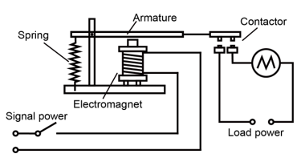
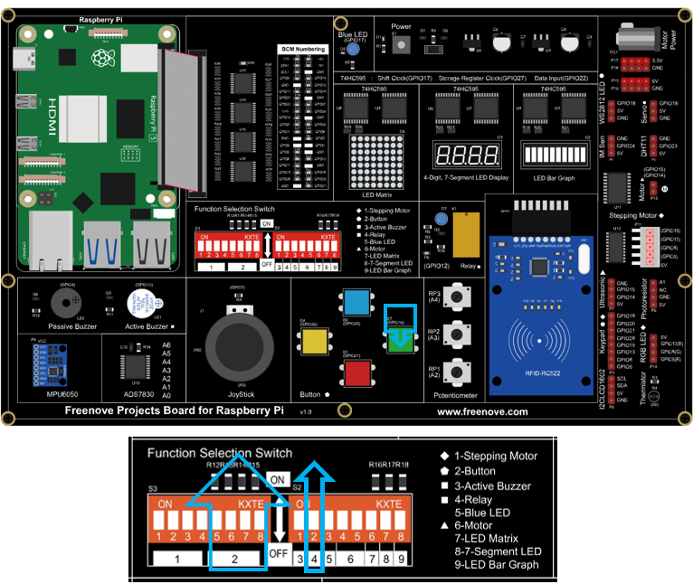

##############################################################################
Chapter Relay & LED
##############################################################################

In this chapter, we will learn how to use a relay.

Project 15.1 Relay & LED
****************************************************************

In the project, the relay is used to control the LED.	

Component knowledge
================================================================

Relay
----------------------------------------------------------------

Relays are a type of Switch that open and close circuits electromechanically or electronically. Relays control one electrical circuit by opening and closing contacts in another circuit using an electromagnet to initiate the Switch action. When the electromagnet is energized (powered), it will attract internal contacts completing a circuit, which act as a Switch. Many times Relays are used to allow a low powered circuit (and a small low amperage switch) to safely turn ON a larger more powerful circuit. They are commonly found in automobiles, especially from the ignition to the starter motor.

The following is a basic diagram of a common Relay and the image and circuit symbol diagram of the 5V relay used in this project:

.. list-table:: 
    :width: 100%
    :align: center
    :class: product-table

    *   -   Diagram 
        -   Feature:
        -   Symbol
    
    *   -   |Chapter12_00|
        -   |Chapter12_01|
        -   |Chapter12_02|

.. |Chapter12_01| image:: ../_static/imgs/12_Relay_&_LED/Chapter12_01.png
.. |Chapter12_02| image:: ../_static/imgs/12_Relay_&_LED/Chapter12_02.png

Pin 5 and pin 6 are internally connected to each other. When the coil pin3 and pin 4 are connected to a 5V power supply, pin 1 will be disconnected from pins 5 & 6 and pin 2 will be connected to pins 5 & 6. Pin 1 is called Closed End and pin 2 is called the Open End.

Inductor
----------------------------------------------------------------

The symbol of Inductance is “L” and the unit of inductance is the “Henry” (H). Here is an example of how this can be encountered: 1H=1000mH, 1mH=1000μH.

An Inductor is a passive device that stores energy in its Magnetic Field and returns energy to the circuit whenever required. An Inductor is formed by a Cylindrical Core with many Turns of conducting wire (usually copper wire). Inductors will hinder the changing current passing through it. When the current passing through the Inductor increases, it will attempt to hinder the increasing movement of current; and when the current passing through the inductor decreases, it will attempt to hinder the decreasing movement of current. So the current passing through an Inductor is not transient.

The circuit for a Relay is as follows: The coil of Relay can be equivalent to an Inductor, when a Transistor is present in this coil circuit it can disconnect the power to the relay, the current in the Relay’s coil does not stop immediately, which affects the power supply adversely. To remedy this, diodes in parallel are placed on both ends of the Relay coil pins in opposite polar direction. Having the current pass through the diodes will avoid any adverse effect on the power supply.

.. image:: ../_static/imgs/12_Relay_&_LED/Chapter12_04.png
    :align: center

Component List
================================================================

+------------------------------------------+
| Freenove Projects Board for Raspberry Pi |
|                                          |
|  |Chapter01_04|                          |
+---------------------+--------------------+
| Raspberry Pi        | GPIO Ribbon Cable  |
|                     |                    |
|  |Chapter01_05|     |  |Chapter01_06|    |
+---------------------+--------------------+

.. |Chapter01_04| image:: ../_static/imgs/1_LED/Chapter01_04.png
.. |Chapter01_05| image:: ../_static/imgs/1_LED/Chapter01_05.png
.. |Chapter01_06| image:: ../_static/imgs/1_LED/Chapter01_06.png

Circuit
================================================================

.. list-table:: 
    :width: 100%
    :align: center
    :class: product-table

    *   -   Schematic diagram
    *   -   |Chapter12_05|
    *   -   Hardware connection:
    *   -   |Chapter12_06|

.. |Chapter12_05| image:: ../_static/imgs/12_Relay_&_LED/Chapter12_05.png

.. note::
    
    :red:`If you have any concerns, please send an email to:` support@freenove.com

Sketch
================================================================

Sketch 15.1.1 Relay
----------------------------------------------------------------

First, enter where the project is located:

.. code-block:: console

    /home/pi/Freenove_Kit/Processing/Sketches/Sketch_15_1_1_Relay

And then right-click to select Processing IDE

Or you can enter a command in the terminal to open the file Sketch_15_1_1_Relay. (The following is only one line of command. There is a Space after Processing.)

.. code-block:: console

    processing ~/Freenove_Kit/Processing/Sketches/Sketch_15_1_1_Relay/Sketch_15_1_1_Relay.pde

Open Processing and click Run.

The result is as shown below. Clicking the button will light up the LED and clicking it again will turn the LED OFF.

.. image:: ../_static/imgs/12_Relay_&_LED/Chapter12_15.png
    :align: center

This project contains several code files, as shown below:

The following is program code:

.. literalinclude:: ../../../freenove_Kit/Processing/Sketches/Sketch_15_1_1_Relay/Sketch_15_1_1_Relay.pde
    :linenos: 
    :language: c
    :dedent:

First define pins corresponding to the key and relay.

.. literalinclude:: ../../../freenove_Kit/Processing/Sketches/Sketch_15_1_1_Relay/Sketch_15_1_1_Relay.pde
    :linenos: 
    :language: c
    :lines: 9-13
    :dedent:

In the function setup(), Display Window and virtual button are initialized.

.. literalinclude:: ../../../freenove_Kit/Processing/Sketches/Sketch_15_1_1_Relay/Sketch_15_1_1_Relay.pde
    :linenos: 
    :language: c
    :lines: 16-22
    :dedent:

In the function draw(), scan entity buttons. If the button is pressed, then execute the subfunction relayAction(), in which the state of Relay and virtual buttons will be changed. And then draw the virtual buttons and fan blades.

.. literalinclude:: ../../../freenove_Kit/Processing/Sketches/Sketch_15_1_1_Relay/Sketch_15_1_1_Relay.pde
    :linenos: 
    :language: c
    :lines: 24-36
    :dedent:

Reference

.. c:function:: class SingleKey
    
    This is a custom class that is used to control the state of an independent single key.
    
    public **SingleKey** (int Pin)
    
    Constructor, used to create a SingleKey class object. The parameter represents the GPIO pin number connected to the key.
    
    void **keyScan** ()
    
    Used to detect key state. If the key is pressed, the member variable isPressed will be turned to true, and corresponding GPIO pin number will be assigned to the global variable keyValue. Otherwise, isPressed is false, keyValue is -1.

.. note::
    
    :red:`If you have any concerns, please send an email to:` support@freenove.com