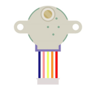

##############################################################################
Chapter 16 Stepper Motor
##############################################################################

Thus far, we have learned about DC Motors and Servos. A DC motor can rotate constantly in on direction but we cannot control the rotation to a specific angle. On the contrary, a Servo can rotate to a specific angle but cannot rotate constantly in one direction. In this chapter, we will learn about a Stepper Motor which is also a type of motor. A Stepper Motor can rotate constantly and also to a specific angle. Using a Stepper Motor can easily achieve higher accuracies in mechanical motion.

Project 16.1 Stepper Motor
****************************************************************

Component List
================================================================

.. table::
    :class: table-line
    :align: center
    :width: 80%

    +---------------------------------------------+
    | Freenove Projects Board for Raspberry Pi    |
    |                                             |
    |  |Chapter01_04|                             |
    +---------------------+-----------------------+
    | Raspberry Pi        | GPIO Ribbon Cable     |
    |                     |                       |
    |  |Chapter01_05|     |  |Chapter01_06|       |
    +---------------------+-----------------------+
    | Stepper Motor                               |
    |                                             |
    |  |Chapter14_04|                             |
    +---------------------------------------------+

.. |Chapter01_04| image:: ../_static/imgs/1_LED/Chapter01_04.png
.. |Chapter01_05| image:: ../_static/imgs/1_LED/Chapter01_05.png
.. |Chapter01_06| image:: ../_static/imgs/1_LED/Chapter01_06.png

Circuit
================================================================

.. list-table:: 
    :width: 100%
    :align: center
    :class: table-line

    * - Schematic diagram
    * - |Chapter14_05|
    * - Hardware connection:
    * - |Chapter14_06|

.. |Chapter14_05| image:: ../_static/imgs/14_Stepper_Motor/Chapter14_05.png
.. |Chapter14_06| image:: ../_static/imgs/14_Stepper_Motor/Chapter14_06.png

Sketch
================================================================

In this project, a separate thread is opened to control the stepper motor. The uncertainty of the system time slice allocation may lead to the running of the stepper motor not smooth, which is a normal phenomenon.

Sketch SteppingMotor
----------------------------------------------------------------

.. note::
    
    :combo:`red font-bolder:If you have any concerns, please send an email to:` support@freenove.com
    
First, enter where the project is located:

.. code-block:: console

    /home/pi/Freenove_Kit/Processing/Sketches/Sketch_16_1_1_SteppingMotor

And then right-click to select Processing IDE

.. image:: ../_static/imgs/14_Stepper_Motor/Chapter14_13.png
    :align: center

Or you can enter a command in the terminal to open the file Sketch_16_1_1_SteppingMotor. :combo:`red font-bolder:(The following is only one line of command. There is a Space after Processing.)`

.. code-block:: console

    processing ~/Freenove_Kit/Processing/Sketches/Sketch_16_1_1_SteppingMotor/Sketch_16_1_1_SteppingMotor.pde

Open Processing and click Run

The result is as shown below. Clicking the button will start or stop the stepper motor. 

This project contains several code files, as shown below:

.. image:: ../_static/imgs/14_Stepper_Motor/Chapter14_16.png
    :align: center

The following is program code:

.. literalinclude:: ../../../freenove_Kit/Processing/Sketches/Sketch_16_1_1_SteppingMotor/Sketch_16_1_1_SteppingMotor.pde
    :linenos: 
    :language: c
    :dedent:

First define 4 GPIOs connected to the motor, the BUTTON class object and SteppingMotor class object.

.. literalinclude:: ../../../freenove_Kit/Processing/Sketches/Sketch_16_1_1_SteppingMotor/Sketch_16_1_1_SteppingMotor.pde
    :linenos: 
    :language: c
    :lines: 9-11
    :dedent:

In the function setup(), initialize the Button, start thread of stepping motor, and set the rotating speed of the virtual motor.

.. literalinclude:: ../../../freenove_Kit/Processing/Sketches/Sketch_16_1_1_SteppingMotor/Sketch_16_1_1_SteppingMotor.pde
    :linenos: 
    :language: c
    :lines: 15-22
    :dedent:

In the function draw(), first draw the button, and calculate the position of the virtual motor and show the current rotating direction.

.. literalinclude:: ../../../freenove_Kit/Processing/Sketches/Sketch_16_1_1_SteppingMotor/Sketch_16_1_1_SteppingMotor.pde
    :linenos: 
    :language: c
    :lines: 24-54
    :dedent:

And then determine whether the stepper motor is in stopping state according to the value of “m.steps”. If it is true, change the rotating direction of motor, and drive the motor to rotate a circle.

.. literalinclude:: ../../../freenove_Kit/Processing/Sketches/Sketch_16_1_1_SteppingMotor/Sketch_16_1_1_SteppingMotor.pde
    :linenos: 
    :language: c
    :lines: 46-52
    :dedent:

Finally draws the virtual fan.

.. literalinclude:: ../../../freenove_Kit/Processing/Sketches/Sketch_16_1_1_SteppingMotor/Sketch_16_1_1_SteppingMotor.pde
    :linenos: 
    :language: c
    :lines: 53-53
    :dedent:

Reference
----------------------------------------------------------------

.. py:function:: class SteppinMotor

    This is a custom class that defines some methods to drive the four-phase stepper motor.
    
    public **SteppingMotor** (int[] mPins)
    
    Constructor. The parameter represents the GPIO pin connected to the stepper motor.
    
    public void **motorStart** ()
    
    Start a stepper motor thread, then the thread is in the state of waiting, waiting for a notification to wake it up.
    
    public void **moveSteps** (int idir, int ims, int isteps)
    
    Used to drive stepper motor to rotate, the parameter “idir” indicates the direction that can be set as CW/CCW. The parameter “ims” is the delay (with unit ms) between each two steps of stepper motor. The higher the value of “ims”, the lower the speed of stepper motor. Parameter “isteps” specifies the number of rotating steps of the stepper motor. As for four-phase stepper motor, four steps make a cycle, if set isteps=1, which means to specify the stepping motor to rotate four steps.
    
    public void **motorStop** ()
    
    Stop stepper motor.
    
    public void **motorRestart** ()
    
    Restart to drive stepper motor.