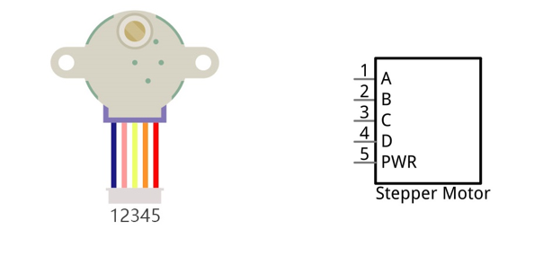
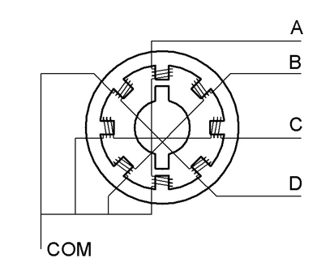
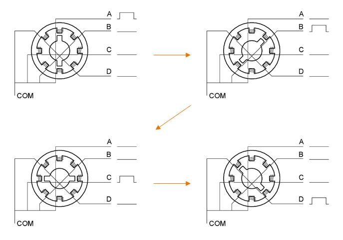

##############################################################################
Chapter Stepper Motor
##############################################################################

Thus far, we have learned about DC Motors and Servos. A DC motor can rotate constantly in on direction but we cannot control the rotation to a specific angle. On the contrary, a Servo can rotate to a specific angle but cannot rotate constantly in one direction. In this chapter, we will learn about a Stepper Motor which is also a type of motor. A Stepper Motor can rotate constantly and also to a specific angle. Using a Stepper Motor can easily achieve higher accuracies in mechanical motion.

Project 14.1 Stepper Motor
****************************************************************

In this project, we will learn how to drive a Stepper Motor, and understand its working principle.

Component knowledge
================================================================

Stepper Motor
----------------------------------------------------------------

Stepper Motors are an open-loop control device, which converts an electronic pulse signal into angular displacement or linear displacement. In a non-overload condition, the speed of the motor and the location of the stops depends only on the pulse signal frequency and number of pulses and is not affected by changes in load as with a DC Motor. A small Four-Phase Deceleration Stepper Motor is shown here:

The electronic schematic diagram of a Four-Phase Stepper Motor is shown below:

The outside case or housing of the Stepper Motor is the Stator and inside the Stator is the Rotor. There is a specific number of individual coils, usually an integer multiple of the number of phases the motor has, when the Stator is powered ON, an electromagnetic field will be formed to attract a corresponding convex diagonal groove or indentation in the Rotor’s surface. The Rotor is usually made of iron or a permanent magnet. Therefore, the Stepper Motor can be driven by powering the coils on the Stator in an ordered sequence (producing a series of “steps” or stepped movements).

A common driving sequence is shown here:

In the sequence above, the Stepper Motor rotates by a certain angle at once, which is called a “step”. By controlling the number of rotational steps, you can then control the Stepper Motor's rotation angle. By defining the time between two steps, you can control the Stepper Motor's rotation speed. When rotating clockwise, the order of coil powered on is: A -> B -> C -> D -> A ->……. And the rotor will rotate in accordance with this order, step by step, called four-steps, four-part. If the coils is powered ON in the reverse order, D -> C -> B -> A -> D ->…… , the rotor will rotate in counter-clockwise direction.

There are other methods to control Stepper Motors, such as: connect A phase, then connect A B phase, the stator will be located in the center of A B, which is called a half-step. This method can improve the stability of the Stepper Motor and reduces noise. Tise sequence of powering the coils looks like this: A -> AB -> B -> BC -> C -> CD -> D -> DA -> A ->……, the rotor will rotate in accordance to this sequence ar, a half-step at a time, called four-steps, eight-part. Conversely, if the coils are powered ON in the reverse order the Stepper Motor will rotate in the opposite direction.

The stator in the Stepper Motor we have supplied has 32 magnetic poles. Therefore, to complete one full revolution requires 32 full steps. The rotor (or output shaft) of the Stepper Motor is connected to a speed reduction set of gears and the reduction ratio is 1:64. Therefore, the final output shaft (exiting the Stepper Motor’s housing) requires 32 X 64 = 2048 steps to make one full revolution.

ULN2003 Stepper Motor driver
----------------------------------------------------------------

A ULN2003 Stepper Motor Driver is used to convert weak signals into more powerful control signals in order to drive the Stepper Motor. In the illustration below, the input signal IN1-IN4 corresponds to the output signal A-D, and 4 LEDs are integrated into the board to indicate the state of these signals. The PWR interface can be used as a power supply for the Stepper Motor. By default, PWR and VCC are connected.

.. image:: ../_static/imgs/14_Stepper_Motor/Chapter14_03.png
    :align: center

Component List
================================================================

+---------------------------------------------+
| Freenove Projects Board for Raspberry Pi    |
|                                             |
|  |Chapter01_04|                             |
+---------------------+-----------------------+
| Raspberry Pi        | GPIO Ribbon Cable     |
|                     |                       |
|  |Chapter01_05|     |  |Chapter01_06|       |
+---------------------+-----------------------+
| Stepper Motor                               |
|                                             |
|  |Chapter14_04|                             |                              
|                                             |
+---------------------------------------------+

.. |Chapter01_04| image:: ../_static/imgs/1_LED/Chapter01_04.png
.. |Chapter01_05| image:: ../_static/imgs/1_LED/Chapter01_05.png
.. |Chapter01_06| image:: ../_static/imgs/1_LED/Chapter01_06.png
.. |Chapter14_04| image:: ../_static/imgs/14_Stepper_Motor/Chapter14_04.png

Circuit
================================================================

.. list-table:: 
    :width: 100%
    :align: center
    :class: product-table

    *   -   Schematic diagram
    *   -   |Chapter14_05|
    *   -   Hardware connection:
    *   -   |Chapter14_06|

.. |Chapter14_06| image:: ../_static/imgs/14_Stepper_Motor/Chapter14_06.png

.. note::
    
    :red:`If you have any concerns, please send an email to:` support@freenove.com

Sketch
================================================================

In this project, a separate thread is opened to control the stepper motor. The uncertainty of the system time slice allocation may lead to the running of the stepper motor not smooth, which is a normal phenomenon.

Sketch 16.1.1 SteppingMotor
----------------------------------------------------------------

.. note::
    
    :red:`If you have any concerns, please send an email to:` support@freenove.com
    
First, enter where the project is located:

.. code-block:: console

    /home/pi/Freenove_Kit/Processing/Sketches/Sketch_16_1_1_SteppingMotor

And then right-click to select Processing IDE

Or you can enter a command in the terminal to open the file Sketch_16_1_1_SteppingMotor. (The following is only one line of command. There is a Space after Processing.)

.. code-block:: console

    processing ~/Freenove_Kit/Processing/Sketches/Sketch_16_1_1_SteppingMotor/Sketch_16_1_1_SteppingMotor.pde

Open Processing and click Run

.. image:: ../_static/imgs/14_Stepper_Motor/Chapter14_14.png
    :align: center

The result is as shown below. Clicking the button will start or stop the stepper motor. 

.. image:: ../_static/imgs/14_Stepper_Motor/Chapter14_15.png
    :align: center

This project contains several code files, as shown below:

.. image:: ../_static/imgs/14_Stepper_Motor/Chapter14_16.png
    :align: center

The following is program code:

.. literalinclude:: ../../../freenove_Kit/Processing/Sketches/Sketch_16_1_1_SteppingMotor/Sketch_16_1_1_SteppingMotor.pde
    :linenos: 
    :language: c
    :dedent:

First define 4 GPIOs connected to the motor, the BUTTON class object and SteppingMotor class object.

.. literalinclude:: ../../../freenove_Kit/Processing/Sketches/Sketch_16_1_1_SteppingMotor/Sketch_16_1_1_SteppingMotor.pde
    :linenos: 
    :language: c
    :lines: 9-11
    :dedent:

In the function setup(), initialize the Button, start thread of stepping motor, and set the rotating speed of the virtual motor.

.. literalinclude:: ../../../freenove_Kit/Processing/Sketches/Sketch_16_1_1_SteppingMotor/Sketch_16_1_1_SteppingMotor.pde
    :linenos: 
    :language: c
    :lines: 15-22
    :dedent:

In the function draw(), first draw the button, and calculate the position of the virtual motor and show the current rotating direction.

.. literalinclude:: ../../../freenove_Kit/Processing/Sketches/Sketch_16_1_1_SteppingMotor/Sketch_16_1_1_SteppingMotor.pde
    :linenos: 
    :language: c
    :lines: 24-54
    :dedent:

And then determine whether the stepper motor is in stopping state according to the value of “m.steps”. If it is true, change the rotating direction of motor, and drive the motor to rotate a circle.

.. literalinclude:: ../../../freenove_Kit/Processing/Sketches/Sketch_16_1_1_SteppingMotor/Sketch_16_1_1_SteppingMotor.pde
    :linenos: 
    :language: c
    :lines: 46-52
    :dedent:

Finally draws the virtual fan.

.. literalinclude:: ../../../freenove_Kit/Processing/Sketches/Sketch_16_1_1_SteppingMotor/Sketch_16_1_1_SteppingMotor.pde
    :linenos: 
    :language: c
    :lines: 53-53
    :dedent:

Reference
----------------------------------------------------------------

.. c:function:: class SteppinMotor

    This is a custom class that defines some methods to drive the four-phase stepper motor.
    
    public **SteppingMotor** (int[] mPins)
    
    Constructor. The parameter represents the GPIO pin connected to the stepper motor.
    
    public void **motorStart** ()
    
    Start a stepper motor thread, then the thread is in the state of waiting, waiting for a notification to wake it up.
    
    public void **moveSteps** (int idir, int ims, int isteps)
    
    Used to drive stepper motor to rotate, the parameter “idir” indicates the direction that can be set as CW/CCW. The parameter “ims” is the delay (with unit ms) between each two steps of stepper motor. The higher the value of “ims”, the lower the speed of stepper motor. Parameter “isteps” specifies the number of rotating steps of the stepper motor. As for four-phase stepper motor, four steps make a cycle, if set isteps=1, which means to specify the stepping motor to rotate four steps.
    
    public void **motorStop** ()
    
    Stop stepper motor.
    
    public void **motorRestart** ()
    
    Restart to drive stepper motor.