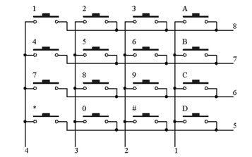

##############################################################################
Chapter 17 Matrix Keypad
##############################################################################

Earlier we learned about a single Push Button Switch. In this chapter, we will learn about Matrix Keyboards, which integrates a number of Push Button Switches as Keys for the purposes of Input.

Project 17.1 Matrix Keypad
****************************************************************

In this project, we will attempt to get every key code on the Matrix Keypad to work.

Component knowledge
================================================================

4x4 Matrix Keypad
----------------------------------------------------------------

First, review the matrix keyboard sequence to facilitate building circuit.

.. image:: ../_static/imgs/21_Matrix_Keypad/Chapter21_00.png
    :align: center

Component List
================================================================

.. table:: 
    :align: center
    :width: 80%
    :class: table-line
    
    +---------------------------------------------+
    | Freenove Projects Board for Raspberry Pi    |
    |                                             |
    |  |Chapter01_04|                             |
    +---------------------+-----------------------+
    | Raspberry Pi        | GPIO Ribbon Cable     |
    |                     |                       |
    |  |Chapter01_05|     |  |Chapter01_06|       |
    +---------------------+-----------------------+
    | 4x4 Matrix Keypad                           |
    |                                             |
    |  |Chapter21_02|                             |                              
    +---------------------------------------------+

.. |Chapter01_04| image:: ../_static/imgs/1_LED/Chapter01_04.png
.. |Chapter01_05| image:: ../_static/imgs/1_LED/Chapter01_05.png
.. |Chapter01_06| image:: ../_static/imgs/1_LED/Chapter01_06.png
.. |Chapter21_02| image:: ../_static/imgs/21_Matrix_Keypad/Chapter21_02.png

Circuit
================================================================

.. list-table:: 
    :width: 100%
    :align: center
    :class: table-line

    * - Schematic diagram
    * - |Chapter21_03|
    * - Hardware connection:
    * - |Chapter21_04|

.. |Chapter21_03| image:: ../_static/imgs/21_Matrix_Keypad/Chapter21_03.png

Sketch
================================================================

Sketch 17.1.1 Calculator
----------------------------------------------------------------

.. note::
    
    :combo:`red font-bolder:If you have any concerns, please send an email to:` support@freenove.com

First, enter where the project is located:

.. code-block:: console

    /home/pi/Freenove_Kit/Processing/Sketches/Sketch_17_1_1_Calculator

And then right-click to select Processing IDE

Or you can enter a command in the terminal to open the file Sketch_17_1_1_Calculator. :combo:`red font-bolder:(The following is only one line of command. There is a Space after Processing.)`

.. code-block:: console

    processing ~/Freenove_Kit/Processing/Sketches/Sketch_17_1_1_Calculator/Sketch_17_1_1_Calculator.pde

Open Processing and click Run

The result is as shown below. Pressing the matrix keypad can make calculation. (Clicking the windows doesn't work.) 

Calculator achieves the basic operation of add, subtract, multiply and divide. Button "C" means Clear, namely, clear the current content. When a button is pressed, the color of the corresponding button on the virtual keyboard will be turned into green, which indicates that the button is pressed.

This project contains several code files, as shown below:

The following is program code:

.. literalinclude:: ../../../freenove_Kit/Processing/Sketches/Sketch_17_1_1_Calculator/Sketch_17_1_1_Calculator.pde
    :linenos: 
    :language: c
    :dedent:

In the code, first define key code of the Keypad, and the GPIO connected to the Keypad. Then create a Keypad class object based on the information, and finally create a Calculator class object according to the Keypad class object.

.. literalinclude:: ../../../freenove_Kit/Processing/Sketches/Sketch_17_1_1_Calculator/Sketch_17_1_1_Calculator.pde
    :linenos: 
    :language: c
    :lines: 9-17
    :dedent:

In draw(), use cc.process() to obtain the key code of Keypad and for processing. And then draw the display area and virtual Keypad.

.. literalinclude:: ../../../freenove_Kit/Processing/Sketches/Sketch_17_1_1_Calculator/Sketch_17_1_1_Calculator.pde
    :linenos: 
    :language: c
    :lines: 21-27
    :dedent:

Reference
----------------------------------------------------------------

.. py:function:: void drawKeypad(int x, int y)

    Used to draw a Keypad with (x, y) on the upper left corner.

.. py:function:: void drawDisplay(String content)

    The function at the top of the window to draw a calculator display area, and in the area of the right alignment display content.

.. py:function:: class Key

    This is a custom class that defines the associated attribute owned by a key. There are only some member variables and a constructor in this class.

.. py:function:: class Keypad

    This is a custom class that defines the methods to use keypad.
    
    public **Keypad** (char[] usrKeyMap, int[] row_Pins, int[] col_Pins)
    
    Constructor, the parameters are: key code of keyboard, row pins, column pins.
    
    public char **getKey** ()
    
    Get the key code of the pressed key. If no key is pressed, the return value is '\0'.
    
    public void **setDebounceTime** (int ms)
    
    Set the debounce time. And the default time is 10ms.
    
    public void **setHoldTime** (int ms)
    
    Set the time when the key holds stable state after pressed.
    
    public boolean **isPressed** (char keyChar)
    
    Judge wether the key with code "keyChar" is pressed.
    
    public char **waitForKey** ()
    
    Wait for a key to be pressed, and return key code of the pressed key.
    
    public int **getState** ()
    
    Get state of the keys.
    
    boolean **keyStateChanged** ()
    
    Judge whether there is a change of key state, then return True or False.

.. py:function:: class Calculator

    This is a custom class that defines the rules and calculating methods of the calculator.
    
    String **contentStr** = ""; 
    
    Member variable that saves the current processing results of the calculator, which will be directly displayed in the display area.
    
    public **Calculator** (Keypad kp)
    
    Constructor. the parameter is for the Keypad class object.
    
    public void **process** ()
    
    Gets the key code of the key, and makes the corresponding judgment and processing. The Processing results are stored in the member variable “contentStr”.
    
    public double **parse** (String content)
    
    This is the core of the calculator. It is to parse a string of four fundamental operations and return its double-precision floating-point number equivalent. For example, enter a string "1+2-3*4/5", then return value of 0.6.

.. note::
    
    :combo:`red font-bolder:If you have any concerns, please send an email to:` support@freenove.com