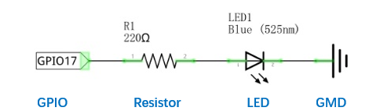
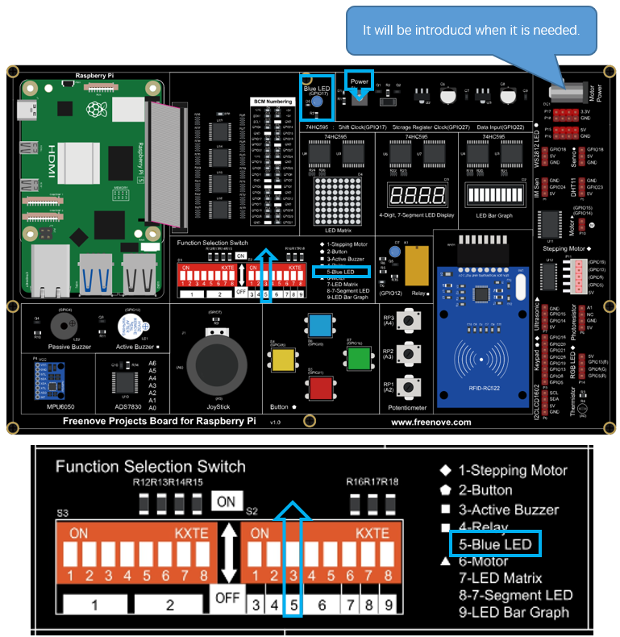
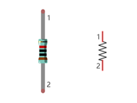

##############################################################################
Chapter LED
##############################################################################

This chapter is the Start Point in the journey to build and explore RPi electronic projects. We will start with simple “Blink” project.

Project Blink
****************************************************************

In this project, we will use RPi to control blinking a common LED.

GPIO
================================================================

GPIO: General Purpose Input/Output. Here we will introduce the specific function of the pins on the Raspberry Pi and how you can utilize them in all sorts of ways in your projects. Most RPi Module pins can be used as either an input or output, depending on your program and its functions.

When programming GPIO pins, there are 3 different ways to reference them: GPIO Numbering, Physical Numbering and WiringPi GPIO Numbering.

BCM GPIO Numbering
----------------------------------------------------------------

The Raspberry Pi CPU uses Broadcom (BCM) processing chips BCM2835, BCM2836 or BCM2837. GPIO pin numbers are assigned by the processing chip manufacturer and are how the computer recognizes each pin. The pin numbers themselves do not make sense or have meaning as they are only a form of identification. Since their numeric values and physical locations have no specific order, there is no way to remember them, so you will need to have a printed reference or a reference board that fits over the pins.

Each pin's functional assignment is defined in the image below:

.. image:: ../_static/imgs/1_LED/Chapter01_00.png
    :align: center

For more details about pin definition of GPIO, please refer to http://pinout.xyz/

PHYSICAL Numbering
----------------------------------------------------------------

Another way to refer to the pins is by simply counting across and down from pin 1 at the top left (nearest to the SD card). This is 'Physical Numbering', as shown below:

.. image:: ../_static/imgs/1_LED/Chapter01_01.png
    :align: center

WiringPi GPIO Numbering
----------------------------------------------------------------

Different from the previous two types of GPIO serial numbers, RPi GPIO serial number of the WiringPi are numbered according to the BCM chip used in RPi.

.. image:: ../_static/imgs/1_LED/Chapter01_02.png
    :align: center

You can also use the following command to view their correlation.

.. code-block:: console
    
    $ gpio readall

.. image:: ../_static/imgs/1_LED/Chapter01_03.png
    :align: center

For more details about wiringPi, please refer to https://github.com/WiringPi/WiringPi .

Component List
================================================================

+------------------------------------------+
| Freenove Projects Board for Raspberry Pi |
|                                          |
|  |Chapter01_04|                          |
+---------------------+--------------------+
| Raspberry Pi        | GPIO Ribbon Cable  |
|                     |                    |
|  |Chapter01_05|     |  |Chapter01_06|    |
+---------------------+--------------------+

.. |Chapter01_04| image:: ../_static/imgs/1_LED/Chapter01_04.png
.. |Chapter01_05| image:: ../_static/imgs/1_LED/Chapter01_05.png
.. |Chapter01_06| image:: ../_static/imgs/1_LED/Chapter01_06.png

Circuit
================================================================

.. list-table:: 
    :width: 100%
    :align: center
    :class: product-table

    *   -   Schematic diagram
    *   -   |Chapter01_07|
    *   -   Hardware connection:

            Turn ON the power switch and NO.5 toggle switch. 

            Power switch should be turned ON in all the projects.
    *   -   |Chapter01_08|

.. note::
    
    :red:`If you have any concerns, please send an email to:` support@freenove.com

Component knowledge
================================================================

LED
----------------------------------------------------------------

An LED is a type of diode. All diodes have two Poles and only work if current is flowing in the correct direction. An LED will only work (light up) if the longer pin (+) of LED is connected to the positive output from a power source and the shorter pin is connected to the negative (-) output, which is also referred to as Ground (GND). This type of component is known as “Polar” (think One-Way Street).

All common 2 lead diodes are the same in this respect. Diodes work only if the voltage of its positive electrode is higher than its negative electrode and there is a narrow range of operating voltage for most all common diodes of 1.9 and 3.4V. If you use much more than 3.3V the LED will be damaged and burnt out.

.. image:: ../_static/imgs/1_LED/Chapter01_09.png
    :align: center

.. note:: 
    
    LEDs cannot be directly connected to a power supply, which usually ends in a damaged component. A resistor with a specified resistance value must be connected in series to the LED you plan to use.

Resistor
----------------------------------------------------------------

Resistors use Ohms (Ω) as the unit of measurement of their resistance (R). 1MΩ=1000kΩ, 1kΩ=1000Ω.

A resistor is a passive electrical component that limits or regulates the flow of current in an electronic circuit.

On the left, we see a physical representation of a resistor, and the right is the symbol used to represent the presence of a resistor in a circuit diagram or schematic.

The bands of color on a resistor is a shorthand code used to identify its resistance value. For more details of resistor color codes, please refer to the card in the kit package.

With a fixed voltage, there will be less current output with greater resistance added to the circuit. The relationship between Current, Voltage and Resistance can be expressed by this formula: I=V/R known as Ohm’s Law where I = Current, V = Voltage and R = Resistance. Knowing the values of any two of these allows you to solve the value of the third.

In the following diagram, the current through R1 is: I=U/R=5V/10kΩ=0.0005A=0.5mA.

.. image:: ../_static/imgs/1_LED/Chapter01_11.png
    :align: center

.. warning::
    
    Never connect the two poles of a power supply with anything of low resistance value (i.e. a metal object or bare wire). This is a Short and results in high current that may damage the power supply and electronic components.

.. note::
    
    Unlike LEDs and Diodes, Resistors have no poles and re non-polar (it does not matter which direction you insert them into a circuit, it will work the same)

Sketch
================================================================

Sketch 1.1.1 Blink
----------------------------------------------------------------

.. note::
    
    :red:`If you have any concerns, please send an email to:` support@freenove.com

First, enter where the project is located:

.. code-block:: console
    
    /home/pi/Freenove_Kit/Processing/Sketches/Sketch_01_1_1_Blink

And then right-click to select Processing IDE

Or you can enter a command in the terminal to open the file Sketch_01_1_1_Blink. (The following is only one line of command. There is a Space after Processing.)

.. code-block:: console
    
    $ processing ~/Freenove_Kit/Processing/Sketches/Sketch_01_1_1_Blink/Sketch_01_1_1_Blink.pde

Open Processing and click Run.

After the program runs, LED will start Blinking and the background of Display window will change with the change of LED state.

.. image:: ../_static/imgs/1_LED/Chapter01_25.png
    :align: center

The following is program code:

.. literalinclude:: ../../../freenove_Kit/Processing/Sketches/Sketch_01_1_1_Blink/Sketch_01_1_1_Blink.pde
    :linenos: 
    :language: c
    :dedent:

Processing code usually have two functions: setup() and draw(), where the function setup() is only executed once while the function draw() will be executed repeatedly. In the function setup(), size(100, 100) specifies the size of the Display Window to 100x100pixl. FrameRate(1) specifies the refresh rate of Display Window to once per second, which means the draw() function will be executed once per second. GPIO.pinMode (ledPin, GPIO.OUTPUT) is used to set ledPin to output mode.

.. literalinclude:: ../../../freenove_Kit/Processing/Sketches/Sketch_01_1_1_Blink/Sketch_01_1_1_Blink.pde
    :linenos: 
    :language: c
    :lines: 12-16
    :dedent:

In draw() function, each execution will invert the variable "ledState". When “ledState” is true, LED is turned ON, and the background color of display window is set to red. And when the “ledState” is false, the LED is turned OFF and the background color of display window is set to gray. Since the function draw() is executed once per second, the background color of Display Window and the state of LED will also change once per second. This process will repeat in an endless loop to achieve the effect of blinking.

.. literalinclude:: ../../../freenove_Kit/Processing/Sketches/Sketch_01_1_1_Blink/Sketch_01_1_1_Blink.pde
    :linenos: 
    :language: c
    :lines: 18-27
    :dedent:

The following is a brief description of some functions:

.. c:function:: setup()

    The setup() function is run once when the program starts.

.. c:function:: draw()

    It is called directly after the setup() function. The draw() function continuously executes the lines of code within its block until the program stops or noLoop() is called. draw() is called automatically and should never be called explicitly.

.. c:function:: size()

    Defines width and height of the display window in pixels.

.. c:function:: framerate()

    Specifies the number of frames to be displayed every second.

.. c:function:: background()

    Set the color of the background of the display window.

.. c:function:: GPIO.pinMode()

    Configures a pin to act either as input or output.

.. c:function:: GPIO.digitalWrite()

    Sets an output pin to be either high or low.

All functions used in this code can be found in the Reference of Processing Software, in which built-in functions are described in details, and there are some sample programs. It is recommended that beginners learn more about usage and function of those functions. The localization of Reference can be opened with the following steps: click the menu bar "Help""Reference".

Then the following page will be displayed in the web browser:

.. image:: ../_static/imgs/1_LED/Chapter01_27.png
    :align: center

Or you can directly access to the official website for reference:http://processing.org/reference/

Project 1.2 MouseLED
****************************************************************

In this project, we will use the mouse to control the state of LED.

The components and circuits of this project are the same as the previous section.

Component List
================================================================

+------------------------------------------+
| Freenove Projects Board for Raspberry Pi |
|                                          |
|  |Chapter01_04|                          |
+---------------------+--------------------+
| Raspberry Pi        | GPIO Ribbon Cable  |
|                     |                    |
|  |Chapter01_05|     |  |Chapter01_06|    |
+---------------------+--------------------+

.. |Chapter01_04| image:: ../_static/imgs/1_LED/Chapter01_04.png
.. |Chapter01_05| image:: ../_static/imgs/1_LED/Chapter01_05.png
.. |Chapter01_06| image:: ../_static/imgs/1_LED/Chapter01_06.png

Circuit
================================================================

.. list-table:: 
    :width: 100%
    :align: center
    :class: product-table

    *   -   Schematic diagram
    *   -   |Chapter01_07|
    *   -   Hardware connection:

            Turn ON the power switch and NO.5 toggle switch. 

            Power switch should be turned ON in all the projects.
    *   -   |Chapter01_08|

.. note::
    
    :red:`If you have any concerns, please send an email to:` support@freenove.com

Sketch
================================================================

Sketch 1.2.1 MouseLED
----------------------------------------------------------------

If you have any concerns, please send an email to: support@freenove.com

First, enter where the project is located:

.. code-block:: console
    
    /home/pi/Freenove_Kit/Processing/Sketches/Sketch_01_2_1_MouseLED

And then right-click to select Processing IDE.

Or you can enter a command in the terminal to open the file Sketch_01_2_1_MouseLED. (The following is only one line of command. There is a Space after Processing.)

.. code-block:: console
    
    processing ~/Freenove_Kit/Processing/Sketches/Sketch_01_2_1_MouseLED/Sketch_01_2_1_MouseLED.pde

Open Processing and click Run. 

After the program runs, the LED is in OFF-state, and background color of Display window is gray. Click the grey area of the Display Window with the mouse, LED is turned ON and Display window background color becomes blue. Click on the Display Window again, the LED is turned OFF and the background color becomes gray, as shown below.

The following is program code:

.. literalinclude:: ../../../freenove_Kit/Processing/Sketches/Sketch_01_2_1_MouseLED/Sketch_01_2_1_MouseLED.pde
    :linenos: 
    :language: c
    :dedent:

The function mouseClicked() in this code is used to capture the mouse click events. Once the mouse is clicked, the function will be executed. We can change the state of the variable “ledState” in this function to realize controlling LED by clicking on the mouse.

.. literalinclude:: ../../../freenove_Kit/Processing/Sketches/Sketch_01_2_1_MouseLED/Sketch_01_2_1_MouseLED.pde
    :linenos: 
    :language: c
    :lines: 27-29
    :dedent:

.. note::
    
    :red:`If you have any concerns, please send an email to:` support@freenove.com