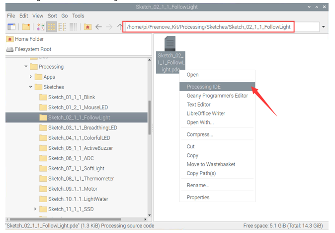
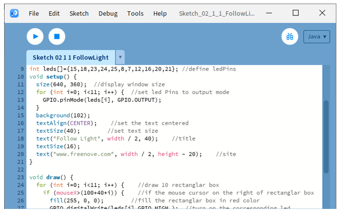
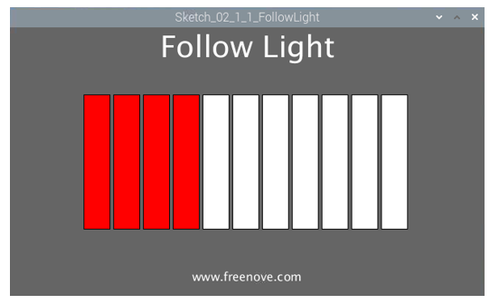

##############################################################################
Chapter Flowing Light
##############################################################################

We have learned how to control one LED to blink. Next, we will learn how to control a number of LEDs.

Project Flowing Water Light
****************************************************************

In this project, we use a number of LEDs to make a flowing water light.

Component List
================================================================

+------------------------------------------+
| Freenove Projects Board for Raspberry Pi |
|                                          |
|  |Chapter01_04|                          |
+---------------------+--------------------+
| Raspberry Pi        | GPIO Ribbon Cable  |
|                     |                    |
|  |Chapter01_05|     |  |Chapter01_06|    |
+---------------------+--------------------+

.. |Chapter01_04| image:: ../_static/imgs/1_LED/Chapter01_04.png
.. |Chapter01_05| image:: ../_static/imgs/1_LED/Chapter01_05.png
.. |Chapter01_06| image:: ../_static/imgs/1_LED/Chapter01_06.png

Circuit
================================================================

.. list-table:: 
    :width: 100%
    :align: center
    :class: product-table

    *   -   Schematic diagram
    *   -   |Chapter02_00|
    *   -   Hardware connection:
    *   -   |Chapter02_01|

.. |Chapter02_00| image:: ../_static/imgs/2_FlowingLight/Chapter02_00.png
.. |Chapter02_01| image:: ../_static/imgs/2_FlowingLight/Chapter02_01.png

.. note::
    
    :red:`If you have any concerns, please send an email to:` support@freenove.com

Sketch
================================================================

Sketch 2.1.1 FollowLight
----------------------------------------------------------------

.. note::
    
    :red:`If you have any concerns, please send an email to:` support@freenove.com

First, enter where the project is located:

.. code-block:: console
    
    /home/pi/Freenove_Kit/Processing/Sketches/Sketch_02_1_1_FollowLight

And then right-click to select Processing IDE

Or you can enter a command in the terminal to open the file Sketch_02_1_1_FollowLight. (The following is only one line of command. There is a Space after Processing.)

.. code-block:: console
    
    processing ~/Freenove_Kit/Processing/Sketches/Sketch_02_1_1_FollowLight/Sketch_02_1_1_FollowLight.pde

Open the Processing and click Run.

The result is as follows. The LED “touched” by the mouse cursor will be lit. 

The following is program code:

.. literalinclude:: ../../../freenove_Kit/Processing/Sketches/Sketch_02_1_1_FollowLight/Sketch_02_1_1_FollowLight.pde
    :linenos: 
    :language: c
    :dedent:

In the function draw(), we draw 11 rectangles to represent 11 LEDs of LED Bar Graph. We make rectangles on the left of mouse filled with red, corresponding LEDs turned ON, and the rectangles on the right of mouse is white, corresponding LEDs turned OFF. In this way, when slide the mouse to right, the more LEDs on the left of mouse will be turned ON. When to the left, the reverse is the case.

.. literalinclude:: ../../../freenove_Kit/Processing/Sketches/Sketch_02_1_1_FollowLight/Sketch_02_1_1_FollowLight.pde
    :linenos: 
    :language: c
    :lines: 23-34
    :dedent:

.. note::
    
    :red:`If you have any concerns, please send an email to:` support@freenove.com