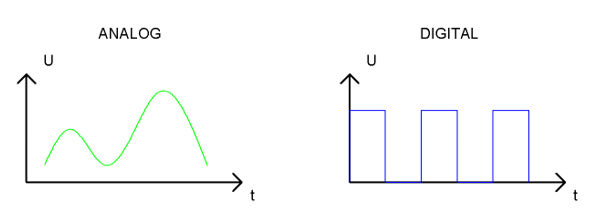

##############################################################################
Chapter Analog & PWM
##############################################################################

In previous chapters, we learned that a Push Button Switch has two states: Pressed (ON) and Released (OFF), and an LED has a Light ON and OFF state. Is there a middle or intermediated state? We will next learn how to create an intermediate output state to achieve a partially bright (dim) LED.

First, let us learn how to control the brightness of an LED.

Project Breathing LED
****************************************************************

We describe this project as a Breathing Light. This means that an LED that is OFF will then turn ON gradually and then gradually turn OFF like "breathing". Okay, so how do we control the brightness of an LED to create a Breathing Light? We will use PWM to achieve this goal.

Component Knowledge
================================================================

Analog & Digital
----------------------------------------------------------------

An Analog Signal is a continuous signal in both time and value. On the contrary, a Digital Signal or discrete-time signal is a time series consisting of a sequence of quantities. Most signals in life are analog signals. A familiar example of an Analog Signal would be how the temperature throughout the day is continuously changing and could not suddenly change instantaneously from 0℃ to 10℃. However, Digital Signals can instantaneously change in value. This change is expressed in numbers as 1 and 0 (the basis of binary code). Their differences can more easily be seen when compared when graphed as below.

.. note::
    
    he Analog signals are curved waves and the Digital signals are “Square Waves”. 

In practical applications, we often use binary as the digital signal, that is a series of 0's and 1’s. Since a binary signal only has two values (0 or 1) it has great stability and reliability. Lastly, both analog and digital signals can be converted into the other.

PWM
----------------------------------------------------------------

PWM, Pulse-Width Modulation, is a very effective method for using digital signals to control analog circuits. Digital processors cannot directly output analog signals. PWM technology makes it very convenient to achieve this conversion (translation of digital to analog signals).

PWM technology uses digital pins to send certain frequencies of square waves, that is, the output of high levels and low levels, which alternately last for a while. The total time for each set of high levels and low levels is generally fixed, which is called the period (Note: the reciprocal of the period is frequency). The time of high level outputs are generally called “pulse width”, and the duty cycle is the percentage of the ratio of pulse duration, or pulse width (PW) to the total period (T) of the waveform. The longer the output of high levels last, the longer the duty cycle and the higher the corresponding voltage in the analog signal will be. The following figures show how the analog signal voltages vary between 0V-5V (high level is 5V) corresponding to the pulse width 0%-100%:

The longer the PWM duty cycle is, the higher the output power will be. Now that we understand this relationship, we can use PWM to control the brightness of an LED or the speed of DC motor and so on.

It is evident, from the above, that PWM is not actually analog but the effective value of voltage is equivalent to the corresponding analog value. Therefore, by using PWM, we can control the output power of to an LED and control other devices and modules to achieve multiple effects and actions.

In RPi, GPIO18 pin has the ability to output to hardware via PWM with a 10-bit accuracy. This means that 100% of the pulse width can be divided into 210=1024 equal parts.

The wiringPi library of C provides both a hardware PWM and a software PWM method, while the wiringPi library of Python does not provide a hardware PWM method. There is only a software PWM option for Python.

The hardware PWM only needs to be configured, does not require CPU resources and is more precise in time control. The software PWM requires the CPU to work continuously by using code to output high level and low level. This part of the code is carried out by multi-threading, and the accuracy is relatively not high enough. 

In order to keep the results running consistently, we will use PWM.

Component List
================================================================

+------------------------------------------+
| Freenove Projects Board for Raspberry Pi |
|                                          |
|  |Chapter01_04|                          |
+---------------------+--------------------+
| Raspberry Pi        | GPIO Ribbon Cable  |
|                     |                    |
|  |Chapter01_05|     |  |Chapter01_06|    |
+---------------------+--------------------+

.. |Chapter01_04| image:: ../_static/imgs/1_LED/Chapter01_04.png
.. |Chapter01_05| image:: ../_static/imgs/1_LED/Chapter01_05.png
.. |Chapter01_06| image:: ../_static/imgs/1_LED/Chapter01_06.png

Circuit
================================================================

.. list-table:: 
    :width: 100%
    :align: center
    :class: product-table

    *   -   Schematic diagram
    *   -   |Chapter04_02|
    *   -   Hardware connection:
           
            Switch ON NO.5 switch and the four switches of NO.2.

    *   -   |Chapter04_03|

.. |Chapter04_02| image:: ../_static/imgs/4_Analog_&_PWM/Chapter04_02.png
.. |Chapter04_03| image:: ../_static/imgs/4_Analog_&_PWM/Chapter04_03.png

.. note::
    
    :red:`If you have any concerns, please send an email to:` support@freenove.com

Sketch
================================================================

Sketch 3.1.1 BreathingLED
----------------------------------------------------------------

.. note::
    
    :red:`If you have any concerns, please send an email to:` support@freenove.com

First, enter where the project is located:

.. code-block:: console
    
    /home/pi/Freenove_Kit/Processing/Sketches/Sketch_03_1_1_BreadthingLED

And then right-click to select Processing IDE

Or you can enter a command in the terminal to open the file Sketch_03_1_1_BreadthingLED. (The following is only one line of command. There is a Space after Processing.)

.. code-block:: console
    
    processing ~/Freenove_Kit/Processing/Sketches/Sketch_03_1_1_BreadthingLED/Sketch_03_1_1_BreadthingLED.pde

Open Processing and click Run.

The result is as shown below. The LED will light up gradually, and then extinguish and light up again. You can control the brightness with the mouse.

.. image:: ../_static/imgs/4_Analog_&_PWM/Chapter04_11.png
    :align: center

The following is program code:

.. literalinclude:: ../../../freenove_Kit/Processing/Sketches/Sketch_03_1_1_BreadthingLED/Sketch_03_1_1_BreadthingLED.pde
    :linenos: 
    :language: c
    :dedent:

First, use SOFTPWM class to create a PWM pin, which is used to control the brightness of LED. Then define a variable “t” and a variable “tStep” to control the PWM duty cycle and the rate at which “t” increases.

.. literalinclude:: ../../../freenove_Kit/Processing/Sketches/Sketch_03_1_1_BreadthingLED/Sketch_03_1_1_BreadthingLED.pde
    :linenos: 
    :language: c
    :lines: 11-13
    :dedent:

In the function draw, if there is a click detected, the coordinate in X direction of the mouse will be mapped into the duty cycle “t”; Otherwise, duty cycle “t” will be increased gradually and PWM with the duty cycle will be output.

.. literalinclude:: ../../../freenove_Kit/Processing/Sketches/Sketch_03_1_1_BreadthingLED/Sketch_03_1_1_BreadthingLED.pde
    :linenos: 
    :language: c
    :lines: 21-28
    :dedent:

The next code is designed to draw a circle filled with colors in different depth according to the “t” value, which is used to simulate LEDs with different brightness.

.. literalinclude:: ../../../freenove_Kit/Processing/Sketches/Sketch_03_1_1_BreadthingLED/Sketch_03_1_1_BreadthingLED.pde
    :linenos: 
    :language: c
    :lines: 32-33
    :dedent:

The last code is designed to draw the progress bar and the percentage of the progress.

.. literalinclude:: ../../../freenove_Kit/Processing/Sketches/Sketch_03_1_1_BreadthingLED/Sketch_03_1_1_BreadthingLED.pde
    :linenos: 
    :language: c
    :lines: 39-48
    :dedent:

In processing software, you will see a tag page "SOFTPWM" in addition to the above code.

Reference
----------------------------------------------------------------

.. c:function:: class SOFTPWM

    public **SOFTPWM** (int iPin, int dc, int pwmRange):
    
    Constructor, used to create a PWM pin, set the pwmRange and initial duty cycle. The minimum of pwmRange is 0.1ms. So pwmRange=100 means that the PWM duty cycle is 0.1ms*100=10ms.
    
    public void softPwmWrite(int value)
    
    Set PMW duty cycle.
    
    public void **softPwmStop** ()
    
    Stop outputting PWM.

.. note::
    
    :red:`If you have any concerns, please send an email to:` support@freenove.com