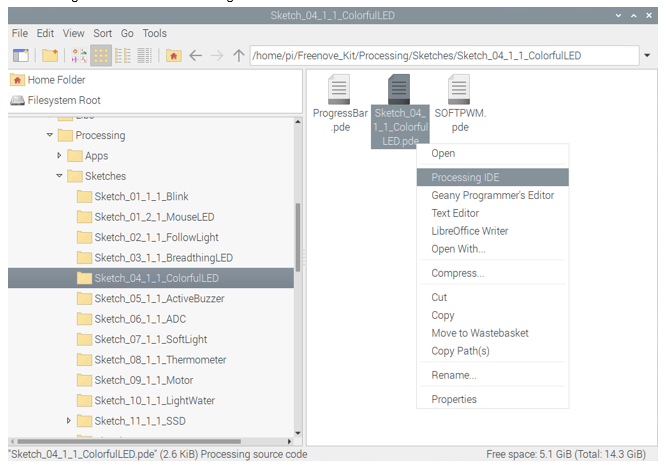
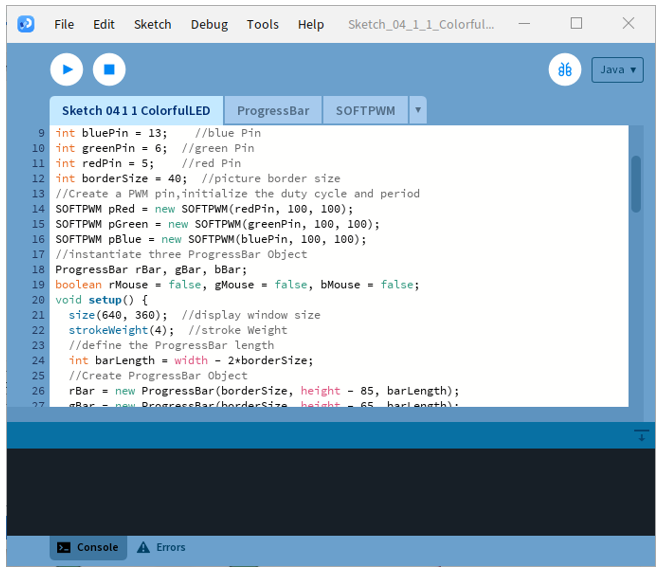
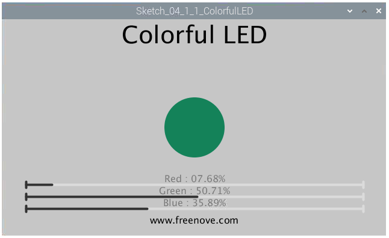
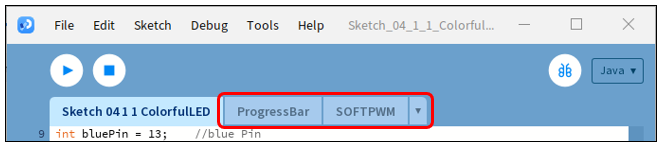

##############################################################################
Chapter 4 RGB LED
##############################################################################

In this chapter, we will learn how to control an RGB LED.

Project 4.1 Multicolored LED
****************************************************************

This project will make a Multicolored LED, namely, use Processing to control the color of RGBLED.

Component List
================================================================

.. table:: 
    :align: center
    :width: 80%
    :class: table-line
    
    +------------------------------------------+
    | Freenove Projects Board for Raspberry Pi |
    |                                          |
    |  |Chapter01_04|                          |
    +---------------------+--------------------+
    | Raspberry Pi        | GPIO Ribbon Cable  |
    |                     |                    |
    |  |Chapter01_05|     |  |Chapter01_06|    |
    +---------------------+--------------------+
    | Jumper Wire         | RGBLED Module      |
    |                     |                    |
    |  |Chapter05_02|     |  |Chapter05_03|    |
    +---------------------+--------------------+

.. |Chapter01_04| image:: ../_static/imgs/1_LED/Chapter01_04.png
.. |Chapter01_05| image:: ../_static/imgs/1_LED/Chapter01_05.png
.. |Chapter01_06| image:: ../_static/imgs/1_LED/Chapter01_06.png
.. |Chapter05_02| image:: ../_static/imgs/5_RGB_LED/Chapter05_02.png
.. |Chapter05_03| image:: ../_static/imgs/5_RGB_LED/Chapter05_03.png

Circuit
================================================================

.. list-table:: 
    :width: 80%
    :align: center
    :class: table-line

    * - Schematic diagram
    * - |Chapter05_04|
    * - Hardware connection:
    * - |Chapter05_05|

.. |Chapter05_04| image:: ../_static/imgs/5_RGB_LED/Chapter05_04.png
.. |Chapter05_05| image:: ../_static/imgs/5_RGB_LED/Chapter05_05.png

.. note::
    
    :combo:`red font-bolder:If you have any concerns, please send an email to:` support@freenove.com

Sketch
================================================================

Sketch 4.1.1 ColorfulLED
----------------------------------------------------------------

:combo:`red font-bolder:If you have any concerns, please send an email to:` support@freenove.com

First, enter where the project is located:

.. code-block:: console
    
    /home/pi/Freenove_Kit/Processing/Sketches/Sketch_04_1_1_ColorfulLED

And then right-click to select Processing IDE

Or you can enter a command in the terminal to open the file Sketch_04_1_1_ColorfulLED. :combo:`red font-bolder:(The following is only one line of command. There is a Space after Processing.)`

.. code-block:: console
    
    processing ~/Freenove_Kit/Processing/Sketches/Sketch_04_1_1_ColorfulLED/Sketch_04_1_1_ColorfulLED.pde

Open Processing and click Run.

The result is as shown below. You can change the color of the LED by dragging the slider.

This project contains a lot of code files, and the core code is contained in the file Sketch_04_1_1_ColorfulLED. The other files only contain some custom classes.

The following is program code:

.. literalinclude:: ../../../freenove_Kit/Processing/Sketches/Sketch_04_1_1_ColorfulLED/Sketch_04_1_1_ColorfulLED.pde
    :linenos: 
    :language: c
    :dedent:

In the code, first create three PWM pins and three progress bars to control RGBLED.

.. literalinclude:: ../../../freenove_Kit/Processing/Sketches/Sketch_04_1_1_ColorfulLED/Sketch_04_1_1_ColorfulLED.pde
    :linenos: 
    :language: c
    :lines: 13-18
    :dedent:

And then in function setup(), define position and length of progress bar according to the size of Display Window, and set the name of each progress bar.

.. literalinclude:: ../../../freenove_Kit/Processing/Sketches/Sketch_04_1_1_ColorfulLED/Sketch_04_1_1_ColorfulLED.pde
    :linenos: 
    :language: c
    :lines: 20-31
    :dedent:

In function draw(), first set background, header and other basic information. Then draw a circle and set its color according to the duty cycle of three channels of RGB. Finally draw three progress bars.

.. literalinclude:: ../../../freenove_Kit/Processing/Sketches/Sketch_04_1_1_ColorfulLED/Sketch_04_1_1_ColorfulLED.pde
    :linenos: 
    :language: c
    :lines: 33-43
    :dedent:

System functions mousePressed(), mouseReleased() and mouseDragged() are used to determine whether the mouse drags the progress bar and set the schedule. If the mouse button is pressed in a progress bar, then the mousePressed () sets the progress flag rgbMouse to true, mouseDragged (mouseX) maps progress value to set corresponding PWM. When the mouse is released, mouseReleased() sets the progress flag rgbMouse to false.. 

.. literalinclude:: ../../../freenove_Kit/Processing/Sketches/Sketch_04_1_1_ColorfulLED/Sketch_04_1_1_ColorfulLED.pde
    :linenos: 
    :language: c
    :lines: 45-72
    :dedent:

Reference
----------------------------------------------------------------

.. py:function:: class ProgressBar

    This is a custom class that is used to create a progress bar.
    
    public **ProgressBar** (int ix, int iy, int barlen)
    
    Constructor, used to create ProgressBar, the parameters for coordinates X, Y and length of ProgressBar.
    
    public void **setTitle** (String str)
    
    Used to set the name of progress bar, which will be displayed in the middle of the progress bar.
    
    public void **setProgress** (float pgress)
    
    Used to set the progress of progress bar. The parameter: 0<pgress<1.0.
    
    public void **create()** & public void **create** (float pgress)
    
    Used to draw progress bar.

.. note::
    
    :combo:`red font-bolder:If you have any concerns, please send an email to:` support@freenove.com