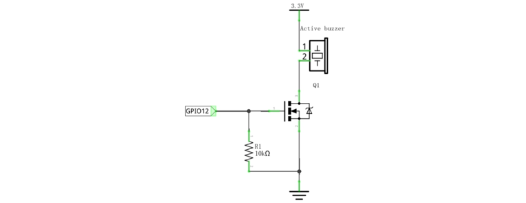
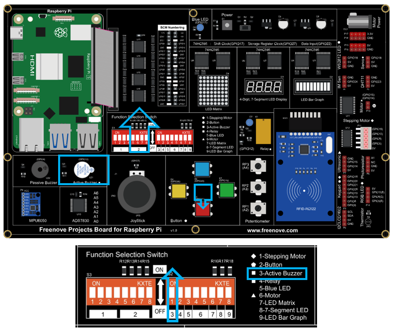

##############################################################################
Chapter 5 Buzzer
##############################################################################

In this chapter, we will learn about buzzers and the sounds they make. And in our next project, we will use an active buzzer to make a doorbell and a passive buzzer to make an alarm.

Project 5.1 ActiveBuzzer
****************************************************************

In this project, we will use the mouse to control an active buzzer.

Component List
================================================================

.. table:: 
    :align: center
    :width: 80%
    :class: table-line
    
    +------------------------------------------+
    | Freenove Projects Board for Raspberry Pi |
    |                                          |
    |  |Chapter01_04|                          |
    +---------------------+--------------------+
    | Raspberry Pi        | GPIO Ribbon Cable  |
    |                     |                    |
    |  |Chapter01_05|     |  |Chapter01_06|    |
    +---------------------+--------------------+

.. |Chapter01_04| image:: ../_static/imgs/1_LED/Chapter01_04.png
.. |Chapter01_05| image:: ../_static/imgs/1_LED/Chapter01_05.png
.. |Chapter01_06| image:: ../_static/imgs/1_LED/Chapter01_06.png

Circuit
================================================================

.. list-table:: 
    :width: 80%
    :align: center
    :class: table-line

    * - Schematic diagram
    * - |Chapter06_05|
    * - Hardware connection:
    * - |Chapter06_06|

.. note::
    
    :combo:`red font-bolder:If you have any concerns, please send an email to:` support@freenove.com

Code
================================================================

Sketch 5.1.1 ActiveBuzzer
----------------------------------------------------------------

First, enter where the project is located:

.. code-block:: console
    
    /home/pi/Freenove_Kit/Processing/Sketches/Sketch_05_1_1_ActiveBuzzer

And then right-click to select Processing IDE

.. image:: ../_static/imgs/6_Buzzer/Chapter06_21.png
    :align: center

Or you can enter a command in the terminal to open the file Sketch_05_1_1_ActiveBuzzer. (The following is only one line of command. There is a Space after Processing.)

.. code-block:: console
    
    processing ~/Freenove_Kit/Processing/Sketches/Sketch_05_1_1_ActiveBuzzer/Sketch_05_1_1_ActiveBuzzer.pde

Open Processing and click Run.

The result is as shown below. Click the buzzer, it will emit sounds. Click it again, it will stop sounding.

.. image:: ../_static/imgs/6_Buzzer/Chapter06_23.png
    :align: center

The following is program code:

.. literalinclude:: ../../../freenove_Kit/Processing/Sketches/Sketch_05_1_1_ActiveBuzzer/Sketch_05_1_1_ActiveBuzzer.pde
    :linenos: 
    :language: c
    :dedent:

Code in this project is logically the same as previous "MouseLED" project. And the difference is that this project needs to draw the buzzer pattern and arc graphics after the buzzer sounding.

.. note::
    
    :combo:`red font-bolder:If you have any concerns, please send an email to:` support@freenove.com