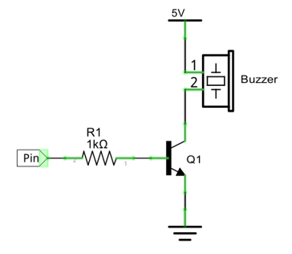

##############################################################################
Chapter Buzzer
##############################################################################

In this chapter, we will learn about buzzers and the sounds they make. And in our next project, we will use an active buzzer to make a doorbell and a passive buzzer to make an alarm.

Project 5.1 ActiveBuzzer
****************************************************************

We will make a doorbell with this functionality: when the Push Button Switch is pressed the buzzer sounds and when the button is released, the buzzer stops. This is a momentary switch function.

Component knowledge
================================================================

Buzzer
----------------------------------------------------------------

A buzzer is an audio component. They are widely used in electronic devices such as calculators, electronic alarm clocks, automobile fault indicators, etc. There are both active and passive types of buzzers. Active buzzers have oscillator inside, these will sound as long as power is supplied. Passive buzzers require an external oscillator signal (generally using PWM with different frequencies) to make a sound.

.. image:: ../_static/imgs/6_Buzzer/Chapter06_00.png
    :align: center

Active buzzers are easier to use. Generally, they only make a specific sound frequency. Passive buzzers require an external circuit to make sounds, but passive buzzers can be controlled to make sounds of various frequencies. The resonant frequency of the passive buzzer in this Kit is 2kHz, which means the passive buzzer is the loudest when its resonant frequency is 2kHz.

:red:`How to identify active and passive buzzer?`

1.	As a rule, there is a label on an active buzzer covering the hole where sound is emitted, but there are exceptions to this rule.

2.	Active buzzers are more complex than passive buzzers in their manufacture. There are many circuits and crystal oscillator elements inside active buzzers; all of this is usually protected with a waterproof coating (and a housing) exposing only its pins from the underside. On the other hand, passive buzzers do not have protective coatings on their underside. From the pin holes, view of a passive buzzer, you can see the circuit board, coils, and a permanent magnet (all or any combination of these components depending on the model.

.. image:: ../_static/imgs/6_Buzzer/Chapter06_01.png
    :align: center

Transistors

A transistor is required in this project due to the buzzer's current being so great that GPIO of RPi's output capability cannot meet the power requirement necessary for operation. A NPN transistor is needed here to amplify the current. 

Transistors, full name: semiconductor transistor, is a semiconductor device that controls current (think of a transistor as an electronic “amplifying or switching device”. Transistors can be used to amplify weak signals, or to work as a switch. Transistors have three electrodes (PINs): base (b), collector (c) and emitter (e). When there is current passing between "be" then "ce" will have a several-fold current increase (transistor magnification), in this configuration the transistor acts as an amplifier. When current produced by "be" exceeds a certain value, "ce" will limit the current output. at this point the transistor is working in its saturation region and acts like a switch. Transistors are available as two types as shown below: PNP and NPN,

.. image:: ../_static/imgs/6_Buzzer/Chapter06_02.png
    :align: center

:red:`In our kit, the PNP transistor is marked with 8550, and the NPN transistor is marked with 8050.`

Thanks to the transistor's characteristics, they are often used as switches in digital circuits. As micro-controllers output current capacity is very weak, we will use a transistor to amplify its current in order to drive components requiring higher current.

When we use a NPN transistor to drive a buzzer, we often use the following method. If GPIO outputs high level, current will flow through R1 (Resistor 1), the transistor conducts current and the buzzer will make sounds. If GPIO outputs low level, no current will flow through R1, the transistor will not conduct currentand buzzer will remain silent (no sounds).

When we use a PNP transistor to drive a buzzer, we often use the following method. If GPIO outputs low level, current will flow through R1. The transistor conducts current and the buzzer will make sounds. If GPIO outputs high level, no current flows through R1, the transistor will not conduct current and buzzer will remain silent (no sounds). Below are the circuit schematics for both a NPN and PNP transistor to power a buzzer.

.. list-table:: 
    :width: 100%
    :align: center
    :class: product-table

    *   -   NPN transistor to drive buzzer
        -   PNP transistor to drive buzzer
    *   -   |Chapter06_03|
        -   |Chapter06_04|

.. |Chapter06_04| image:: ../_static/imgs/6_Buzzer/Chapter06_04.png

Component List
================================================================

+------------------------------------------+
| Freenove Projects Board for Raspberry Pi |
|                                          |
|  |Chapter01_04|                          |
+---------------------+--------------------+
| Raspberry Pi        | GPIO Ribbon Cable  |
|                     |                    |
|  |Chapter01_05|     |  |Chapter01_06|    |
+---------------------+--------------------+

.. |Chapter01_04| image:: ../_static/imgs/1_LED/Chapter01_04.png
.. |Chapter01_05| image:: ../_static/imgs/1_LED/Chapter01_05.png
.. |Chapter01_06| image:: ../_static/imgs/1_LED/Chapter01_06.png

Circuit
================================================================

.. list-table:: 
    :width: 100%
    :align: center
    :class: product-table

    *   -   Schematic diagram
    *   -   |Chapter06_05|
    *   -   Hardware connection:
    *   -   |Chapter06_06|

.. |Chapter06_05| image:: ../_static/imgs/6_Buzzer/Chapter06_05.png
.. |Chapter06_06| image:: ../_static/imgs/6_Buzzer/Chapter06_06.png

.. note::
    
    :red:`If you have any concerns, please send an email to:` support@freenove.com

Code
================================================================

Sketch 5.1.1 ActiveBuzzer
----------------------------------------------------------------

First, enter where the project is located:

.. code-block:: console
    
    /home/pi/Freenove_Kit/Processing/Sketches/Sketch_05_1_1_ActiveBuzzer

And then right-click to select Processing IDE

Or you can enter a command in the terminal to open the file Sketch_05_1_1_ActiveBuzzer. (The following is only one line of command. There is a Space after Processing.)

.. code-block:: console
    
    processing ~/Freenove_Kit/Processing/Sketches/Sketch_05_1_1_ActiveBuzzer/Sketch_05_1_1_ActiveBuzzer.pde

Open Processing and click Run.

.. image:: ../_static/imgs/6_Buzzer/Chapter06_22.png
    :align: center

The result is as shown below. Click the buzzer, it will emit sounds. Click it again, it will stop sounding.

The following is program code:

.. literalinclude:: ../../../freenove_Kit/Processing/Sketches/Sketch_05_1_1_ActiveBuzzer/Sketch_05_1_1_ActiveBuzzer.pde
    :linenos: 
    :language: c
    :dedent:

Code in this project is logically the same as previous "MouseLED" project. And the difference is that this project needs to draw the buzzer pattern and arc graphics after the buzzer sounding.

.. note::
    
    :red:`If you have any concerns, please send an email to:` support@freenove.com