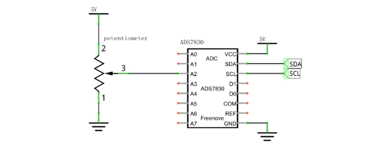
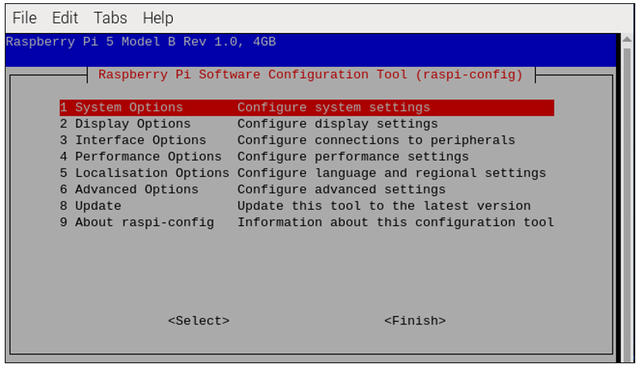

##############################################################################
Chapter 6 ADC Module
##############################################################################

In this chapter we will learn how to use an ADC module.

Project 6.1 Voltmeter
****************************************************************

This project uses an ADC module to read potentiometer voltage value and display the value on Display Window.

Component List
================================================================

.. table:: 
    :align: center
    :width: 80%
    :class: table-line
    
    +------------------------------------------+
    | Freenove Projects Board for Raspberry Pi |
    |                                          |
    |  |Chapter01_04|                          |
    +---------------------+--------------------+
    | Raspberry Pi        | GPIO Ribbon Cable  |
    |                     |                    |
    |  |Chapter01_05|     |  |Chapter01_06|    |
    +---------------------+--------------------+

.. |Chapter01_04| image:: ../_static/imgs/1_LED/Chapter01_04.png
.. |Chapter01_05| image:: ../_static/imgs/1_LED/Chapter01_05.png
.. |Chapter01_06| image:: ../_static/imgs/1_LED/Chapter01_06.png

Circuit
================================================================

.. list-table:: 
    :width: 80%
    :align: center
    :class: table-line

    * - |Chapter07_04|
    * - Hardware connection:
    * - |Chapter07_05|

.. |Chapter07_05| image:: ../_static/imgs/7_ADC/Chapter07_05.png

Configure I2C and Install Smbus 
================================================================

Enable I2C
----------------------------------------------------------------

The I2C interface in Raspberry Pi is disabled by default. You will need to open it manually and enable the I2C interface as follows:

Type command in the Terminal:

.. code-block:: console

    $ sudo raspi-config

Then open the following dialog box:

Choose “Interfacing Options” then “I5 I2C” then “Yes” and then “Finish” in this order and restart your RPi. The I2C module will then be started.

Type a command to check whether the I2C module is started:

.. code-block:: console

    $ lsmod | grep i2c

If the I2C module has been started, the following content will be shown. 

Different models of Raspberry Pi display different contents depending on the CPU installed:

.. image:: ../_static/imgs/7_ADC/Chapter07_07.png
    :align: center

Install I2C-Tools
----------------------------------------------------------------

Type the command to install I2C-Tools.

.. code-block:: console

    $ sudo apt-get install i2c-tools

Detect the address of I2C device with the following command:

.. code-block:: console

    $ i2cdetect -y 1

When you are using the ADS7830 Module, the result should look like this:

.. image:: ../_static/imgs/7_ADC/Chapter07_08.png
    :align: center

Here, 48 (HEX) is the I2C address of ADC Module (ADS7830).

Sketch
================================================================

Sketch 6.1.1 ADC
----------------------------------------------------------------

First, enter where the project is located:

.. code-block:: console

    /home/pi/Freenove_Kit/Processing/Sketches/Sketch_06_1_1_ADC

And then right-click to select Processing IDE

.. image:: ../_static/imgs/7_ADC/Chapter07_34.png
    :align: center

Or you can enter a command in the terminal to open the file Sketch_06_1_1_ADC. :combo:`red font-bolder:(The following is only one line of command. There is a Space after Processing.)`

.. code-block:: console

    processing ~/Freenove_Kit/Processing/Sketches/Sketch_06_1_1_ADC/Sketch_06_1_1_ADC.pde

Open Processing and click Run。

.. image:: ../_static/imgs/7_ADC/Chapter07_35.png
    :align: center

The result is as shown below. Rotate RP1 potentiometer, the reading will change accordingly. 

This project contains a lot of code files, and the core code is contained in the file Sketch_06_1_1_ADC. The other files only contain some custom classes.

.. image:: ../_static/imgs/7_ADC/Chapter07_37.png
    :align: center

The following is program code:

.. literalinclude:: ../../../freenove_Kit/Processing/Sketches/Sketch_06_1_1_ADC/Sketch_06_1_1_ADC.pde
    :linenos: 
    :language: c
    :dedent:

The code of this project mainly uses PCF8591 class member function analogRead() to read ADC.

.. literalinclude:: ../../../freenove_Kit/Processing/Sketches/Sketch_06_1_1_ADC/Sketch_06_1_1_ADC.pde
    :linenos: 
    :language: c
    :lines: 20-21
    :dedent:

About class ADCDevice, PCF8591, ADS7830:

.. py:function:: class ADCDevice 

    This is a base class, and all ADC module classes are subclasses of it. It provides two basic member functions.

    public int **analogRead** (int chn)
    
    This is a unified function name. Different chips have different implement methods. Therefore, specific method is implemented in subclasses.

    public boolean **detectI2C** (int addr)
    
    Used to detect I2C device with a given address. If it exists, it returns true, otherwise it returns false.

.. py:function:: class ADS7830 extends ADCDevice

    This is a custom class that is used to operate the ADC of ADS7830.

    public **ADS7830** (int addr)

    Constructor, used to create a ADS7830 class object, parameters for the I2C ADS7830 device address.

    public int **analogRead** (int chn)

    Used to read ADC value of one channel of ADS7830, the parameter CHN indicates the channel number: 0,1,2,3,4,5,6,7.

.. note::
    
    :combo:`red font-bolder:If you have any concerns, please send an email to:` support@freenove.com