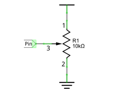

##############################################################################
Chapter ADC Module
##############################################################################

We have learned how to control the brightness of an LED through PWM and that PWM is not a real analog signal. In this chapter, we will learn how to read analog values via an ADC Module and convert these analog values into digital.

Project 6.1 Voltmeter
****************************************************************

In this project, we will use the ADC function of an ADC Module to read the voltage value of a potentiometer. 

Circuit knowledge
================================================================

ADC
----------------------------------------------------------------

**An ADC is an electronic integrated circuit used to convert analog signals such as voltages to digital or binary form consisting of 1s and 0s.** The range of our ADC module is 8 bits, that means the resolution is 2^8=256, so that its range (at 3.3V) will be divided equally to 256 parts. 

Any analog value can be mapped to one digital value using the resolution of the converter. So the more bits the ADC has, the denser the partition of analog will be and the greater the precision of the resulting conversion.

.. image:: ../_static/imgs/7_ADC/Chapter07_00.png
    :align: center

Subsection 1: the analog in range of 0V-3.3/256 V corresponds to digital 0;

Subsection 2: the analog in range of 3.3 /256 V-2*3.3 /256V corresponds to digital 1;

The resultant analog signal will be divided accordingly.

DAC
----------------------------------------------------------------

The reversing this process requires a DAC, Digital-to-Analog Converter. The digital I/O port can output high level and low level (0 or 1), but cannot output an intermediate voltage value. This is where a DAC is useful. The DAC module PCF8591 has a DAC output pin with 8-bit accuracy, which can divide VDD (here is 3.3V) into 28=256 parts. For example, when the digital quantity is 1, the output voltage value is 3.3/256 *1 V, and when the digital quantity is 128, the output voltage value is 3.3/256 *128=1.65V, the higher the accuracy of DAC, the higher the accuracy of output voltage value will be.

Component knowledge
================================================================

Potentiometer
----------------------------------------------------------------

Potentiometer is a resistive element with three Terminal parts. Unlike the resistors that we have used thus far in our project which have a fixed resistance value, the resistance value of a potentiometer can be adjusted. A potentiometer is often made up by a resistive substance (a wire or carbon element) and movable contact brush. When the brush moves along the resistor element, there will be a change in the resistance of the potentiometer’s output side (3) (or change in the voltage of the circuit that is a part). The illustration below represents a linear sliding potentiometer and its electronic symbol on the right.

.. image:: ../_static/imgs/7_ADC/Chapter07_01.png
    :align: center

Between potentiometer pin 1 and pin 2 is the resistive element (a resistance wire or carbon) and pin 3 is connected to the brush that makes contact with the resistive element. In our illustration, when the brush moves from pin 1 to pin 2, the resistance value between pin 1 and pin 3 will increase linearly (until it reaches the highest value of the resistive element) and at the same time the resistance between pin 2 and pin 3 will decrease linearly and conversely down to zero. At the midpoint of the slider the measured resistance values between pin 1 and 3 and between pin 2 and 3 will be the same.

In a circuit, both sides of resistive element are often connected to the positive and negative electrodes of power. When you slide the brush “pin 3”, you can get variable voltage within the range of the power supply.

Rotary potentiometer
----------------------------------------------------------------

Rotary potentiometers and linear potentiometers have the same function; the only difference being the physical action being a rotational rather than a sliding movement.

ADS7830
----------------------------------------------------------------

The ADS7830 is a single-supply, low-power, 8-bit data acquisition device that features a serial I2C interface and an 8-channel multiplexer. The following table is the pin definition diagram of ADS7830.

+-----------+-----+---------------------------------------------------+-----------------------------------------------+
| SYMBOL    | PIN |                    DESCRIPTION                    |                    TOP VIEW                   |
+===========+=====+===================================================+===============================================+
|  CH0      |  1  |                                                   |                                               |
+-----------+-----+                                                   |                                               |
|  CH1      |  2  |                                                   |                                               |
+-----------+-----+                                                   |                                               |
|  CH2      |  3  |                                                   |                                               |
+-----------+-----+                                                   |                                               |
|  CH3      |  4  |                                                   |                                               |                                               
+-----------+-----+       Analog input channels  (A/D converter)      |                                               |
|  CH4      |  5  |                                                   |                                               |
+-----------+-----+                                                   |                                               |
|  CH5      |  6  |                                                   |                                               |
+-----------+-----+                                                   |                                               |
|  CH6      |  7  |                                                   |                                               |
+-----------+-----+                                                   |                                               |
|  CH7      |  8  |                                                   ||Chapter07_03|                                  |
+-----------+-----+---------------------------------------------------+                                               |
|  GND      |  9  |   Ground                                          |                                               |
+-----------+-----+---------------------------------------------------+                                               |
|           |     | Internal +2.5V Reference,External                 |                                               |
|REF in/out |  10 |                                                   |                                               |
|           |     | Reference Input                                   |                                               |
+-----------+-----+---------------------------------------------------+                                               |
|  COM      |  11 |   Common to Analog Input Channel                  |                                               |
+-----------+-----+---------------------------------------------------+                                               |
|  A0       |  12 |                                                   |                                               |
+-----------+-----+   Hardware address                                |                                               |
|  A1       |  13 |                                                   |                                               |
+-----------+-----+---------------------------------------------------+                                               |
|  SCL      |  14 |   Serial Clock                                    |                                               |
+-----------+-----+---------------------------------------------------+                                               |
|  SDA      |  15 |   Serial Sata                                     |                                               |
+-----------+-----+---------------------------------------------------+                                               |
|  +VDD     |  16 |   Power Supply, 3.3V Nominal                      |                                               |
+-----------+-----+---------------------------------------------------+-----------------------------------------------+

.. |Chapter07_03| image:: ../_static/imgs/7_ADC/Chapter07_03.png

I2C communication
----------------------------------------------------------------

I2C (Inter-Integrated Circuit) has a two-wire serial communication mode, which can be used to connect a micro-controller and its peripheral equipment. Devices using I2C communications must be connected to the serial data line (SDA), and serial clock line (SCL) (called I2C bus). Each device has a unique address which can be used as a transmitter or receiver to communicate with devices connected via the bus.

Component List
================================================================

+------------------------------------------+
| Freenove Projects Board for Raspberry Pi |
|                                          |
|  |Chapter01_04|                          |
+---------------------+--------------------+
| Raspberry Pi        | GPIO Ribbon Cable  |
|                     |                    |
|  |Chapter01_05|     |  |Chapter01_06|    |
+---------------------+--------------------+

.. |Chapter01_04| image:: ../_static/imgs/1_LED/Chapter01_04.png
.. |Chapter01_05| image:: ../_static/imgs/1_LED/Chapter01_05.png
.. |Chapter01_06| image:: ../_static/imgs/1_LED/Chapter01_06.png

Circuit
================================================================

.. list-table:: 
    :width: 100%
    :align: center
    :class: product-table

    *   -   Schematic diagram
    *   -   |Chapter07_04|
    *   -   Hardware connection:
    *   -   |Chapter07_05|

.. |Chapter07_04| image:: ../_static/imgs/7_ADC/Chapter07_04.png
.. |Chapter07_05| image:: ../_static/imgs/7_ADC/Chapter07_05.png

Configure I2C and Install Smbus 
================================================================

Enable I2C
----------------------------------------------------------------

The I2C interface in Raspberry Pi is disabled by default. You will need to open it manually and enable the I2C interface as follows:

Type command in the Terminal:

.. code-block:: console

    $ sudo raspi-config

Then open the following dialog box:

.. image:: ../_static/imgs/7_ADC/Chapter07_06.png
    :align: center

Choose “Interfacing Options” then “I5 I2C” then “Yes” and then “Finish” in this order and restart your RPi. The I2C module will then be started.

Type a command to check whether the I2C module is started:

.. code-block:: console

    $ lsmod | grep i2c

If the I2C module has been started, the following content will be shown. 

Different models of Raspberry Pi display different contents depending on the CPU installed:

.. image:: ../_static/imgs/7_ADC/Chapter07_07.png
    :align: center

Install I2C-Tools
----------------------------------------------------------------

Next, type the command to install I2C-Tools. It is available with the Raspberry Pi OS by default.

.. code-block:: console

    $ sudo apt-get install i2c-tools
    $ sudo apt-get install python3-smbus

I2C device address detection:

.. code-block:: console

    $ i2cdetect -y 1

When you are using the ADS7830 Module, the result should look like this:

.. image:: ../_static/imgs/7_ADC/Chapter07_08.png
    :align: center

Here, 48 (HEX) is the I2C address of ADC Module (ADS7830).

Sketch
================================================================

Sketch 6.1.1 ADC
----------------------------------------------------------------

First, enter where the project is located:

.. code-block:: console

    /home/pi/Freenove_Kit/Processing/Sketches/Sketch_06_1_1_ADC

And then right-click to select Processing IDE

Or you can enter a command in the terminal to open the file Sketch_06_1_1_ADC. (The following is only one line of command. There is a Space after Processing.)

.. code-block:: console

    processing ~/Freenove_Kit/Processing/Sketches/Sketch_06_1_1_ADC/Sketch_06_1_1_ADC.pde

Open Processing and click Run。

The result is as shown below. Rotate RP1 potentiometer, the reading will change accordingly. 

.. image:: ../_static/imgs/7_ADC/Chapter07_36.png
    :align: center

This project contains a lot of code files, and the core code is contained in the file Sketch_06_1_1_ADC. The other files only contain some custom classes.

The following is program code:

.. literalinclude:: ../../../freenove_Kit/Processing/Sketches/Sketch_06_1_1_ADC/Sketch_06_1_1_ADC.pde
    :linenos: 
    :language: c
    :dedent:

The code of this project mainly uses PCF8591 class member function analogRead() to read ADC.

.. literalinclude:: ../../../freenove_Kit/Processing/Sketches/Sketch_06_1_1_ADC/Sketch_06_1_1_ADC.pde
    :linenos: 
    :language: c
    :lines: 20-21
    :dedent:

About class ADCDevice, PCF8591, ADS7830:

.. c:function:: class ADCDevice 

    This is a base class, and all ADC module classes are subclasses of it. It provides two basic member functions.

    public int **analogRead** (int chn)
    
    This is a unified function name. Different chips have different implement methods. Therefore, specific method is implemented in subclasses.

    public boolean **detectI2C** (int addr)
    
    Used to detect I2C device with a given address. If it exists, it returns true, otherwise it returns false.

.. note::
    
    :red:`If you have any concerns, please send an email to:` support@freenove.com