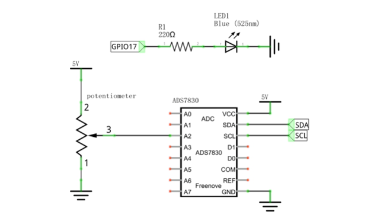
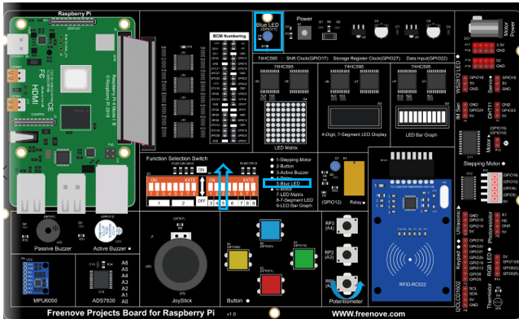
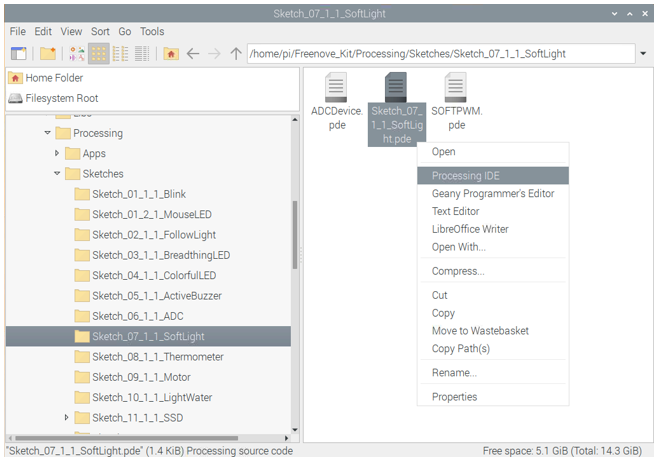
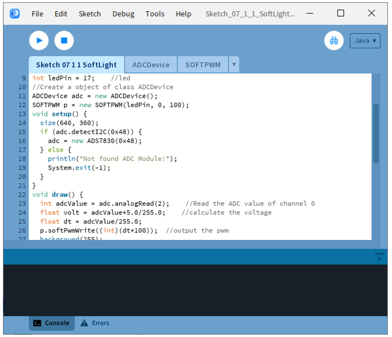
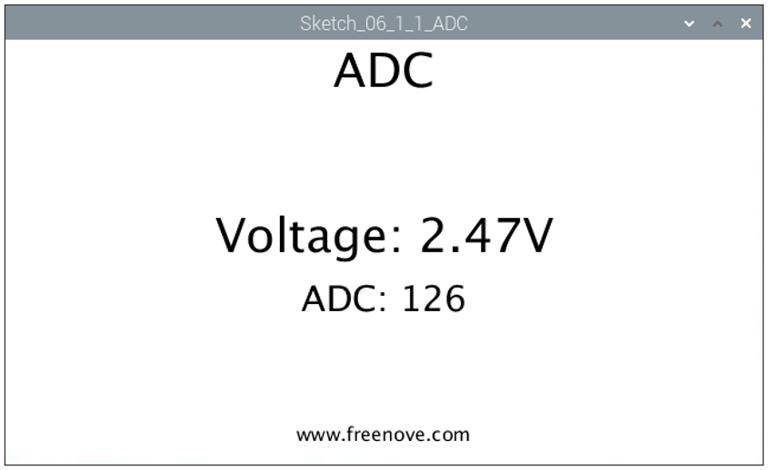
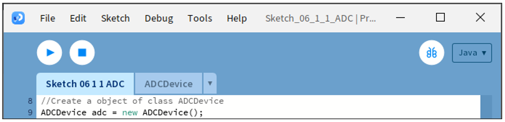

##############################################################################
Chapter ADC & LED
##############################################################################

In this chapter, we will combine ADC and PWM to control the brightness of LED.

Project 7.1 SoftLight
****************************************************************

In this project, we will make a softlight, which uses a potentiometer to control the brightness of LED.

Component List
================================================================

+------------------------------------------+
| Freenove Projects Board for Raspberry Pi |
|                                          |
|  |Chapter01_04|                          |
+---------------------+--------------------+
| Raspberry Pi        | GPIO Ribbon Cable  |
|                     |                    |
|  |Chapter01_05|     |  |Chapter01_06|    |
+---------------------+--------------------+

.. |Chapter01_04| image:: ../_static/imgs/1_LED/Chapter01_04.png
.. |Chapter01_05| image:: ../_static/imgs/1_LED/Chapter01_05.png
.. |Chapter01_06| image:: ../_static/imgs/1_LED/Chapter01_06.pngA

Circuit
================================================================

.. list-table:: 
    :width: 100%
    :align: center
    :class: product-table

    *   -   Schematic diagram
    *   -   |Chapter08_09|
    *   -   Hardware connection:
    *   -   |Chapter08_10|

.. note::
    
    :red:`If you have any concerns, please send an email to:` support@freenove.com

Sketch
================================================================

If you haven't configured I2C, please refer to Chapter 6. If you've done it, please move on.

If you have any concerns, please send an email to: support@freenove.com

Sketch 7.1.1 SoftLight
----------------------------------------------------------------

First, enter where the project is located:

.. code-block:: console

    /home/pi/Freenove_Kit/Processing/Sketches/Sketch_07_1_1_SoftLight

And then right-click to select Processing IDE

Or you can enter a command in the terminal to open the file Sketch_07_1_1_SoftLight. (The following is only one line of command. There is a Space after Processing.)

.. code-block:: console

    processing ~/Freenove_Kit/Processing/Sketches/Sketch_07_1_1_SoftLight/Sketch_07_1_1_SoftLight.pde

Open Processing and click Run

The result is as shown below. Rotate the RP1 potentiometer, and the brightness of the blue LED will change accordingly.

This project contains a lot of code files, and the core code is contained in the file Sketch_07_1_1_SoftLight. The other files only contain some custom classes.

The following is program code:

.. literalinclude:: ../../../freenove_Kit/Processing/Sketches/Sketch_07_1_1_SoftLight/Sketch_07_1_1_SoftLight.pde
    :linenos: 
    :language: c
    :dedent:

In this project code, get the ADC value of the potentiometer, then map it into the PWM duty cycle of LED to control its brightness. In Display Window, the color filled in LED pattern changes to simulate the change of LED brightness.

.. literalinclude:: ../../../freenove_Kit/Processing/Sketches/Sketch_07_1_1_SoftLight/Sketch_07_1_1_SoftLight.pde
    :linenos: 
    :language: c
    :lines: 23-26
    :dedent:

.. note::
    
    :red:`If you have any concerns, please send an email to:` support@freenove.com