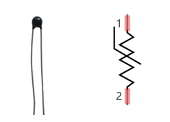
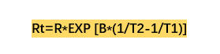
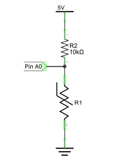
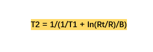
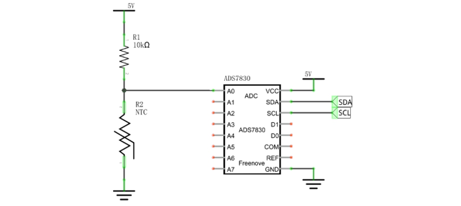
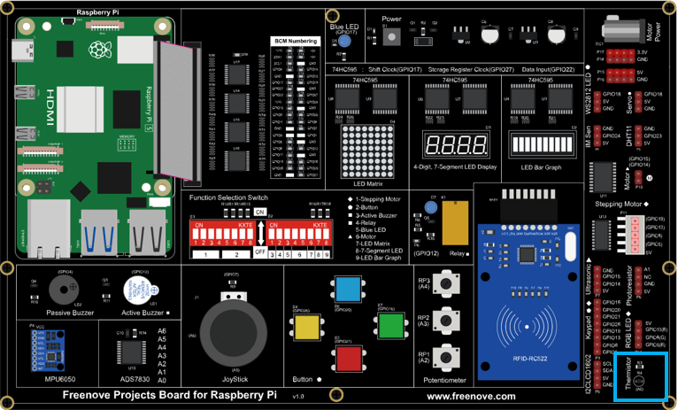
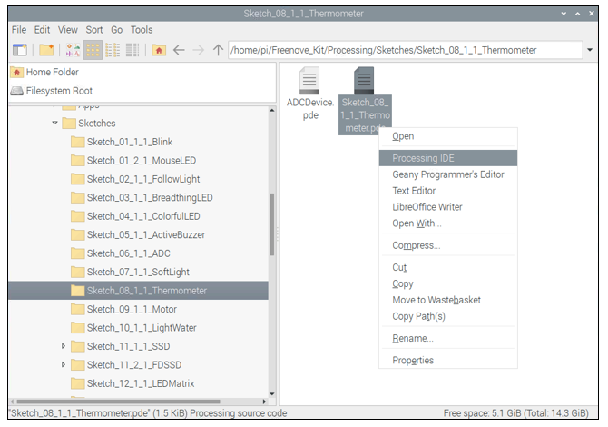
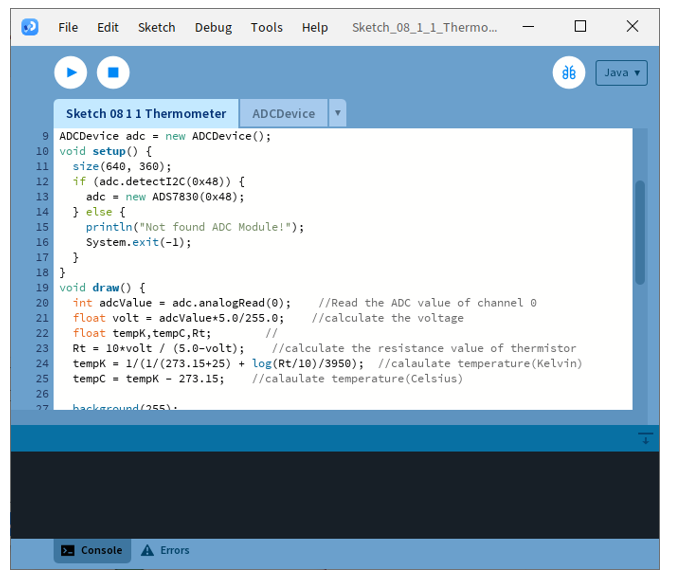
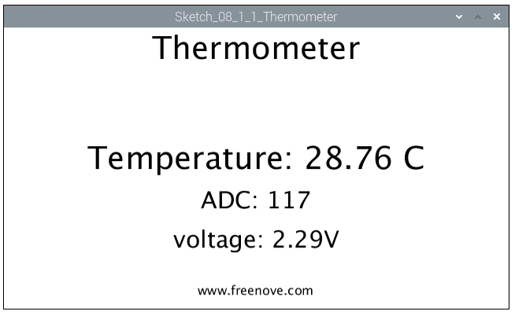
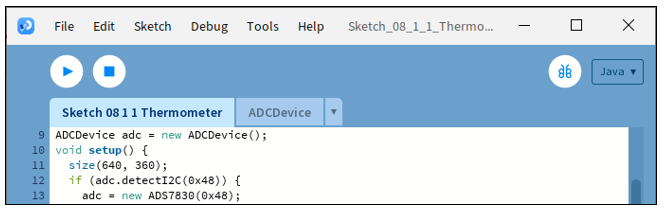

##############################################################################
Chapter Thermistor
##############################################################################

In this chapter, we will learn about Thermistors which are another kind of Resistor.

Project 8.1 Thermometer
****************************************************************

In this project, we will use a thermistor to make a thermometer.

Component knowledge
================================================================

Thermistor
----------------------------------------------------------------

Thermistor is a temperature sensitive resistor. When it senses a change in temperature, the resistance of the Thermistor will change. We can take advantage of this characteristic by using a Thermistor to detect temperature intensity. A Thermistor and its electronic symbol are shown below.

The relationship between resistance value and temperature of a thermistor is:

Rt=R*EXP [B*(1/T2-1/T1)]

Where:

    Rt is the thermistor resistance under T2 temperature;

    R is in the nominal resistance of thermistor under T1 temperature;

    EXP[n] is nth power of e;

    B is for thermal index;

    T1, T2 is Kelvin temperature (absolute temperature). Kelvin temperature=273.15 + Celsius temperature.

For the parameters of the Thermistor, we use: B=3950, R=10k, T1=25.

The circuit connection method of the Thermistor is similar to photoresistor, as the following:

We can use the value measured by the ADC converter to obtain the resistance value of Thermistor, and then we can use the formula to obtain the temperature value.

Therefore, the temperature formula can be derived as:

Component List
================================================================

+------------------------------------------+
| Freenove Projects Board for Raspberry Pi |
|                                          |
|  |Chapter01_04|                          |
+---------------------+--------------------+
| Raspberry Pi        | GPIO Ribbon Cable  |
|                     |                    |
|  |Chapter01_05|     |  |Chapter01_06|    |
+---------------------+--------------------+

.. |Chapter01_04| image:: ../_static/imgs/1_LED/Chapter01_04.png
.. |Chapter01_05| image:: ../_static/imgs/1_LED/Chapter01_05.png
.. |Chapter01_06| image:: ../_static/imgs/1_LED/Chapter01_06.png

Circuit
================================================================

.. list-table:: 
    :width: 100%
    :align: center
    :class: product-table

    *   -   Schematic diagram
    *   -   |Chapter09_04|
    *   -   Hardware connection:
    *   -   |Chapter09_05|

.. note::
    
    :red:`If you have any concerns, please send an email to:` support@freenove.com

Sketch
================================================================

Sketch 8.1.1 Thermometer
----------------------------------------------------------------

.. note::
    
    :red:`If you have any concerns, please send an email to:` support@freenove.com

First, enter where the project is located:

.. code-block:: console

    /home/pi/Freenove_Kit/Processing/Sketches/Sketch_08_1_1_Thermometer

And then right-click to select Processing IDE

Or you can enter a command in the terminal to open the file Sketch_08_1_1_Thermometer. (The following is only one line of command. There is a Space after Processing.)

.. code-block:: console

    processing ~/Freenove_Kit/Processing/Sketches/Sketch_08_1_1_Thermometer/Sketch_08_1_1_Thermometer.pde

Open Processing and click Run

The result is as shown below. The thermometer will detect the current temperature.

This project contains a lot of code files, and the core code is contained in the file Sketch_08_1_1_Thermometer. The other files only contain some custom classes.

The following is program code:

.. literalinclude:: ../../../freenove_Kit/Processing/Sketches/Sketch_08_1_1_Thermometer/Sketch_08_1_1_Thermometer.pde
    :linenos: 
    :language: c

In this project code, first read ADC, and then calculate the current temperature according to the Ohm's law and temperature formula mentioned before, finally display them on Display Window.

.. literalinclude:: ../../../freenove_Kit/Processing/Sketches/Sketch_08_1_1_Thermometer/Sketch_08_1_1_Thermometer.pde
    :linenos: 
    :lines: 20-25
    :language: c
    :dedent:

.. note::
    
    :red:`If you have any concerns, please send an email to:` support@freenove.com