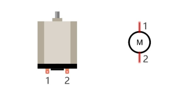
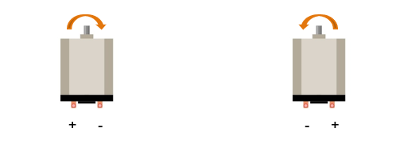
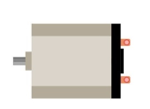
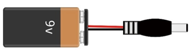
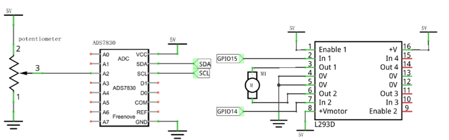
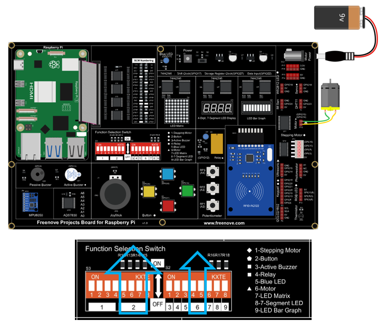
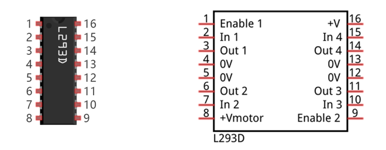
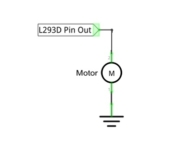
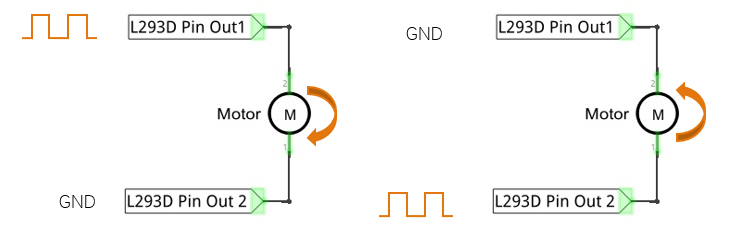
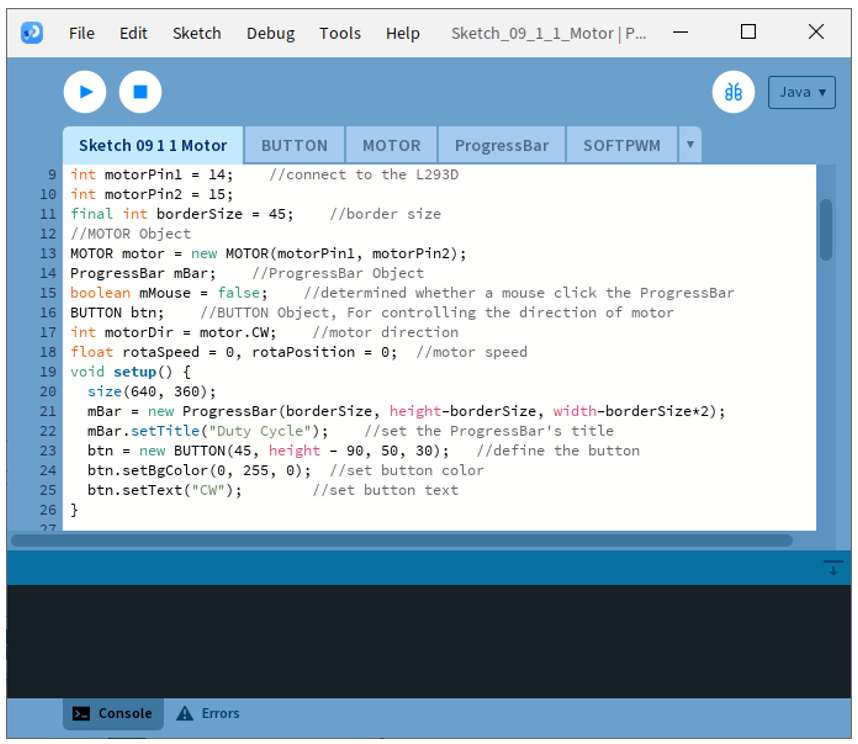

##############################################################################
Chapter Motor & Driver
##############################################################################

In this chapter, we will learn about DC Motors and DC Motor Drivers and how to control the speed and direction of a DC Motor.

Project 9.1 Motor
****************************************************************

In this project, we use L293D to drive the DC motor. We can click on the button in the Processing Display Window to control motor direction, and drag the progress bar to control the motor speed.

Component knowledge
================================================================

DC Motor
----------------------------------------------------------------

DC Motor is a device that converts electrical energy into mechanical energy. DC Motors consist of two major parts, a Stator and the Rotor. The stationary part of a DC Motor is the Stator and the part that Rotates is the Rotor. The Stator is usually part of the outer case of motor (if it is simply a pair of permanent magnets), and it has terminals to connect to the power if it is made up of electromagnet coils. Most Hobby DC Motors only use Permanent Magnets for the Stator Field. The Rotor is usually the shaft of motor with 3 or more electromagnets connected to a commutator where the brushes (via the terminals 1 & 2 below) supply electrical power, which can drive other mechanical devices. The diagram below shows a small DC Motor with two terminal pins.

When a DC Motor is connected to a power supply, it will rotate in one direction. If you reverse the polarity of the power supply, the DC Motor will rotate in opposite direction. This is important to note.

Component List
================================================================

+---------------------------------------------+
| Freenove Projects Board for Raspberry Pi    |
|                                             |
|  |Chapter01_04|                             |
+---------------------+-----------------------+
| Raspberry Pi        | GPIO Ribbon Cable     |
|                     |                       |
|  |Chapter01_05|     |  |Chapter01_06|       |
+---------------------+-----------------------+
| Jumper Wire         | Motor                 |
|                     |                       |
|  |Chapter05_02|     |  |Chapter11_02|       |
+---------------------+-----------------------+
| 9V Battery (you provide) & 9V Battery Cable |
|                                             |
|  |Chapter11_03|                             |
+---------------------------------------------+

.. |Chapter01_04| image:: ../_static/imgs/1_LED/Chapter01_04.png
.. |Chapter01_05| image:: ../_static/imgs/1_LED/Chapter01_05.png
.. |Chapter01_06| image:: ../_static/imgs/1_LED/Chapter01_06.png
.. |Chapter05_02| image:: ../_static/imgs/5_RGB_LED/Chapter05_02.png

Circuit
================================================================

.. list-table:: 
    :width: 100%
    :align: center
    :class: product-table

    *   -   Schematic diagram
    *   -   |Chapter11_04|
    *   -   Hardware connection:
    *   -   |Chapter11_05|

.. note::
    
    :red:`If you have any concerns, please send an email to:` support@freenove.com

Sketch
================================================================

Sketch 9.1.1 Motor

If you have any concerns, please send an email to: support@freenove.com

First, enter where the project is located:

.. code-block:: console

    /home/pi/Freenove_Kit/Processing/Sketches/Sketch_09_1_1_Motor

And then right-click to select Processing IDE

Or you can enter a command in the terminal to open the file Sketch_09_1_1_Motor. (The following is only one line of command. There is a Space after Processing.)

.. code-block:: console

    processing ~/Freenove_Kit/Processing/Sketches/Sketch_09_1_1_Motor/Sketch_09_1_1_Motor.pde

Open Processing and click Run

The result is as shown below. The duty cycle can be changed by dragging the slider. Cicking the button will change the rotating direction.

This project contains a lot of code files, and the core code is contained in the file Sketch_09_1_1_Motor. The other files only contain some custom classes.

The following is program code:

.. literalinclude:: ../../../freenove_Kit/Processing/Sketches/Sketch_09_1_1_Motor/Sketch_09_1_1_Motor.pde
    :linenos: 
    :language: c
    :dedent:

First define the GPIO pin connected to the Motor, motor class object, the L293D class object, the ProgressBar class object, the Button class object, and some variables.

.. literalinclude:: ../../../freenove_Kit/Processing/Sketches/Sketch_09_1_1_Motor/Sketch_09_1_1_Motor.pde
    :linenos: 
    :language: c
    :lines: 9-18
    :dedent:

Initialize the ProgressBar and Button in setup().

.. literalinclude:: ../../../freenove_Kit/Processing/Sketches/Sketch_09_1_1_Motor/Sketch_09_1_1_Motor.pde
    :linenos: 
    :language: c
    :lines: 21-25
    :dedent:

In function draw(), draw all the contents to be displayed. Then set the motor speed, as well as the speed of virtual fan according to the progress of progress bar. And set the motor direction according to the button flag.

.. literalinclude:: ../../../freenove_Kit/Processing/Sketches/Sketch_09_1_1_Motor/Sketch_09_1_1_Motor.pde
    :linenos: 
    :language: c
    :lines: 28-48
    :dedent:

In the mousePressed(), determine whether the Button is clicked on. If the mouse clicks on the Button, then change the motor direction and the text and color of Button. We have learned how to drag ProgressBar before, so here is no introduction.

.. literalinclude:: ../../../freenove_Kit/Processing/Sketches/Sketch_09_1_1_Motor/Sketch_09_1_1_Motor.pde
    :linenos: 
    :language: c
    :lines: 65-75
    :dedent:

Subfunction drawFan(float angle) is used to draw a three-blade fan, based on an initial angle. And the angle between each two blades is 120°. Changing the value of “angle” can make the fan rotate to different angles.

.. literalinclude:: ../../../freenove_Kit/Processing/Sketches/Sketch_09_1_1_Motor/Sketch_09_1_1_Motor.pde
    :linenos: 
    :language: c
    :lines: 50-60
    :dedent:

Reference
----------------------------------------------------------------

class MOTOR