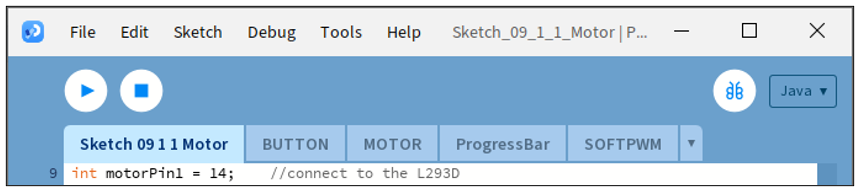

##############################################################################
Chapter 9 Motor & Driver
##############################################################################

In this chapter, we will learn how to use a DC motor, including how to control the speed and direction of the motor.

Project 9.1 Motor
****************************************************************

In this project, we use L293D to drive the DC motor. We can click on the button in the Processing Display Window to control motor direction, and drag the progress bar to control the motor speed.

Component List
================================================================

.. table:: 
    :align: center
    :class: table-line
    :width: 80%
    
    +---------------------------------------------+
    | Freenove Projects Board for Raspberry Pi    |
    |                                             |
    |  |Chapter01_04|                             |
    +---------------------+-----------------------+
    | Raspberry Pi        | GPIO Ribbon Cable     |
    |                     |                       |
    |  |Chapter01_05|     |  |Chapter01_06|       |
    +---------------------+-----------------------+
    | Jumper Wire         | Motor                 |
    |                     |                       |
    |  |Chapter05_02|     |  |Chapter11_02|       |
    +---------------------+-----------------------+
    | 9V Battery (you provide) & 9V Battery Cable |
    |                                             |
    |  |Chapter11_03|                             |
    +---------------------------------------------+

.. |Chapter01_04| image:: ../_static/imgs/1_LED/Chapter01_04.png
.. |Chapter01_05| image:: ../_static/imgs/1_LED/Chapter01_05.png
.. |Chapter01_06| image:: ../_static/imgs/1_LED/Chapter01_06.png
.. |Chapter05_02| image:: ../_static/imgs/5_RGB_LED/Chapter05_02.png
.. |Chapter11_02| image:: ../_static/imgs/11_Motor_&_Driver/Chapter11_02.png
.. |Chapter11_03| image:: ../_static/imgs/11_Motor_&_Driver/Chapter11_03.png

Circuit
================================================================

.. list-table:: 
    :width: 80%
    :align: center
    :class: table-line

    * - Schematic diagram
    * - |Chapter11_04|
    * - Hardware connection:
    * - |Chapter11_05|

.. |Chapter11_04| image:: ../_static/imgs/11_Motor_&_Driver/Chapter11_04.png
.. |Chapter11_05| image:: ../_static/imgs/11_Motor_&_Driver/Chapter11_05.png

.. note::
    
    :combo:`red font-bolder:If you have any concerns, please send an email to:` support@freenove.com

Sketch
================================================================

Sketch 9.1.1 Motor
----------------------------------------------------------------

.. note::
    
    :combo:`red font-bolder:If you have any concerns, please send an email to:` support@freenove.com

First, enter where the project is located:

.. code-block:: console

    /home/pi/Freenove_Kit/Processing/Sketches/Sketch_09_1_1_Motor

And then right-click to select Processing IDE

.. image:: ../_static/imgs/11_Motor_&_Driver/Chapter11_13.png
    :align: center

Or you can enter a command in the terminal to open the file Sketch_09_1_1_Motor. (The following is only one line of command. There is a Space after Processing.)

.. code-block:: console

    processing ~/Freenove_Kit/Processing/Sketches/Sketch_09_1_1_Motor/Sketch_09_1_1_Motor.pde

Open Processing and click Run

.. image:: ../_static/imgs/11_Motor_&_Driver/Chapter11_16.png
    :align: center

The result is as shown below. The duty cycle can be changed by dragging the slider. Cicking the button will change the rotating direction.

.. image:: ../_static/imgs/11_Motor_&_Driver/Chapter11_17.png
    :align: center

This project contains a lot of code files, and the core code is contained in the file Sketch_09_1_1_Motor. The other files only contain some custom classes.

The following is program code:

.. literalinclude:: ../../../freenove_Kit/Processing/Sketches/Sketch_09_1_1_Motor/Sketch_09_1_1_Motor.pde
    :linenos: 
    :language: c
    :dedent:

First define the GPIO pin connected to the Motor, motor class object, the L293D class object, the ProgressBar class object, the Button class object, and some variables.

.. literalinclude:: ../../../freenove_Kit/Processing/Sketches/Sketch_09_1_1_Motor/Sketch_09_1_1_Motor.pde
    :linenos: 
    :language: c
    :lines: 9-18
    :dedent:

Initialize the ProgressBar and Button in setup().

.. literalinclude:: ../../../freenove_Kit/Processing/Sketches/Sketch_09_1_1_Motor/Sketch_09_1_1_Motor.pde
    :linenos: 
    :language: c
    :lines: 21-25
    :dedent:

In function draw(), draw all the contents to be displayed. Then set the motor speed, as well as the speed of virtual fan according to the progress of progress bar. And set the motor direction according to the button flag.

.. literalinclude:: ../../../freenove_Kit/Processing/Sketches/Sketch_09_1_1_Motor/Sketch_09_1_1_Motor.pde
    :linenos: 
    :language: c
    :lines: 28-48
    :dedent:

In the mousePressed(), determine whether the Button is clicked on. If the mouse clicks on the Button, then change the motor direction and the text and color of Button. We have learned how to drag ProgressBar before, so here is no introduction.

.. literalinclude:: ../../../freenove_Kit/Processing/Sketches/Sketch_09_1_1_Motor/Sketch_09_1_1_Motor.pde
    :linenos: 
    :language: c
    :lines: 65-75
    :dedent:

Subfunction drawFan(float angle) is used to draw a three-blade fan, based on an initial angle. And the angle between each two blades is 120°. Changing the value of “angle” can make the fan rotate to different angles.

.. literalinclude:: ../../../freenove_Kit/Processing/Sketches/Sketch_09_1_1_Motor/Sketch_09_1_1_Motor.pde
    :linenos: 
    :language: c
    :lines: 50-60
    :dedent:

Reference
----------------------------------------------------------------

.. py:function:: class MOTOR

    This is a custom class that is used to operate the motor controlled by L293D.
    
    public **MOTOR** (int pin1, int pin2, int enablePin)
    
    Constructor, the first two parameters are GPIO pins connected to the L293D pin, and the enablePin is used to create a PWM pin within the range of 0-100 and with frequency of 100Hz.
    
    public void **start** (int dir, int speed)
    
    Used to drive motor. Parameter dir represents the rotation direction, whose value is CW, CCW, STOP. Parameter speed is used to decide the duty cycle of PWM. Its value is within the range of 0-100.

About class BUTTON:

.. py:function:: About class BUTTON:

    This is a custom class that is used to create a Button.
    
    public **BUTTON** (int ix, int iy, int iw, int ih)
    
    Constructor, used to create a BUTTON class object. The parameters are for the location and size of the button to be created.
    
    public void **create** ()
    
    Used to draw Button.
    
    public void **setBgColor** (int ir, int ig, int ib)
    
    Used to set Button color.
    
    public void **setText** (String str)
    
    Used to set Button text.
    
    public void **setTextColor** (int ir, int ig, int ib)
    
    Used to set text color.

.. note::
    
    :combo:`red font-bolder:If you have any concerns, please send an email to:` support@freenove.com