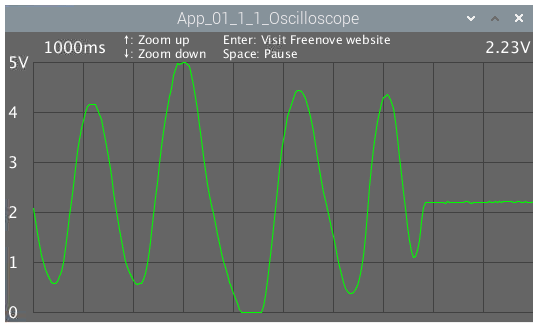

##############################################################################
App Oscilloscope
##############################################################################

We have used the ADC module to read the voltage of potentiometer to achieve the function of a voltmeter before. In this chapter, we will make a more complex virtual instrument, oscilloscope. Oscilloscope is a widely used electronic measuring instrument. It can get the electrical signals that cannot be observed directly into visible images to facilitate the analysis and study of various electrical signals changing process.

App 1.1 Oscilloscope
****************************************************************

Now, let's make an oscilloscope.

Component List
================================================================

+------------------------------------------+
| Freenove Projects Board for Raspberry Pi |
|                                          |
|  |Chapter01_04|                          |
+---------------------+--------------------+
| Raspberry Pi        | GPIO Ribbon Cable  |
|                     |                    |
|  |Chapter01_05|     |  |Chapter01_06|    |
+---------------------+--------------------+

.. |Chapter01_04| image:: ../_static/imgs/1_LED/Chapter01_04.png
.. |Chapter01_05| image:: ../_static/imgs/1_LED/Chapter01_05.png
.. |Chapter01_06| image:: ../_static/imgs/1_LED/Chapter01_06.png

Circuit
================================================================

.. list-table:: 
    :width: 100%
    :align: center
    :class: product-table

    *   -   Schematic diagram
    *   -   |APP1_00|
    *   -   Hardware connection:
    *   -   |APP1_01|

.. note::
    
    :red:`If you have any concerns, please send an email to:` support@freenove.com

Sketch
================================================================

Sketch 1.1.1 Oscilloscope
----------------------------------------------------------------

.. note::
    
    :red:`If you have any concerns, please send an email to:` support@freenove.com

First, enter where the project is located:

.. code-block:: console

    /home/pi/Freenove_Kit/Processing/Apps/App_01_1_1_Oscilloscope

And then right-click to select Processing IDE

Or you can enter a command in the terminal to open the file App_01_1_1_Oscilloscope. (The following is only one line of command. There is a Space after Processing.)

.. code-block:: console

    processing ~/Freenove_Kit/Processing/Apps/App_01_1_1_Oscilloscope/App_01_1_1_Oscilloscope.pde

Open Processing and click Run。

The result is as shown below. Rotating RP1 potemtiometer will make changes. 

The left side of the software interface is a voltage scale, which is used to indicate the voltage of the waveform.

The "1000ms" on top left corner is the time of a square, and you can press “↑” and “↓” key on keyboard to adjust it.

The "0.00V" on top right corner is the voltage value of current signal.

You can press the space bar on keyboard to pause the display of waveform, which is easy to view and analysis.

We believe that with the help of this oscilloscope, you can have a more intuitive understanding of the actual work of some electronic circuits. It will help you complete the project and facilitate troubleshooting. You can export this sketch to an application used as a tool.

.. note::
    
    :red:`If you have any concerns, please send an email to:` support@freenove.com