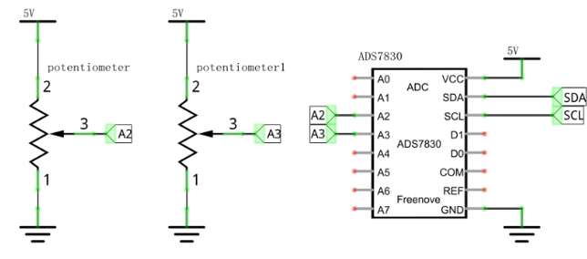
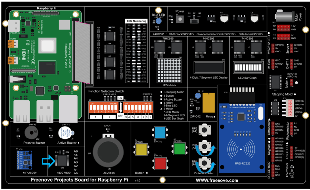
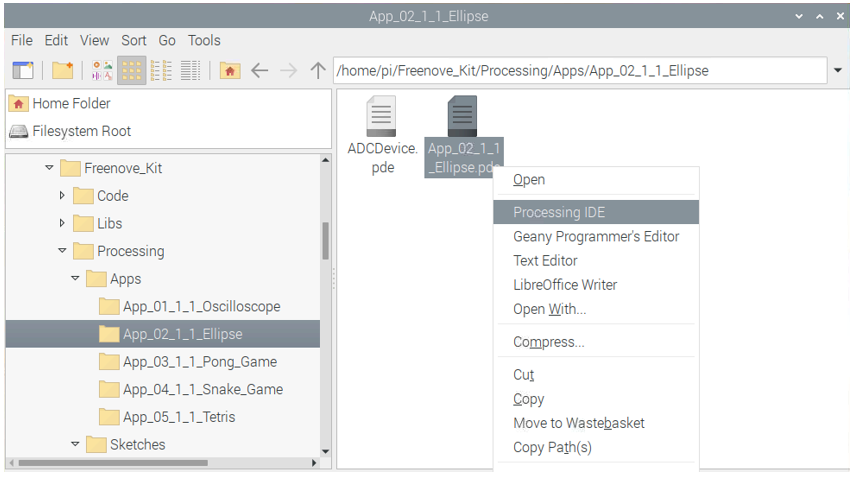
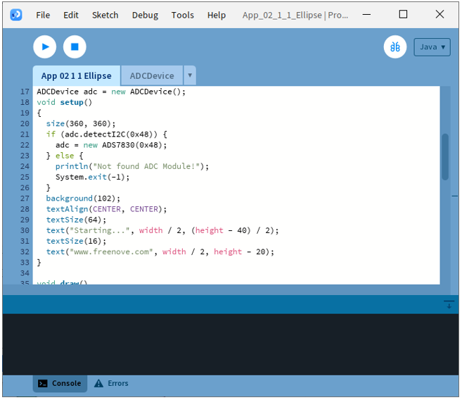
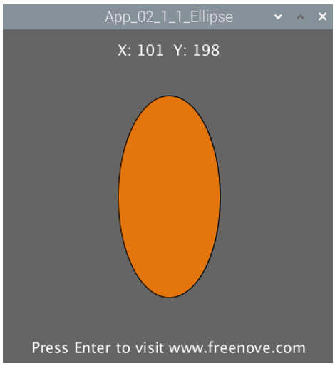

##############################################################################
App 2 Control Graphics
##############################################################################

In this chapter, we will use a potentiometer to make the graphics change in Processing.

App 2.1 Ellipse
****************************************************************

This project uses two potentiometers to control the size and shape of an ellipse respectively.

Component List
================================================================

.. table:: 
    :align: center
    :width: 80%
    :class: table-line
    
    +------------------------------------------+
    | Freenove Projects Board for Raspberry Pi |
    |                                          |
    |  |Chapter01_04|                          |
    +---------------------+--------------------+
    | Raspberry Pi        | GPIO Ribbon Cable  |
    |                     |                    |
    |  |Chapter01_05|     |  |Chapter01_06|    |
    +---------------------+--------------------+

.. |Chapter01_04| image:: ../_static/imgs/1_LED/Chapter01_04.png
.. |Chapter01_05| image:: ../_static/imgs/1_LED/Chapter01_05.png
.. |Chapter01_06| image:: ../_static/imgs/1_LED/Chapter01_06.png

Circuit
================================================================

.. list-table:: 
    :width: 80%
    :align: center
    :class: table-line

    * - Schematic diagram
    * - |APP2_00|
    * - Hardware connection:
    * - |APP2_01|

Sketch
================================================================

Sketch 2.1.1 Ellipse
----------------------------------------------------------------

.. note::
    
    :combo:`red font-bolder:If you have any concerns, please send an email to:` support@freenove.com

First, enter where the project is located:

.. code-block:: console

    /home/pi/Freenove_Kit/Processing/Apps/App_02_1_1_Ellipse

And then right-click to select Processing IDE

Or you can enter a command in the terminal to open the file App_02_1_1_Ellipse. :combo:`red font-bolder:(The following is only one line of command. There is a Space after Processing.)`

.. code-block:: console

    processing ~/Freenove_Kit/Processing/Apps/App_02_1_1_Ellipse/App_02_1_1_Ellipse.pde

Open Processing and click Run

The result is as shown below. Rotating RP1 and RP2 potentimeters will change the length of the circle.

.. note::
    
    :combo:`red font-bolder:If you have any concerns, please send an email to:` support@freenove.com