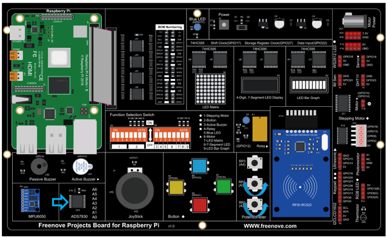

##############################################################################
App Pong Game
##############################################################################

In this chapter, we will play a Pong Game.

App 3.1 Pong Game
****************************************************************

Now, let's create and experience our own game.

Component List
================================================================

+------------------------------------------+
| Freenove Projects Board for Raspberry Pi |
|                                          |
|  |Chapter01_04|                          |
+---------------------+--------------------+
| Raspberry Pi        | GPIO Ribbon Cable  |
|                     |                    |
|  |Chapter01_05|     |  |Chapter01_06|    |
+---------------------+--------------------+

.. |Chapter01_04| image:: ../_static/imgs/1_LED/Chapter01_04.png
.. |Chapter01_05| image:: ../_static/imgs/1_LED/Chapter01_05.png
.. |Chapter01_06| image:: ../_static/imgs/1_LED/Chapter01_06.png

Circuit
================================================================

.. list-table:: 
    :width: 100%
    :align: center
    :class: product-table

    *   -   Schematic diagram
    *   -   |APP3_00|
    *   -   Hardware connection:
    *   -   |APP3_01|

.. note::
    
    :red:`If you have any concerns, please send an email to:` support@freenove.com

Sketch
================================================================

Sketch 3.1.1 PongGame
----------------------------------------------------------------

.. note::
    
    :red:`If you have any concerns, please send an email to:` support@freenove.com

First, enter where the project is located:

.. code-block:: console

    /home/pi/Freenove_Kit/Processing/Apps/App_03_1_1_Pong_Game

And then right-click to select Processing IDE

Or you can enter a command in the terminal to open the file App_03_1_1_Pong_Game. (The following is only one line of command. There is a Space after Processing.)

.. code-block:: console

    processing ~/Freenove_Kit/Processing/Apps/App_03_1_1_Pong_Game/App_03_1_1_Pong_Game.pde

Open Processing and click Run

The result is as shown below. Player1 can control the pat by rotating RP1 and player2 can control by rotating RP2.

Pressing the space bar keyboard can start the game. Then you can try to rotate the potentiometer to control the movement of paddles:

Use potentiometer to control the movement of paddle to hit back the ball. The rules are the same as the classic Pong game:

The game will be over when one side gets three points. Pressing the space can restart the game:

You can restart the game by pressing the space bar at any time during the game.

.. note::
    
    :red:`If you have any concerns, please send an email to:` support@freenove.com