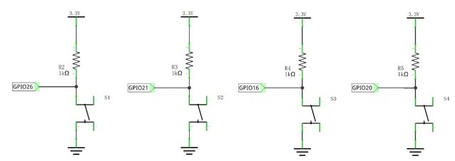
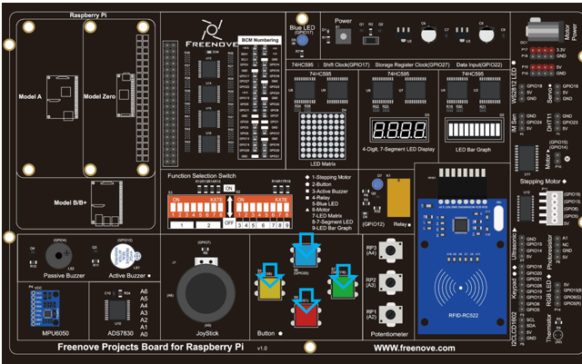
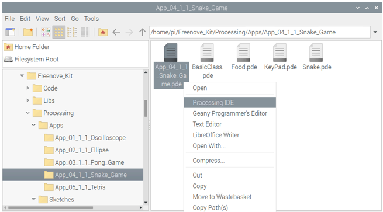
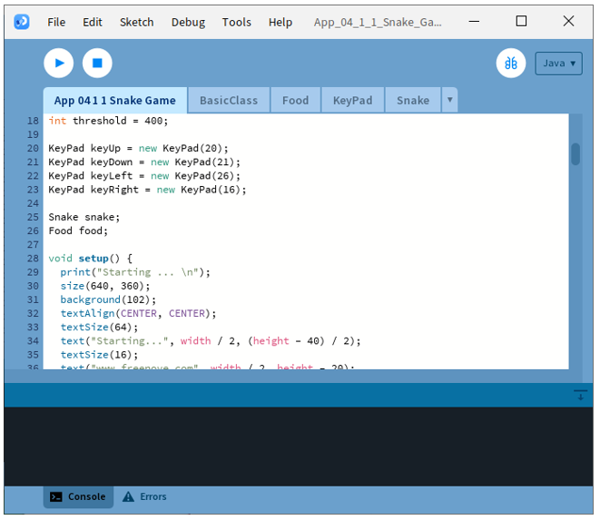
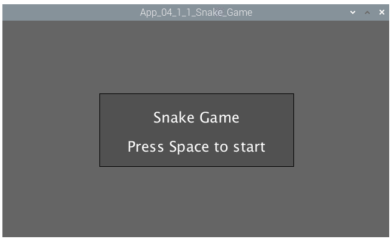
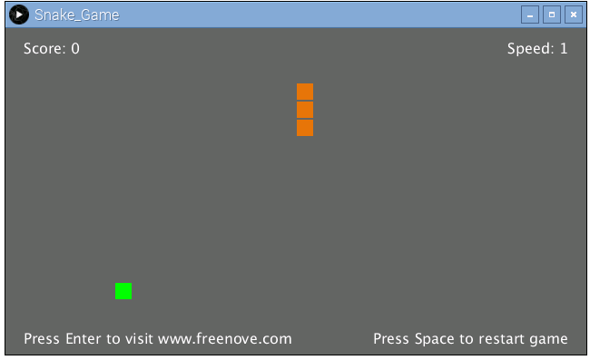
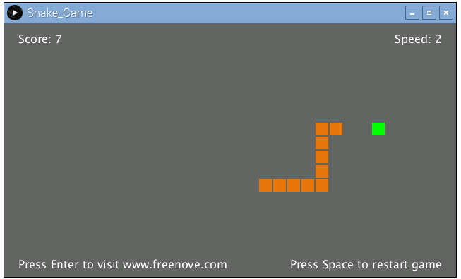
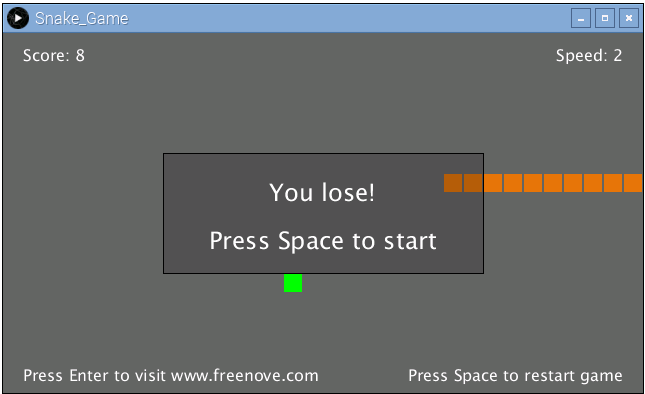

##############################################################################
App Snake Game
##############################################################################

In this chapter, we will play a classic game, snake.

App 4.1 Snake Game
****************************************************************

Now, let's create and experience our own game.

Component List
================================================================

+------------------------------------------+
| Freenove Projects Board for Raspberry Pi |
|                                          |
|  |Chapter01_04|                          |
+---------------------+--------------------+
| Raspberry Pi        | GPIO Ribbon Cable  |
|                     |                    |
|  |Chapter01_05|     |  |Chapter01_06|    |
+---------------------+--------------------+

.. |Chapter01_04| image:: ../_static/imgs/1_LED/Chapter01_04.png
.. |Chapter01_05| image:: ../_static/imgs/1_LED/Chapter01_05.png
.. |Chapter01_06| image:: ../_static/imgs/1_LED/Chapter01_06.png

Circuit
================================================================

.. list-table:: 
    :width: 100%
    :align: center
    :class: product-table

    *   -   Schematic diagram
    *   -   |APP4_00|
    *   -   Hardware connection:
    *   -   |APP4_01|

.. note::
    
    :red:`If you have any concerns, please send an email to:` support@freenove.com

Sketch	
================================================================

Sketch 4.1.1 SnakeGame
----------------------------------------------------------------

.. note::
    
    :red:`If you have any concerns, please send an email to:` support@freenove.com

First, enter where the project is located:

.. code-block:: console

    /home/pi/Freenove_Kit/Processing/Apps/App_04_1_1_Snake_Game

And then right-click to select Processing IDE

Or you can enter a command in the terminal to open the file App_04_1_1_Snake_Game. (The following is only one line of command. There is a Space after Processing.)

.. code-block:: console

    processing ~/Freenove_Kit/Processing/Apps/App_04_1_1_Snake_Game/App_04_1_1_Snake_Game.pde

Open Processing and click Run.

The result is as shown below. Pressing Space to start the game.

Pressing the space can start the game:

You can control the movement direction of the snake through the four buttons in circuit or four arrow keys on the keyboard. The rules are the same as the classic Snake game:

When the game is over, pressing the space can restart the game:

You can restart the game by pressing the space bar at any time during the game.

.. note::
    
    :red:`If you have any concerns, please send an email to:` support@freenove.com