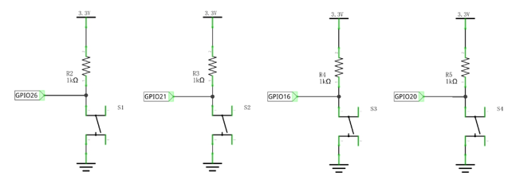
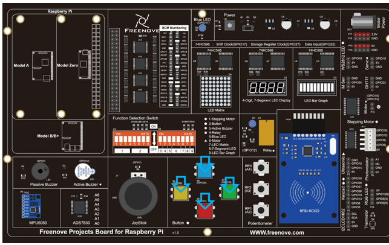
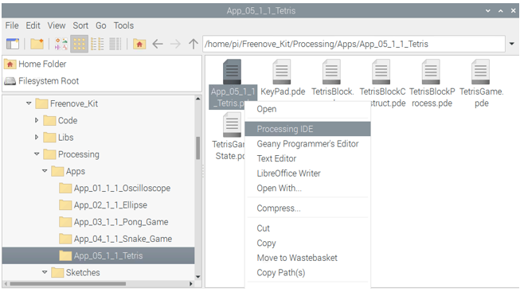
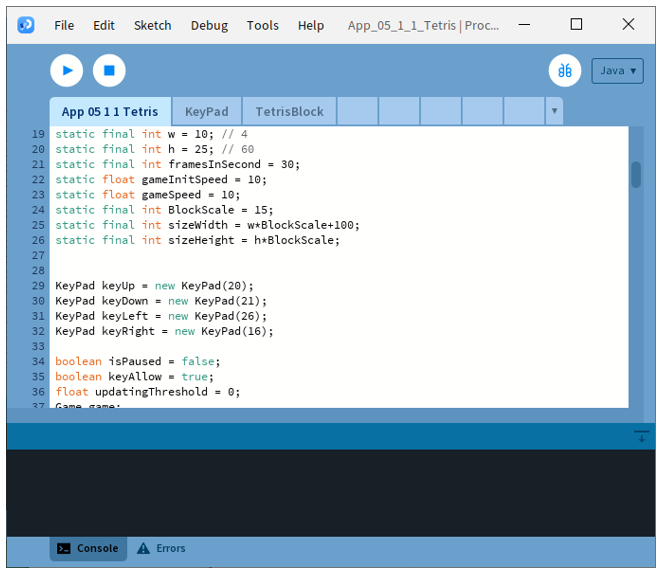
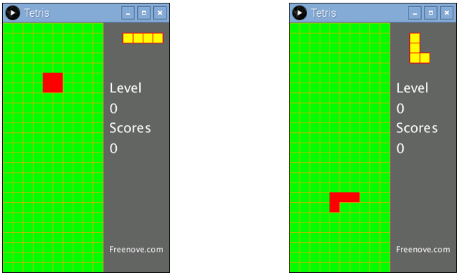
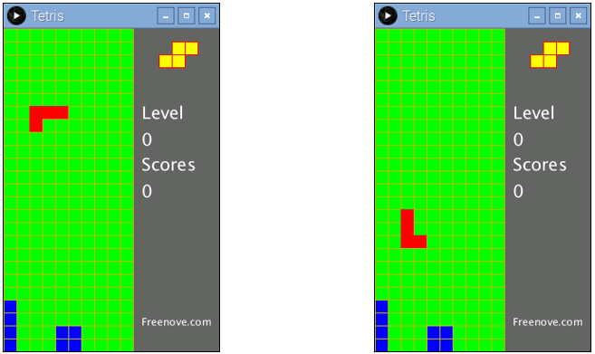
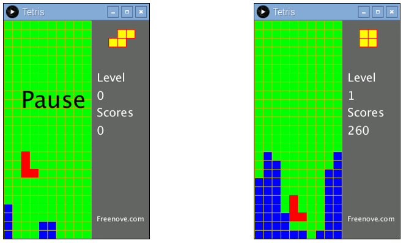
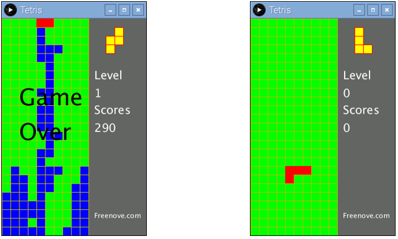

##############################################################################
App Tetris Game
##############################################################################

In this chapter, we will play a game, Tetris game.

App 5.1 Tetris Game
****************************************************************

Now, let's create and experience our own game.

Component List
================================================================

+------------------------------------------+
| Freenove Projects Board for Raspberry Pi |
|                                          |
|  |Chapter01_04|                          |
+---------------------+--------------------+
| Raspberry Pi        | GPIO Ribbon Cable  |
|                     |                    |
|  |Chapter01_05|     |  |Chapter01_06|    |
+---------------------+--------------------+

.. |Chapter01_04| image:: ../_static/imgs/1_LED/Chapter01_04.png
.. |Chapter01_05| image:: ../_static/imgs/1_LED/Chapter01_05.png
.. |Chapter01_06| image:: ../_static/imgs/1_LED/Chapter01_06.png

Circuit
================================================================

.. list-table:: 
    :width: 100%
    :align: center
    :class: product-table

    *   -   Schematic diagram
    *   -   |APP4_00|
    *   -   Hardware connection:
    *   -   |APP4_01|

.. note::
    
    :red:`If you have any concerns, please send an email to:` support@freenove.com

Sketch
================================================================

Sketch 5.1.1 TetrisGame
----------------------------------------------------------------

.. note::
    
    :red:`If you have any concerns, please send an email to:` support@freenove.com

First, enter where the project is located:

.. code-block:: console

    /home/pi/Freenove_Kit/Processing/Apps/App_05_1_1_Tetris

And then right-click to select Processing IDE

Or you can enter a command in the terminal to open the file App_05_1_1_Tetris. (The following is only one line of command. There is a Space after Processing.)

.. code-block:: console

    processing ~/Freenove_Kit/Processing/Apps/App_05_1_1_Tetris/App_05_1_1_Tetris.pde

Open Processing and click Run

The result is as shown below.

The left and right button in the circuit can control the movement of the falling block to left or right. And the button below can accelerate falling of the block. The button above is used for rotating of the block. Four direction keys on keyboard can also be used to play the game.

In the process of game, pressing the space bar on the keyboard can pause the game. The right side of the Display Window shows the upcoming block, the current game speed and the current score. The more lines you eliminate once, the higher the scores you will get. If you eliminate one line once, you will get 10 points. If you eliminate 4 lines once, you will get 70 points.

When the blocks are beyond the screen, the game is over. After the game is over, press the space bar to start a new game.

