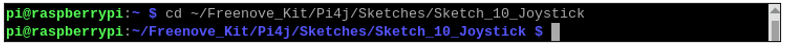

##############################################################################
Chapter Joystick
##############################################################################

In an earlier chapter, we learned how to use Rotary Potentiometer. We will now learn about joysticks, which are electronic modules that work on the same principle as the Rotary Potentiometer.

Project 10.1 Joystick
****************************************************************

In this project, we will read the output data of a joystick and display it to the Terminal screen.

Component knowledge
================================================================

Joystick
----------------------------------------------------------------

A Joystick is a kind of input sensor used with your fingers. You should be familiar with this concept already as they are widely used in gamepads and remote controls. It can receive input on two axes (Y and or X) at the same time (usually used to control direction on a two dimensional plane). And it also has a third direction capability by pressing down (Z axis/direction).

.. image:: ../_static/imgs/10_Joystick/Chapter10_00.png
    :align: center

This is accomplished by incorporating two rotary potentiometers inside the Joystick Module at 90 degrees of each other, placed in such a manner as to detect shifts in two directions simultaneously and with a Push Button Switch in the “vertical” axis, which can detect when a User presses on the Joystick.

.. image:: ../_static/imgs/10_Joystick/Chapter10_01.png
    :align: center

When the Joystick data is read, there are some differences between the axes: data of X and Y axes is analog, which needs to use the ADC. The data of the Z axis is digital, so you can directly use the GPIO to read this data or you have the option to use the ADC to read this.

Component List
================================================================

+------------------------------------------+
| Freenove Projects Board for Raspberry Pi |
|                                          |
|  |Chapter01_04|                          |
+---------------------+--------------------+
| Raspberry Pi        | GPIO Ribbon Cable  |
|                     |                    |
|  |Chapter01_05|     |  |Chapter01_06|    |
+---------------------+--------------------+

.. |Chapter01_04| image:: ../_static/imgs/1_LED/Chapter01_04.png
.. |Chapter01_05| image:: ../_static/imgs/1_LED/Chapter01_05.png
.. |Chapter01_06| image:: ../_static/imgs/1_LED/Chapter01_06.png

Circuit
================================================================

.. list-table:: 
    :width: 100%
    :align: center
    :class: product-table

    *   -   Schematic diagram
    *   -   |Chapter10_00|
    *   -   Hardware connection:
    *   -   |Chapter10_01|

.. |Chapter10_00| image:: ../_static/imgs/9_Thermistor/Chapter10_00.png
.. |Chapter10_01| image:: ../_static/imgs/9_Thermistor/Chapter10_01.png

.. note::
    
    :red:`If you have any concerns, please send an email to:` support@freenove.com

Code
================================================================

In this project's code, we will read the ADC values of X and Y axes of the Joystick, and read digital quality of the Z axis, then display these out in Terminal.

C Code 10.1 Joystick
----------------------------------------------------------------

If you haven't configured I2C, please refer to Chapter 7. If you've done it, please continue.

First, observe the project result, and then learn about the code in detail.

If you have any concerns, please send an email to: support@freenove.com

1.	Use cd command to enter 10_Joystick directory of C code.

.. code-block:: console

    $ cd ~/Freenove_Kit/Code/C_Code/10_Joystick

2.	Use following command to compile "Joystick.cpp" and generate executable file "Joystick".

.. code-block:: console

    $ g++ Joystick.cpp -o Joystick -lwiringPi -lADCDevice

3.	Then run the generated file "Joystick".

.. code-block:: console

    $ ./Joystick

After the program is executed, the terminal window will display the data of 3 axes X, Y and Z. Shifting (moving) the Joystick or pressing it down will make the data change.

The flowing is the code:

.. literalinclude:: ../../../freenove_Kit/Code/C_Code/10_Joystick/Joystick.cpp
    :linenos: 
    :language: c

In the code, configure Z_Pin to pull-up input mode. In the while loop of the main function, use analogRead () to read the value of axes X and Y and use digitalRead () to read the value of axis Z, then display them.

.. literalinclude:: ../../../freenove_Kit/Code/C_Code/10_Joystick/Joystick.cpp
    :linenos: 
    :language: c
    :lines: 33-39

Python Code 10.1 Joystick
----------------------------------------------------------------

If you haven't configured I2C, please refer to Chapter 7. If you've done it, please continue.

First, observe the project result, and then learn about the code in detail.

.. note::
    
    :red:`If you have any concerns, please send an email to:` support@freenove.com

1.	Use cd command to enter 10_Joystick directory of Python code.

.. code-block:: console

    $ cd ~/Freenove_Kit/Code/Python_GPIOZero_Code/10_Joystick

2.	Use Python command to execute Python code "Joystick.py". 

.. code-block:: console

    $ python Joystick.py

After the program is executed, the Terminal window will display the data of 3 axes X, Y and Z. Shifting (moving) the joystick or pressing it down will make the data change.

The following is the program code:

.. literalinclude:: ../../../freenove_Kit/Code/Python_GPIOZero_Code/10_Joystick/Joystick.py
    :linenos: 
    :language: python