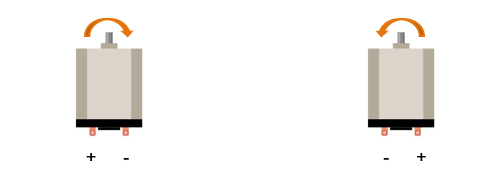

##############################################################################
Chapter Motor & Driver
##############################################################################

In this chapter, we will learn about DC Motors and DC Motor Drivers and how to control the speed and direction of a DC Motor.

Project 11.1 Control a DC Motor with a Potentiometer
****************************************************************

In this project, a potentiometer will be used to control a DC Motor. When the Potentiometer is at the midpoint position, the DC Motor will STOP, and when the Potentiometer is turned in either direction of this midpoint, the DC Motor speed increases until it reached the endpoint where the DC Motor achieves its maximum speed. When the Potentiometer is turned “Left” of the midpoint, the DC Motor will ROTATE in one direction and when turned “Right” the DC Motor will ROTATE in the opposite direction. 

Component knowledge
================================================================

DC Motor
----------------------------------------------------------------

DC Motor is a device that converts electrical energy into mechanical energy. DC Motors consist of two major parts, a Stator and the Rotor. The stationary part of a DC Motor is the Stator and the part that Rotates is the Rotor. The Stator is usually part of the outer case of motor (if it is simply a pair of permanent magnets), and it has terminals to connect to the power if it is made up of electromagnet coils. Most Hobby DC Motors only use Permanent Magnets for the Stator Field. The Rotor is usually the shaft of motor with 3 or more electromagnets connected to a commutator where the brushes (via the terminals 1 & 2 below) supply electrical power, which can drive other mechanical devices. The diagram below shows a small DC Motor with two terminal pins.

.. image:: ../_static/imgs/11_Motor_&_Driver/Chapter11_00.png
    :align: center

When a DC Motor is connected to a power supply, it will rotate in one direction. If you reverse the polarity of the power supply, the DC Motor will rotate in opposite direction. This is important to note.

Component List
================================================================

+---------------------------------------------+
| Freenove Projects Board for Raspberry Pi    |
|                                             |
|  |Chapter01_04|                             |
+---------------------+-----------------------+
| Raspberry Pi        | GPIO Ribbon Cable     |
|                     |                       |
|  |Chapter01_05|     |  |Chapter01_06|       |
+---------------------+-----------------------+
| Jumper Wire         | Motor                 |
|                     |                       |
|  |Chapter05_02|     |  |Chapter11_02|       |
+---------------------+-----------------------+
| 9V Battery (you provide) & 9V Battery Cable |
|                                             |
|  |Chapter11_03|                             |
+---------------------------------------------+

.. |Chapter01_04| image:: ../_static/imgs/1_LED/Chapter01_04.png
.. |Chapter01_05| image:: ../_static/imgs/1_LED/Chapter01_05.png
.. |Chapter01_06| image:: ../_static/imgs/1_LED/Chapter01_06.png
.. |Chapter05_02| image:: ../_static/imgs/5_RGB_LED/Chapter05_02.png
.. |Chapter11_02| image:: ../_static/imgs/11_Motor_&_Driver/Chapter11_02.png
.. |Chapter11_03| image:: ../_static/imgs/11_Motor_&_Driver/Chapter11_03.png

Circuit
================================================================

.. list-table:: 
    :width: 100%
    :align: center
    :class: product-table

    *   -   Schematic diagram
    *   -   |Chapter11_04|
    *   -   Hardware connection:
    *   -   |Chapter11_05|

.. |Chapter11_04| image:: ../_static/imgs/11_Motor_&_Driver/Chapter11_04.png
.. |Chapter11_05| image:: ../_static/imgs/11_Motor_&_Driver/Chapter11_05.png

.. note::
    
    :red:`If you have any concerns, please send an email to:` support@freenove.com

Code
================================================================

In code for this project, first read the ADC value and then control the rotation direction and speed of the DC Motor according to the value of the ADC.

C Code 11.1 Motor
----------------------------------------------------------------

If you haven't configured I2C, please refer to Chapter 7. If you have done it, please continue.

First, observe the project result, and then learn about the code in detail.

.. note::
    
    :red:`If you have any concerns, please send an email to:` support@freenove.com

1.	Use cd command to enter 11_Motor directory of the C code.

.. code-block:: console

    $ cd ~/Freenove_Kit/Code/C_Code/11_Motor

2.	Use the following command to compile “Motor.cpp” and generate the executable file “Motor”.

.. code-block:: console

    $ g++ Motor.cpp -o Motor -lwiringPi -lADCDevice

3.	Then run the generated file ”Motor”. 

.. code-block:: console

    $ ./Motor

After the program runs, you can use the Potentiometer to control the DC Motor. When the Potentiometer is at the midpoint position, the DC Motor will STOP, and when the Potentiometer is turned in either direction of this midpoint, the DC Motor speed increases until it reaches the endpoint where the DC Motor achieves its maximum speed. When the Potentiometer is turned “Left” of the midpoint, the DC Motor will ROTATE in one direction and when turned “Right” the DC Motor will ROTATE in the opposite direction. You will also see the ADC value of the potentiometer displayed in the Terminal with the motor direction and the PWM duty cycle used to control the DC Motor’s speed.

The following is the code:

.. literalinclude:: ../../../freenove_Kit/Code/C_Code/11_Motor/Motor.cpp
    :linenos: 
    :language: c

When ADC value is greater than 128, motorPin2 outputs low lever and motorPin1 output high level.

When ADC value is less than 128, motorPin2 outputs high lever and motorPin1 output low level.

The difference between ADC and 128 determines the duty cycle for the PWM.

.. literalinclude:: ../../../freenove_Kit/Code/C_Code/11_Motor/Motor.cpp
    :linenos: 
    :language: c
    :lines: 24-43

Python Code 11.1 Motor
----------------------------------------------------------------

If you haven't configured I2C and installed Smbus, please refer to Chapter 7. If you've done it, please Continue.

First, observe the project result, and then learn about the code in detail.

If you have any concerns, please send an email to: support@freenove.com

1.	Use cd command to enter 11_Motor directory of Python code.

.. code-block:: console

    $ cd ~/Freenove_Kit/Code/Python_GPIOZero_Code/11_Motor

2.	Use python command to execute the Python code “Motor.py”. 

.. code-block:: console

    $ python Motor.py

After the program runs, you can use the Potentiometer to control the DC Motor. When the Potentiometer is at the midpoint position, the DC Motor will STOP, and when the Potentiometer is turned in either direction of this midpoint, the DC Motor speed increases until it reaches the endpoint where the DC Motor achieves its maximum speed. When the Potentiometer is turned “Left” of the midpoint, the DC Motor will ROTATE in one direction and when turned “Right” the DC Motor will ROTATE in the opposite direction. You will also see the ADC value of the potentiometer displayed in the Terminal with the motor direction and the PWM duty cycle used to control the DC Motor’s speed.

The following is the code:

.. literalinclude:: ../../../freenove_Kit/Code/C_Code/11_Motor/Motor.py
    :linenos: 
    :language: python

When ADC value is greater than 128, motorPin2 outputs low lever and motorPin1 output high level.

When ADC value is less than 128, motorPin2 outputs high lever and motorPin1 output low level.

The difference between ADC and 128 determines the duty cycle for the PWM.

.. literalinclude:: ../../../freenove_Kit/Code/C_Code/11_Motor/Motor.py
    :linenos: 
    :language: python
    :lines: 31-44
